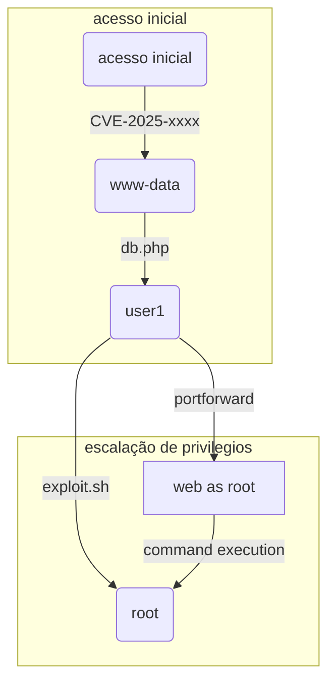

# Subtítulo da horinha

![[Eighteen.png| Um rapaz com uma camisa preta e o número 18 estampado segura um troféu dourado. Abaixo vemos o nome da máquina: Eighteen.]]

## Introdução

introdução e resumo aqui

---

## Reconhecimento

### Varredura com Nmap

Fase de reconhecimento aqui

```bash
echo "Exemplo de comando"
```

### Web

![[imagem.png | descrição da imagem]]

Fase de reconhecimento aqui

### Mssql

Captura do hash aqui

```bash
echo "Exemplo de comando"
```

### Pbdfk2 

Quebra do hash aqui

```bash
echo "Exemplo de comando"
```

---

## Acesso Inicial

### Password-spray

Brute force aqui

```bash
echo "Exemplo de comando"
```

### Shell como adam.scott

Exploração do alvo (foothold) e flag do usuário

```bash
echo "Exemplo de comando"
```

---

## Escalação de Privilégios

### Active Directory 

Fase de enumeração aqui

```bash
echo "Exemplo de comando"
```

### BadSuccessor

Escalada de privilégios até o root

```bash
echo "Exemplo de comando"
```

### Shell como Administrator

Acesso remoto e flag do root

```bash
echo "Exemplo de comando"
```

---

## Conclusão

![[EighteenFinal.png| Mesm imagem do banner inicial, porém abaixo está escrito: Eighteen has been pwned.]]

Palavras finais sobre o que aprendeu e CTA.



Você pode usar links internos: [[outra-nota]]
E inserir imagens: ![[imagem.png | descrição da imagem]]
Ou blocos de código:

```bash
echo "Exemplo de comando"
```
