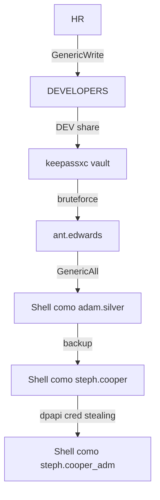

# Subtítulo da horinha

![[Puppy.png | A imagem mostra um filhote de cão segurando uma chave e um cadeado.]]

## Introdução

Olá mundo! Sejam todos muito bem vindos à mais uma aventura na minha jornada no mundo da cibersegurança. A máquina do **[hackthebox](https://www.hackthebox.com)** de hoje chama-se **`Puppy`**, máquina **`Windows Active Directory`** classificada como de dificuldade média.

Nós começamos em um cenário *assumed breach*, onde temos uma credencial válida de usuário: **`levi.james : KingofAkron2025!`**. Nos aproveitamos do grupo desse usuário que nos permite nos adicionar ao grupo **`developers`**, que podem acessar a pasta compartilhada **`DEV`**. Nela encontramos um cofre do **`Keepass`**  cuja senha temos que quebrar usando um script público. Nesse cofre encontramos as credenciais do usuário **`ant.edwards`**, que pode mudar a senha do usuário remoto **`adam.silver`**. Já como adam encontramos um arquivo de backup de um site, onde as credenciais **[[Ldap]]** do usuário **`steph.cooper`** estão em texto plano. Por fim, conseguimos as credenciais da conta **`steph.cooper_adm`** por roubar as credenciais criptografadas pelo **[[Dpapi]]**.

Isso vai ser bem legal e instrutivo, então vamos começar!

## Enumeração

### Nmap

Comecei fazendo a varredura de portas com **[[NMAP]]**. 

```bash
┌──(kali㉿kali)-[~/Boxes/Hackthebox/Medium/Puppy]
└─$ ports=$(nmap -p- --min-rate=1000 -T4 $IP | grep '^[0-9]' | cut -d '/' -f 1 | tr '\n' ',' | sed s/,$//)
sudo nmap -Pn -p$ports -sC -sV -oA nmap/$machine -vv $IP

PORT      STATE SERVICE       REASON          VERSION
53/tcp    open  domain        syn-ack ttl 127 Simple DNS Plus
88/tcp    open  kerberos-sec  syn-ack ttl 127 Microsoft Windows Kerberos (server time: 2025-05-18 23:14:36Z)
111/tcp   open  rpcbind       syn-ack ttl 127 2-4 (RPC #100000)
135/tcp   open  msrpc         syn-ack ttl 127 Microsoft Windows RPC
139/tcp   open  netbios-ssn   syn-ack ttl 127 Microsoft Windows netbios-ssn
389/tcp   open  ldap          syn-ack ttl 127 Microsoft Windows Active Directory LDAP (Domain: PUPPY.HTB0., Site: Default-First-Site-Name)
445/tcp   open  microsoft-ds? syn-ack ttl 127
464/tcp   open  kpasswd5?     syn-ack ttl 127
593/tcp   open  ncacn_http    syn-ack ttl 127 Microsoft Windows RPC over HTTP 1.0
636/tcp   open  tcpwrapped    syn-ack ttl 127
2049/tcp  open  nlockmgr      syn-ack ttl 127 1-4 (RPC #100021)
3260/tcp  open  iscsi?        syn-ack ttl 127
3268/tcp  open  ldap          syn-ack ttl 127 Microsoft Windows Active Directory LDAP (Domain: PUPPY.HTB0., Site: Default-First-Site-Name)
3269/tcp  open  tcpwrapped    syn-ack ttl 127
5985/tcp  open  http          syn-ack ttl 127 Microsoft HTTPAPI httpd 2.0 (SSDP/UPnP)
|_http-server-header: Microsoft-HTTPAPI/2.0
|_http-title: Not Found
9389/tcp  open  mc-nmf        syn-ack ttl 127 .NET Message Framing
49664/tcp open  msrpc         syn-ack ttl 127 Microsoft Windows RPC
49667/tcp open  msrpc         syn-ack ttl 127 Microsoft Windows RPC
49669/tcp open  msrpc         syn-ack ttl 127 Microsoft Windows RPC
49670/tcp open  ncacn_http    syn-ack ttl 127 Microsoft Windows RPC over HTTP 1.0
49691/tcp open  msrpc         syn-ack ttl 127 Microsoft Windows RPC
49696/tcp open  msrpc         syn-ack ttl 127 Microsoft Windows RPC
56813/tcp open  msrpc         syn-ack ttl 127 Microsoft Windows RPC
Service Info: Host: DC; OS: Windows; CPE: cpe:/o:microsoft:windows

Host script results:
| smb2-security-mode:
|   3:1:1:
|_    Message signing enabled and required
|_clock-skew: 6h59m59s
| smb2-time:
|   date: 2025-05-18T23:16:33
|_  start_date: N/A
| p2p-conficker:
|   Checking for Conficker.C or higher...
|   Check 1 (port 38276/tcp): CLEAN (Timeout)
|   Check 2 (port 43439/tcp): CLEAN (Timeout)
|   Check 3 (port 42755/udp): CLEAN (Timeout)
|   Check 4 (port 18130/udp): CLEAN (Timeout)
|_  0/4 checks are positive: Host is CLEAN or ports are blocked

NSE: Script Post-scanning.
NSE: Starting runlevel 1 (of 3) scan.
Initiating NSE at 13:17
Completed NSE at 13:17, 0.00s elapsed
NSE: Starting runlevel 2 (of 3) scan.
Initiating NSE at 13:17
Completed NSE at 13:17, 0.00s elapsed
NSE: Starting runlevel 3 (of 3) scan.
Initiating NSE at 13:17
Completed NSE at 13:17, 0.00s elapsed
Read data files from: /usr/share/nmap
Service detection performed. Please report any incorrect results at https://nmap.org/submit/ .
Nmap done: 1 IP address (1 host up) scanned in 202.79 seconds
           Raw packets sent: 23 (1.012KB) | Rcvd: 23 (1.012KB)
```

As portas **88** (kerberos) e **389** (ldap) estão abertas, o que indica que se trata de um **`Windows Active Directory`**. Também aproveitei para adicionar o hostname **`puppy.htb`** ao meu arquivo **`/etc/hosts`**.

### DEV Share

Usando a ferramenta **[[Netexec]]**, verifiquei se havia pastas compartilhadas que o usuário **`levi.james`** poderia acessar.

```bash {10}
┌──(kali㉿kali)-[~/Boxes/Hackthebox/Medium/Puppy]
└─$ nxc smb puppy.htb -u 'levi.james' -p 'KingofAkron2025!' --shares
SMB         10.129.49.206   445    DC               [*] Windows Server 2022 Build 20348 x64 (name:DC) (domain:PUPPY.HTB) (signing:True) (SMBv1:False)
SMB         10.129.49.206   445    DC               [+] PUPPY.HTB\levi.james:KingofAkron2025!
SMB         10.129.49.206   445    DC               [*] Enumerated shares
SMB         10.129.49.206   445    DC               Share           Permissions     Remark
SMB         10.129.49.206   445    DC               -----           -----------     ------
SMB         10.129.49.206   445    DC               ADMIN$                          Remote Admin
SMB         10.129.49.206   445    DC               C$                              Default share
SMB         10.129.49.206   445    DC               DEV                             DEV-SHARE for PUPPY-DEVS
SMB         10.129.49.206   445    DC               IPC$            READ            Remote IPC
SMB         10.129.49.206   445    DC               NETLOGON        READ            Logon server share
SMB         10.129.49.206   445    DC               SYSVOL          READ            Logon server share
```

Pude ver que havia uma pasta chamada **`DEV`**, mas o usuário **`levi.james`** não tinha direito de leitura. Então aproveitando que estava usando o **`Netexec`**, listei os usuários validos do sistema.

```bash
┌──(kali㉿kali)-[~/Boxes/Hackthebox/Medium/Puppy]
└─$ nxc smb puppy.htb -u 'levi.james' -p 'KingofAkron2025!' --users
SMB         10.129.49.206   445    DC               [*] Windows Server 2022 Build 20348 x64 (name:DC) (domain:PUPPY.HTB) (signing:True) (SMBv1:False)
SMB         10.129.49.206   445    DC               [+] PUPPY.HTB\levi.james:KingofAkron2025!
SMB         10.129.49.206   445    DC               -Username-                    -Last PW Set-       -BadPW- -Description-
SMB         10.129.49.206   445    DC               Administrator                 2025-02-19 19:33:28 0       Built-in account for administering the computer/domain
SMB         10.129.49.206   445    DC               Guest                         <never>             0       Built-in account for guest access to the computer/domain
SMB         10.129.49.206   445    DC               krbtgt                        2025-02-19 11:46:15 0       Key Distribution Center Service Account
SMB         10.129.49.206   445    DC               levi.james                    2025-02-19 12:10:56 0
SMB         10.129.49.206   445    DC               ant.edwards                   2025-02-19 12:13:14 0
SMB         10.129.49.206   445    DC               adam.silver                   2025-05-18 23:19:29 0
SMB         10.129.49.206   445    DC               jamie.williams                2025-02-19 12:17:26 0
SMB         10.129.49.206   445    DC               steph.cooper                  2025-02-19 12:21:00 0
SMB         10.129.49.206   445    DC               steph.cooper_adm              2025-03-08 15:50:40 0
SMB         10.129.49.206   445    DC               [*] Enumerated 9 local users: PUPPY
```

Fazer isso me permitiu criar uma lista de usuários para o caso de ter que usar a técnica de [[Password Spray]].

Outra coisa interessante do **`Netexec`**, é que ele possui um **`Bloodhound.py`** integrado. Então eu usei essa função **`Bloodhound`** para fazer a enumeração do [[Active Directory]].

```bash
┌──(kali㉿kali)-[~/Boxes/Hackthebox/Medium/Puppy]
└─$ nxc ldap puppy.htb -u 'levi.james' -p 'KingofAkron2025!' --bloodhound --collection All --dns-server 10.129.49.206
SMB         10.129.49.206   445    DC               [*] Windows Server 2022 Build 20348 x64 (name:DC) (domain:PUPPY.HTB) (signing:True) (SMBv1:False)
LDAP        10.129.49.206   389    DC               [+] PUPPY.HTB\levi.james:KingofAkron2025!
LDAP        10.129.49.206   389    DC               Resolved collection methods: trusts, container, psremote, objectprops, dcom, rdp, localadmin, group, acl, session
LDAP        10.129.49.206   389    DC               Done in 00M 50S
LDAP        10.129.49.206   389    DC               Compressing output into /home/kali/.nxc/logs/DC_10.129.49.206_2025-05-18_142805_bloodhound.zip
```

Nessa hora eu tive um grande problema. Ao tentar abrir o **`Bloodhound GUI`** para exportar o arquivo **`zip`** gerado pelo **`Netexec`**, o **`Bloodhound GUI`** não abria de jeito nenhum. Então tentei instalar a versão mais atual, a **`Community Edition`**. Porém minha [[Máquina Virtual]] é limitada e travou toda na tela de login. Assim entendi que teria que fazer do jeito difícil- na mão.

O arquivo **`zip`** contém uma série de arquivos json, nomeados de acordo com a sua categoria de objetos em um **`Active Directory`**: **Users**, **Groups**, **Computers** e etc. Os arquivos que usei foram os arquivos **`Users.json`** e **`Groups.json`**. Com uma ajudinha do ChatGPT, entendi de forma bem básica como esses dois arquivos poderiam me ajudar a criar as relações entre os usuários e grupos.

Cada entrada nos arquivos **`json`** seguem o seguinte padrão:

```bash
ObjectIdentifier
Properties{}
Aces []{RightName,PrincipalSID}
```

Então para descobrirmos as relações entre os objetos do **`AD`**, precisamos pegar o **`ObjectIdentifier`** de um usuário ou grupo e procurá-lo dentro do **`Aces`** de outro usuário ou grupo. Por exemplo, se pegarmos o **`ObjectIdentifier`** do grupo **`HR`** e procurarmos onde ele aparece como **`PrincipalSID`** no arquivo **`Groups.json`**, veremos que ele aparece no **`Aces`** do grupo **`DEVELOPERS`** com o **`RightName`** **`GenericWrite`**. 

```json title="Trecho do Groups.json" {9,11}
 "Aces": [
                {
                    "RightName": "Owns",
                    "IsInherited": false,
                    "PrincipalSID": "S-1-5-21-1487982659-1829050783-2281216199-512",
                    "PrincipalType": "Group"
                },
                {
                    "RightName": "GenericWrite",
                    "IsInherited": false,
                    "PrincipalSID": "S-1-5-21-1487982659-1829050783-2281216199-1108",
                    "PrincipalType": "Group"
                }
```

Assim podemos concluir que o grupo **`HR`** tem o privilégio **`GenericWrite`** sobre o grupo **`DEVELOPERS`**. Isso significa que o usuário **`levi.james`**, que faz parte do grupo **`HR`**, pode se adicionar ao grupo **`DEVELOPERS`** e herdar o direito de ler o que está na pasta compartilhada **`DEV`**.

## Acesso Inicial

### Keepass Bruteforce

Exploração do alvo (foothold)

```bash

```

### User Flag

```bash

```

## Escalação de Privilégios

### Backup

```bash

```

Escalada de privilégios até o root

### DPAPI

> [!question] O que é DPAPI?
> Explicação top sobre dpapi.

### Root flag

```bash

```

## Conclusão

Palavras finais sobre o que aprendeu e CTA.

