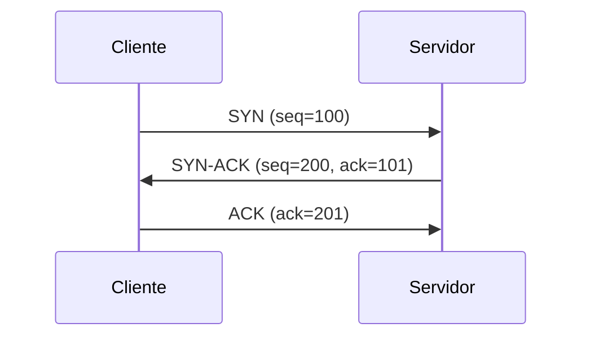

# TCP

---

### 🌐 O que é o TCP?

**TCP (Transmission Control Protocol)** é um protocolo da **camada de transporte** do modelo OSI e do modelo TCP/IP. Ele é usado para **transmitir dados com confiabilidade entre dois computadores** em uma rede.

Ao contrário do UDP (que vimos antes), **TCP garante que os dados cheguem, cheguem na ordem certa e sem duplicação**.

---

### 🔐 Características principais do TCP:

1. **Orientado à conexão:**  
    Antes de transferir dados, o TCP **estabelece uma conexão** entre os dois dispositivos com um processo chamado **three-way handshake**.
    
2. **Confiável:**  
    O protocolo verifica se os dados foram entregues corretamente, e retransmite pacotes perdidos.
    
3. **Controle de fluxo e congestionamento:**  
    TCP adapta a taxa de envio com base na capacidade da rede, para evitar sobrecarga ou perda de pacotes.
    
4. **Entrega ordenada:**  
    Mesmo que os pacotes cheguem fora de ordem, o TCP os reorganiza antes de entregar à aplicação.
    

---

### 🔁 O processo de conexão — _Three-Way Handshake_

1. **SYN:** o cliente envia um pacote SYN para iniciar uma conexão.
    
2. **SYN-ACK:** o servidor responde com um pacote SYN-ACK.
    
3. **ACK:** o cliente envia um ACK final para confirmar.
    

Após isso, a comunicação TCP está aberta.

---

### 📦 Exemplo de uso do TCP

Protocolos que **usam TCP**:

- HTTP/HTTPS (web)
    
- SSH (acesso remoto seguro)
    
- FTP (transferência de arquivos)
    
- SMTP/IMAP/POP3 (e-mails)
    

---

### 🆚 Comparação com UDP:

|Característica|TCP|UDP|
|---|---|---|
|Conexão|Sim (handshake)|Não|
|Confiável|Sim (confirma entrega)|Não|
|Ordem garantida|Sim|Não|
|Velocidade|Mais lento (por segurança)|Mais rápido|
|Casos de uso|Web, e-mail, SSH|Streaming, DNS, jogos|

---

### ✅ Resumo:

> **TCP é o protocolo ideal quando a precisão da entrega importa mais do que a velocidade** — como em sites, transações, login e transmissão de dados sensíveis.

### 🧠 Explicação do Processo:

1. **SYN (Synchronize):**  
    O cliente envia um pacote com a flag SYN ativada, indicando o desejo de estabelecer uma conexão. Ele também envia um número de sequência inicial (por exemplo, `seq=100`).
    
2. **SYN-ACK (Synchronize-Acknowledge):**  
    O servidor responde com um pacote que contém:
    
    - A flag SYN ativada, indicando que ele está disposto a estabelecer a conexão.
        
    - A flag ACK ativada, reconhecendo o pacote SYN do cliente.
        
    - Um número de sequência inicial próprio (por exemplo, `seq=200`).
        
    - O número de sequência do cliente incrementado em 1 no campo de reconhecimento (ack=101), indicando que está pronto para receber dados a partir de `seq=101`.
        
3. **ACK (Acknowledge):**  
    O cliente envia um pacote final com:
    
    - A flag ACK ativada, reconhecendo o pacote SYN-ACK do servidor.
        
    - O número de sequência do servidor incrementado em 1 no campo de reconhecimento (ack=201), confirmando que recebeu o número de sequência inicial do servidor.
        

Após essa troca de pacotes, a conexão TCP é estabelecida, permitindo a comunicação bidirecional entre cliente e servidor.