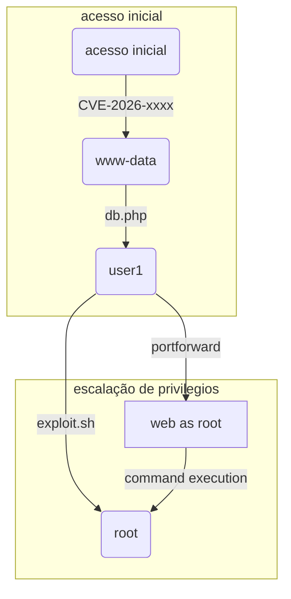

# Subtítulo da horinha


## Introdução

introdução e resumo aqui

## Reconhecimento

Fase de reconhecimento aqui

## Acesso Inicial

Exploração do alvo (foothold)

## Escalação de Privilégios

Escalada de privilégios até o root

## Conclusão

![[bannerfinal.png | descrição da imagem]]

Palavras finais sobre o que aprendeu.



Você pode usar links internos: [[outra-nota]]
E inserir imagens: ![[imagem.png | descrição da imagem]]
Ou blocos de código:

```bash
echo "Exemplo de comando"
```